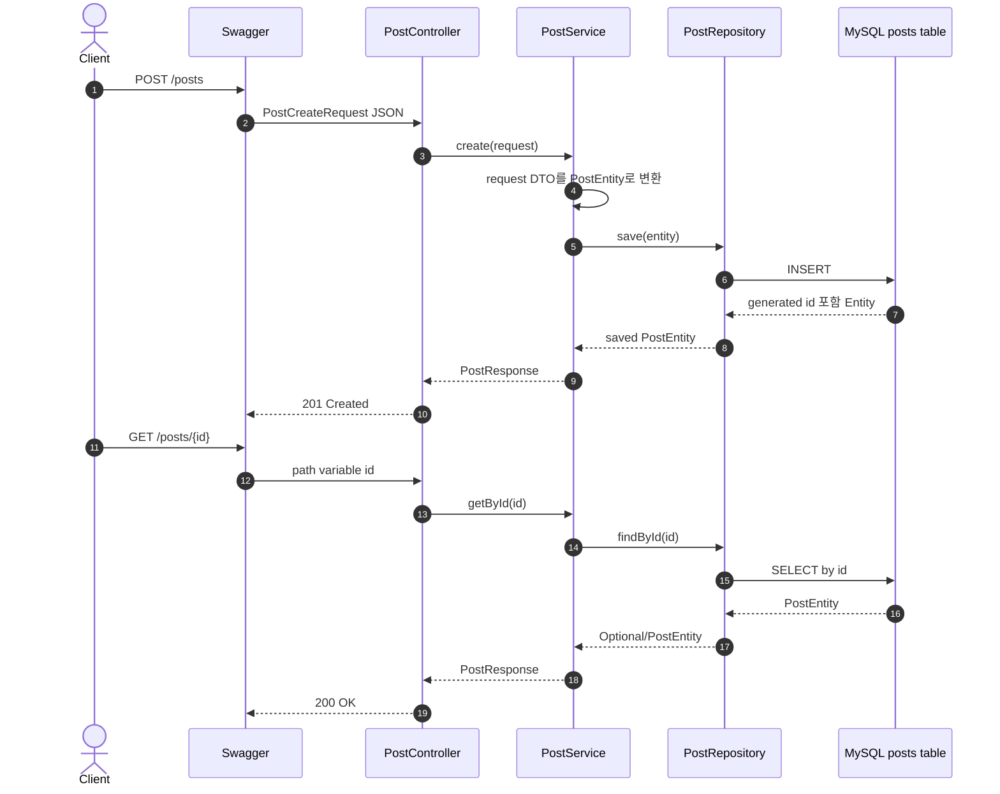
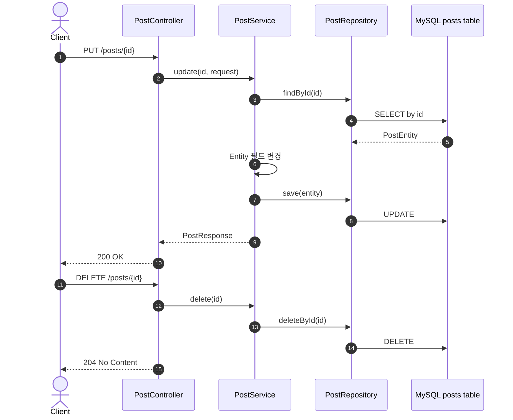
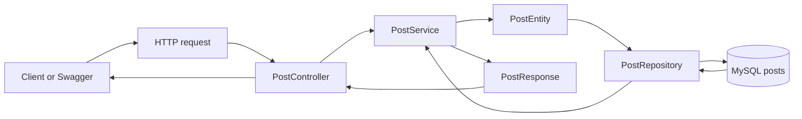

# 이론 정리

> 이번 시퀀스는 메모리 저장소를 MySQL/JPA 기반 저장소로 바꾸는 단계입니다. 목표는 단일 테이블 CRUD에서 Entity, Repository, Service, Controller의 책임을 분리하고, 서버 재시작 후에도 데이터가 남는 영속 저장 흐름을 이해하는 것입니다.

## 1. Problem - 왜 DB 저장과 계층 분리가 필요한가

메모리 저장소는 요청/응답 흐름을 배우기에는 좋지만 서버 프로세스 안에만 데이터를 보관합니다. 애플리케이션을 재시작하면 데이터가 사라지고, 다른 애플리케이션 인스턴스와 같은 데이터를 공유하기 어렵습니다.

서비스가 실제 데이터를 다루려면 애플리케이션 밖의 저장소에 데이터를 남겨야 합니다. 이때 Service가 SQL이나 DB 접근 세부사항을 직접 알게 만들면 처리 흐름과 저장 기술이 강하게 묶입니다. 이번 시퀀스에서는 JPA Repository를 통해 DB 접근 책임을 분리합니다.

## 2. Analyze - 무엇을 메모리 저장과 다르게 볼 것인가

메모리 저장에서 DB 저장으로 넘어가면 단순히 저장 위치만 바뀌지 않습니다. 데이터의 생명주기, id 생성 방식, 테스트 환경, 계층 책임을 함께 봐야 합니다.

| 비교 기준 | 메모리 저장 | DB 저장 |
|---|---|---|
| 데이터 위치 | 애플리케이션 프로세스 안의 리스트 | MySQL 테이블 |
| 재시작 후 데이터 | 사라집니다. | DB에 남습니다. |
| id 생성 | 코드에서 직접 증가시킬 수 있습니다. | DB/JPA 전략에 맡깁니다. |
| 저장 책임 | 메모리 Repository가 리스트를 다룹니다. | JPA Repository가 Entity를 저장합니다. |
| 테스트 | 메모리 동작을 직접 확인합니다. | 테스트 DB와 런타임 MySQL 설정을 구분합니다. |

이번 구현 범위는 단일 테이블 CRUD입니다. 관계 매핑, N+1, Validation, 전역 예외 응답, Security는 직접 구현하지 않습니다.

## 3. API / 실행 시퀀스 다이어그램

### 3.1 생성과 조회 흐름

생성 흐름에서 요청 DTO는 DB에 직접 저장되지 않습니다. Service가 요청 DTO를 Entity로 바꾸고, Repository가 Entity 저장을 맡습니다. 조회 결과도 Entity를 그대로 응답하지 않고 `PostResponse`로 변환합니다.

### 3.2 수정과 삭제 흐름

수정과 삭제도 Controller가 DB에 직접 접근하지 않습니다. id로 대상 Entity를 찾고, Service가 처리 흐름을 조립하며, Repository가 DB 작업을 수행합니다.

## 4. 계층 / DTO / 메시지 흐름

### 4.1 계층 흐름

| 계층 | 주요 타입 | 책임 |
|---|---|---|
| API 입력 | `PostCreateRequest`, `PostUpdateRequest` | 클라이언트가 보낸 생성/수정 요청 데이터를 담습니다. |
| Controller | `PostController` | endpoint와 HTTP method를 Service 호출에 연결합니다. |
| Service | `PostService` | DTO, Entity, Repository, Response DTO 흐름을 조립합니다. |
| Entity | `PostEntity` | DB 테이블과 연결되는 내부 저장 모델입니다. |
| Repository | `PostRepository` | JPA를 통해 Entity 저장과 조회를 맡습니다. |
| DB | `posts` table | 애플리케이션 밖에 데이터를 영속적으로 저장합니다. |
| API 출력 | `PostResponse` | 클라이언트에게 반환할 응답 모양을 정리합니다. |

### 4.2 DTO, Entity, DB 메시지 구분

| 흐름 | 데이터 타입 | 확인할 기준 |
|---|---|---|
| 요청 -> Service | `PostCreateRequest`, `PostUpdateRequest` | API 입력 모양입니다. Entity annotation을 갖지 않습니다. |
| Service -> Repository | `PostEntity` | DB 저장 기준입니다. 테이블과 id 생성 전략을 가집니다. |
| Repository -> DB | SQL로 변환된 Entity 작업 | JPA가 INSERT, SELECT, UPDATE, DELETE로 연결합니다. |
| Service -> 응답 | `PostResponse` | 외부에 돌려줄 응답 모양입니다. |

Entity와 DTO를 섞지 않는 것이 중요합니다. Entity는 DB와 연결된 내부 모델이고, DTO는 API 경계에서 주고받는 데이터 모양입니다.

## 5. Action - 구현에서 연결할 지점

### 5.1 `PostEntity`를 DB 테이블 기준으로 봅니다

`PostEntity`는 `posts` 테이블과 연결되는 내부 모델입니다. id 생성은 DB/JPA 전략을 사용하고, 생성/수정 요청 DTO와는 역할이 다릅니다.

확인 질문:

- Entity가 어떤 테이블과 연결되나요?
- id는 요청에서 받는 값인가요, 저장 과정에서 정해지는 값인가요?
- Entity를 API 응답으로 그대로 반환하고 있지는 않나요?

### 5.2 `PostRepository`가 DB 접근을 맡게 합니다

Repository는 Service가 DB 접근 세부사항을 직접 다루지 않게 하는 경계입니다. 이번 시퀀스에서는 `JpaRepository` 기반 저장, 전체 조회, 단건 조회, 삭제 흐름을 사용합니다.

확인 질문:

- Service가 Repository를 통해 저장과 조회를 수행하나요?
- Controller가 Repository를 직접 호출하지 않나요?
- 테스트 DB와 런타임 MySQL 설정을 구분할 수 있나요?

### 5.3 `PostService`가 CRUD 흐름을 조립합니다

Service는 요청 DTO를 Entity로 바꾸고, Repository 결과를 Response DTO로 바꿉니다. 생성, 조회, 수정, 삭제가 같은 계층 흐름을 따르는지 확인합니다.

확인 질문:

- create는 request DTO를 Entity로 바꾼 뒤 저장하나요?
- getAll과 getById는 Entity 목록이나 Entity를 응답 DTO로 바꾸나요?
- update와 delete도 id 기준 조회/처리 흐름을 설명할 수 있나요?

### 5.4 실행 환경을 구분합니다

서버 실행에는 MySQL 컨테이너가 필요합니다. 반면 테스트는 `src/test/resources/application.yaml` 설정과 H2 기반 테스트 DB를 사용할 수 있습니다. 둘을 혼동하면 테스트는 통과하는데 런타임 서버가 DB 연결에서 실패할 수 있습니다.

확인 질문:

- `docker compose up -d`가 필요한 시점은 언제인가요?
- `./gradlew test`가 사용하는 DB 설정은 어디에 있나요?
- Swagger 실행과 테스트 실행의 목적을 구분할 수 있나요?

## 6. Result - 무엇을 확인하고 어떤 한계가 남는가

이번 시퀀스를 마치면 다음을 확인합니다.

- `./gradlew test`가 통과합니다.
- `docker compose up -d` 후 서버가 MySQL에 연결됩니다.
- Swagger에서 생성, 전체 조회, 단건 조회, 수정, 삭제가 동작합니다.
- 서버 재시작 후에도 DB에 저장된 데이터가 남는 것을 확인합니다.
- Entity, Repository, Service, Controller, DTO 역할을 구분해서 설명합니다.

남은 한계도 분명합니다. 이번 시퀀스는 단일 테이블 CRUD에 집중합니다. Validation, 전역 예외 응답, 인증/인가, 관계 매핑, N+1 해결은 이후 시퀀스나 확장 주제로 남깁니다.

## 7. 실무 포인트

- Entity는 DB 테이블과 강하게 연결되므로 API 응답 모델처럼 사용하지 않는 편이 안전합니다.
- Repository는 DB 접근 경계입니다. Service가 SQL이나 JPA 세부 동작을 모두 알 필요는 없습니다.
- 테스트 DB와 런타임 DB는 다를 수 있습니다. 테스트가 통과해도 Docker MySQL 실행과 application 설정을 별도로 확인합니다.
- `ddl-auto: update`는 학습용으로 편하지만 운영 스키마 관리 전략을 대체하지 않습니다.
- 없는 id 조회, 잘못된 입력, 예외 응답은 이번 범위의 한계로 남기고 다음 시퀀스에서 안전하게 다룹니다.

## 8. 용어 정리

`Persistence`
: 애플리케이션이 종료되어도 데이터가 저장소에 남는 성질입니다.

`Entity`
: DB 테이블과 연결되는 서버 내부 모델입니다.

`Repository`
: 데이터 저장과 조회를 맡는 계층입니다.

`JPA`
: 객체와 관계형 DB 사이의 저장/조회 작업을 도와주는 Java 표준 기술입니다.

`JpaRepository`
: Spring Data JPA가 제공하는 Repository 인터페이스입니다. 기본 CRUD 메서드를 제공합니다.

`Primary Key`
: DB row를 구분하는 대표 값입니다.

`DTO`
: API 요청/응답 경계에서 데이터를 전달하는 객체입니다.

`H2`
: 테스트에서 자주 사용하는 인메모리 DB입니다. 이번 테스트 설정에서도 런타임 MySQL과 구분해서 봅니다.

`MySQL`
: 이번 실습에서 런타임 저장소로 사용하는 관계형 DB입니다.

`Swagger`
: 브라우저에서 API를 실행하고 요청/응답을 확인하는 도구입니다.

## 9. 다음 구현으로 연결되는 지점

다음 시퀀스에서는 이 CRUD 흐름 위에 요청 검증과 실패 응답 처리를 추가합니다. 이번 단계에서 Entity와 DTO, Repository 경계를 분리해 두면 잘못된 요청과 없는 데이터 조회를 더 안전하게 처리할 수 있습니다.

멘토용 설명 포인트

- 멘티가 Entity를 API 응답 객체처럼 이해하면 DB 내부 모델과 외부 응답 DTO의 차이를 다시 짚습니다.
- 관계 매핑이나 N+1 질문은 이번 직접 구현 범위 밖으로 정리하고, 단일 테이블 CRUD에 집중합니다.
- 힌트는 Entity annotation, Repository 선언, Service의 Repository 호출 흐름 순서로 좁혀갑니다.
- 테스트 DB와 런타임 MySQL 설정을 구분해서 설명하게 합니다.

