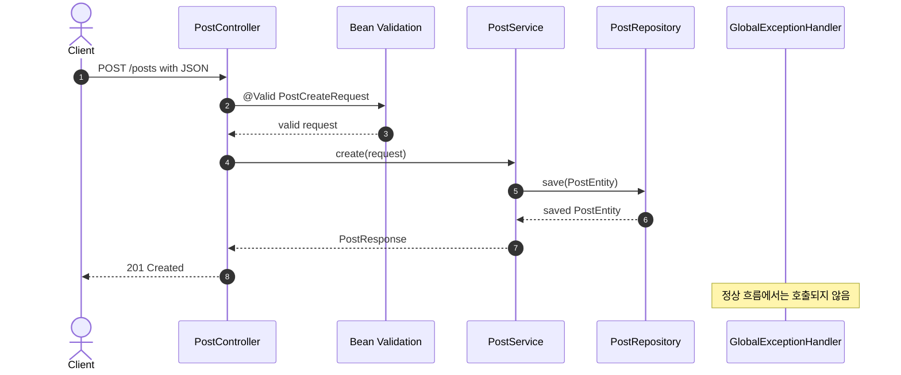
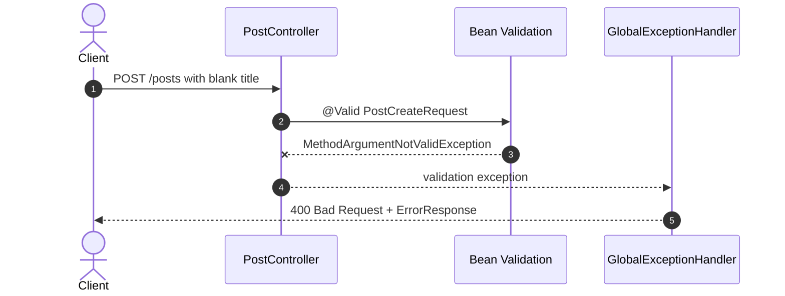

# 이론 정리

> 이번 시퀀스는 DB CRUD 위에 안전한 요청 처리 흐름을 붙입니다. 요청 DTO에서 기본 입력을 검증하고, Service에서 비즈니스 실패를 의미 있는 예외로 구분하며, `GlobalExceptionHandler`에서 실패 응답을 `ErrorResponse`로 통일합니다.

## 1. Problem - 왜 실패 흐름도 API 설계에 포함해야 하는가

성공 요청만 동작하는 CRUD는 실제 API로 보기 어렵습니다. 빈 제목, 빈 본문, 빈 작성자처럼 형식이 잘못된 요청은 저장 로직까지 들어가면 안 됩니다. 존재하지 않는 id 조회나 수정처럼 요청 형식은 맞지만 비즈니스 대상이 없는 경우도 정상 응답과 다르게 처리해야 합니다.

실패 응답이 요청마다 제각각이면 클라이언트는 실패 이유를 안정적으로 해석하기 어렵습니다. 이번 시퀀스에서는 성공 흐름과 실패 흐름을 함께 설계하고, 실패 응답을 같은 구조로 내려주는 기준을 만듭니다.

## 2. Analyze - 검증 실패와 비즈니스 예외를 어떻게 나눌 것인가

모든 검증을 Service 안의 조건문으로 처리하면 요청 형식 검증과 비즈니스 규칙 판단이 섞입니다. 반대로 DTO 검증만 믿으면 존재하지 않는 데이터처럼 저장소 조회가 필요한 실패를 표현하기 어렵습니다.

| 실패 종류 | 발생 위치 | 예시 | 응답 방향 |
|---|---|---|---|
| 요청 형식 검증 실패 | Controller 진입 직후 DTO validation | 빈 `title`, 빈 `content`, 빈 `author` | `400 Bad Request`와 필드별 오류 |
| 비즈니스 대상 없음 | Service가 Repository 조회 후 판단 | 존재하지 않는 게시글 id | `404 Not Found`와 도메인 오류 |
| 아직 다루지 않는 범위 | 이후 시퀀스 | 인증 실패, 권한 실패 | JWT/Security 단계에서 처리 |

이번 구현의 기준은 "요청 모양 문제는 DTO에서, 비즈니스 의미 문제는 Service에서, HTTP 응답 변환은 Handler에서"입니다.

## 3. API / 실행 시퀀스 다이어그램

### 3.1 정상 생성 요청 흐름



정상 요청은 DTO 검증을 통과한 뒤 Service로 들어갑니다. Controller는 request body를 `@Valid`와 함께 받는 입구이고, 저장 흐름은 Service와 Repository가 담당합니다.

### 3.2 Validation 실패 흐름



빈 문자열 같은 요청 형식 문제는 Service까지 들어가기 전에 막습니다. 이 흐름이 작동하려면 DTO 필드의 Bean Validation annotation과 Controller의 `@Valid`가 함께 필요합니다.

### 3.3 비즈니스 예외 흐름


게시글 없음은 요청 JSON 형식 문제가 아닙니다. Service가 Repository 조회 결과를 보고 도메인 의미가 드러나는 예외로 분리합니다.

## 4. 계층 / DTO / 메시지 흐름

### 4.1 계층 흐름

```mermaid
flowchart LR
    Client[Client or Swagger] --> Controller[PostController]
    Controller --> Validation[@Valid + Bean Validation]
    Validation --> RequestDTO[PostCreateRequest / PostUpdateRequest]
    RequestDTO --> Service[PostService]
    Service --> Repository[PostRepository]
    Repository --> DB[(DB)]
    Validation -. failure .-> Handler[GlobalExceptionHandler]
    Service -. PostNotFoundException .-> Handler
    Handler --> ErrorDTO[ErrorResponse]
    Service --> ResponseDTO[PostResponse]
    ResponseDTO --> Controller
    ErrorDTO --> Client
```

| 흐름 | 입력 | 처리 위치 | 출력 |
|---|---|---|---|
| 정상 생성/수정 | `PostCreateRequest`, `PostUpdateRequest` | DTO validation 통과 후 Service | `PostResponse` |
| Validation 실패 | 잘못된 request body | Bean Validation + `GlobalExceptionHandler` | `ErrorResponse(code, message, errors)` |
| 게시글 없음 | 존재하지 않는 id | Service + `PostNotFoundException` | `ErrorResponse(code, message)` |

### 4.2 DTO, Entity, ErrorResponse 구분

| 타입 | 책임 | 주의할 점 |
|---|---|---|
| Request DTO | 외부 요청값과 기본 검증 규칙을 담습니다. | Entity에 요청 검증을 몰아넣지 않습니다. |
| Entity | DB 저장 모델입니다. | API 요청/응답 계약으로 직접 쓰지 않습니다. |
| Response DTO | 정상 응답 모양을 담습니다. | 실패 응답과 섞지 않습니다. |
| ErrorResponse | 실패 응답의 공통 구조입니다. | 실패 종류와 필드별 오류를 구분할 수 있어야 합니다. |

DTO validation은 "요청 모양이 최소 조건을 만족하는가"를 봅니다. Service 예외는 "요청 모양은 통과했지만 처리 대상이나 규칙이 맞는가"를 봅니다.

## 5. Action - 구현에서 연결할 지점

### 5.1 Request DTO에 기본 검증을 둡니다

생성/수정 요청 DTO의 `title`, `content`, `author`는 빈 값이면 안 됩니다. 이번 단계에서는 `@NotBlank` 같은 기본 Bean Validation을 사용합니다.

확인 질문:

- 검증 annotation이 Entity가 아니라 Request DTO에 있나요?
- Kotlin non-null 타입과 Bean Validation의 역할 차이를 설명할 수 있나요?
- 빈 문자열 요청이 Service까지 들어가지 않나요?

### 5.2 Controller에서 `@Valid`를 연결합니다

DTO에 annotation이 있어도 Controller request body에 `@Valid`가 빠지면 검증이 실행되지 않을 수 있습니다. 요청 입구에서 검증이 시작되도록 연결해야 합니다.

확인 질문:

- 생성과 수정 요청 모두 `@Valid`를 사용하나요?
- 실패 요청이 `400 Bad Request`로 내려가나요?
- Swagger에서 정상 요청과 실패 요청을 모두 실행했나요?

### 5.3 Service에서 비즈니스 예외를 분리합니다

없는 게시글 조회/수정/삭제는 요청 형식 문제가 아니라 도메인 대상 없음입니다. Service에서 `PostNotFoundException`처럼 의미가 드러나는 예외로 구분합니다.

확인 질문:

- Repository 조회 결과가 비어 있을 때 어떤 예외를 던지나요?
- 검증 실패와 게시글 없음 실패의 HTTP status가 다르다는 점을 설명할 수 있나요?
- Service가 요청 DTO의 null 여부를 다시 검증하는 구조로 돌아가지 않았나요?

### 5.4 `GlobalExceptionHandler`에서 응답을 통일합니다

검증 실패와 비즈니스 예외는 원인이 다르지만, 클라이언트에게는 일정한 실패 응답 구조로 내려가야 합니다. `code`, `message`, `errors` 같은 공통 필드를 사용하면 실패 종류와 필드별 이유를 구분할 수 있습니다.

확인 질문:

- Validation 실패의 `errors`에 필드별 메시지가 들어가나요?
- 게시글 없음 실패는 별도 code와 message를 갖나요?
- Handler가 성공 응답 DTO와 실패 응답 DTO를 섞지 않나요?

## 6. Result - 무엇을 확인하고 어떤 한계가 남는가

이번 시퀀스를 마치면 다음을 확인합니다.

- `./gradlew test`가 통과합니다.
- 정상 생성/조회 요청이 기존 CRUD 흐름으로 동작합니다.
- 빈 `title`, `content`, `author` 요청이 `400` 실패 응답으로 내려갑니다.
- 존재하지 않는 id 요청이 게시글 없음 실패 응답으로 내려갑니다.
- `ErrorResponse`의 `code`, `message`, `errors` 구조를 설명할 수 있습니다.

남은 한계도 있습니다. 이번 시퀀스는 기본 Bean Validation과 도메인 예외 응답에 집중합니다. 인증 실패, 권한 실패, JWT 토큰 오류, 커스텀 Validation 심화는 직접 구현하지 않습니다.

## 7. 실무 포인트

- 요청 검증은 가능한 한 API 경계에서 시작해야 저장 로직이 불필요한 입력을 받지 않습니다.
- Kotlin non-null은 null 가능성을 줄이지만 빈 문자열이나 길이 같은 규칙까지 대신하지는 않습니다.
- Entity는 DB 모델이므로 외부 요청 검증 규칙을 몰아넣으면 API 계약과 DB 구조가 섞입니다.
- 실패 응답 code는 클라이언트가 분기 처리할 수 있는 안정적인 값이어야 합니다.
- 정상 요청만 Swagger로 확인하지 말고 실패 요청을 함께 실행해야 API 안정성을 설명할 수 있습니다.

## 8. 용어 정리

`Bean Validation`
: annotation을 사용해 요청값의 기본 조건을 검사하는 검증 방식입니다.

`@Valid`
: Controller에서 DTO validation을 실행하도록 연결하는 annotation입니다.

`@NotBlank`
: 문자열이 null이 아니고 공백만으로 구성되지 않도록 검사하는 annotation입니다.

`Request DTO`
: 외부 요청 body를 받는 타입입니다. 이번 시퀀스에서는 검증 규칙을 함께 둡니다.

`Entity`
: DB 테이블과 연결되는 내부 저장 모델입니다.

`Business Exception`
: 요청 형식은 맞지만 서비스 규칙이나 대상 상태가 맞지 않을 때 던지는 예외입니다.

`GlobalExceptionHandler`
: 예외를 HTTP 실패 응답으로 바꾸는 공통 처리 계층입니다.

`ErrorResponse`
: 실패 응답의 공통 DTO입니다.

`MethodArgumentNotValidException`
: Spring MVC에서 `@Valid` 검증 실패 시 발생하는 예외입니다.

`HTTP 400`
: 요청 형식이나 입력값이 잘못되었음을 나타내는 상태 코드입니다.

`HTTP 404`
: 요청 대상 리소스를 찾을 수 없음을 나타내는 상태 코드입니다.

## 9. 다음 구현으로 연결되는 지점

다음 시퀀스에서는 회원가입, 로그인, JWT 발급, 보호 API 흐름을 다룹니다. 이번 단계에서 요청 검증과 실패 응답 구조를 통일해 두면 인증 실패와 보호 API 실패도 같은 관점으로 읽을 수 있습니다.

<details>
<summary>멘토용 설명 포인트</summary>

- 멘티가 Validation을 Service 조건문으로만 이해하면 요청 초입에서 막는 흐름으로 되돌립니다.
- 힌트는 DTO annotation, Controller `@Valid`, Service 예외, ExceptionHandler 순서로 제공합니다.
- 커스텀 Validation은 이번 직접 구현 범위 밖으로 두고, 기본 검증으로 막기 어려운 규칙이 생길 때 확장한다고 설명합니다.
- 실패 요청을 Swagger에서 직접 보내게 하고 status code와 `ErrorResponse`를 같이 읽게 합니다.

</details>
