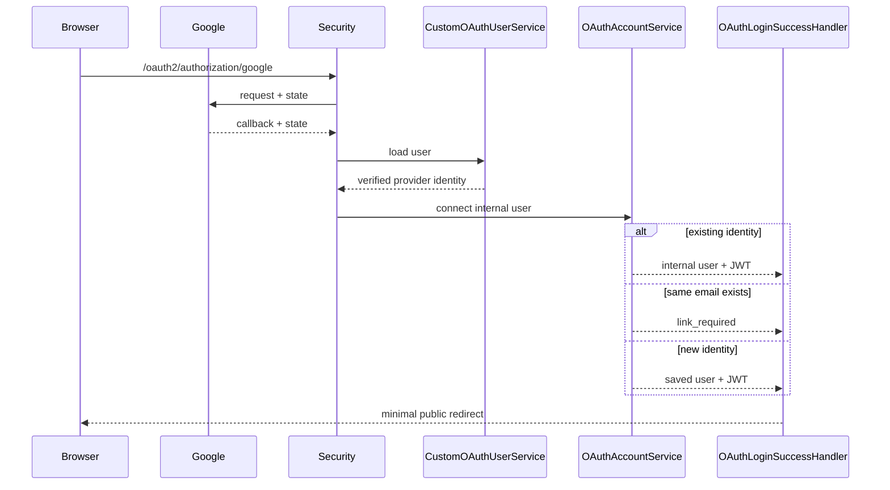
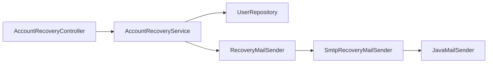

# 이론 정리

> 외부 인증 결과와 메일 발송 요청을 내부 사용자, JWT, 공개 응답 정책 안으로 안전하게 연결하는 기준을 다룹니다.

## 1. Problem - 외부 성공을 그대로 사용할 수 없는 이유

Google 인증이 성공해도 우리 서비스는 내부 사용자를 식별하고 자체 JWT를 발급해야 합니다. 복구 메일 요청도 내부 결과가 달라졌다는 이유로 계정 존재나 인증 방식을 외부에 드러내면 안 됩니다.

이번 시퀀스는 다음 경계를 분리합니다.

- Google 사용자 정보 검증 / 내부 계정 연결
- OAuth 외부 인증 / 우리 API JWT
- OAuth `state` 임시 저장 / API session 인증
- 계정 복구 정책 / SMTP 구현
- 자동 정책 테스트 / 실제 외부 연결 검증
- demo reset link / 실제 비밀번호 변경

## 2. OAuth 사용자 식별

| 값 | 역할 |
|---|---|
| `provider` | 외부 제공자를 구분합니다. |
| `providerId` | 제공자 안의 고유 사용자 ID이며 Google `sub`를 사용합니다. |
| `email` | 내부 계정 충돌을 확인합니다. |
| `emailVerified` | `true`인 email만 내부 판단에 사용합니다. |

판단 순서:

1. profile의 필수 값, 길이, verified 여부를 검증하고 정규화합니다.
2. `provider + providerId`로 기존 OAuth 사용자를 찾습니다.
3. 기존 사용자는 DB의 내부 email을 유지합니다.
4. 기존 identity가 없고 같은 email 계정이 있으면 자동 연결하지 않습니다.
5. 충돌이 없을 때만 신규 사용자를 저장하고 DB unique 제약으로 저장 경쟁을 막습니다.

같은 email의 LOCAL 계정은 외부 인증 결과만으로 소유권과 연결 동의를 증명할 수 없으므로 `link_required`로 끝냅니다.

기존 OAuth 사용자의 provider email도 자동 갱신하지 않습니다. 내부 email은 현재 JWT subject와 게시글 작성자 식별값이므로 변경하려면 별도 소유 확인, 충돌 검사, 데이터 migration이 필요합니다.

## 3. OAuth 흐름



실패와 연결 필요 redirect에는 provider 원본 오류, 내부 예외, email, token을 넣지 않습니다.

## 4. STATELESS API와 임시 OAuth session

`SessionCreationPolicy.STATELESS`는 보호 API가 HTTP session Authentication을 사용하지 않는다는 뜻입니다. 신원은 매 요청의 Bearer JWT로 만듭니다.

OAuth 시작과 callback은 같은 흐름인지 `state`로 확인해야 하므로 OAuth client의 authorization-request 저장소가 짧은 session을 사용할 수 있습니다. 이 임시 session은 보호 API 권한이 아닙니다. OAuth 과정의 session만으로 `/auth/me`에 접근할 수 없어야 합니다.

## 5. fragment 데모 경계

성공 Handler는 데모 JWT를 query가 아니라 fragment에 둡니다.

```text
/auth-practice/index.html?oauth=success#access_token=<demo-token>
```

fragment는 서버 request target에 포함되지 않아 일반적인 access log와 referrer 전달 범위를 줄이지만 브라우저 JavaScript는 읽을 수 있습니다. 현재 화면은 fragment를 자동 소비하지 않습니다. 학생은 주소에서 로컬 token을 수동으로 복사해 curl 또는 Postman의 Bearer 요청으로 `/auth/me`를 확인하고 URL을 직접 지웁니다.

운영에서는 일회용 code 교환 또는 HttpOnly cookie를 검토하고, cookie를 쓰면 CSRF 정책도 다시 설계합니다.

## 6. 계정 복구 공개 정책

형식이 유효한 `POST /account-recovery/password-reset`은 다음 경우 모두 같은 202를 반환합니다.

- 계정이 없음
- LOCAL 계정이 있음
- OAuth 계정이 있음
- SMTP 발송이 실패함

요청 형식이 잘못됐거나 email이 254자를 넘으면 400입니다.

OAuth 계정에는 사용자가 입력한 로컬 비밀번호가 없으므로 `LOCAL` 계정에만 메일을 보냅니다. 외부 응답은 계정 존재와 provider 종류를 구분하지 않습니다.



Service는 email 정규화, LOCAL 판단, demo link 생성과 발송 실패 비노출을 담당합니다. SMTP adapter는 발신자·수신자·제목·본문과 외부 호출만 담당합니다.

## 7. reset link의 한계

현재 link는 email 없이 불투명 demo token만 포함합니다. 다음 기능은 없습니다.

- token 저장과 hash
- 사용자 매핑
- 만료 검증
- 일회성 사용과 재사용 차단
- 새 password 검증과 변경
- 요청 rate limit

따라서 메일 요청 흐름을 확인했을 뿐 실제 비밀번호 재설정을 완성한 것이 아닙니다. token, email, link, credential, SMTP 내부 오류는 로그나 응답에 남기지 않습니다.

## 8. 검증 경계

자동 테스트:

- OAuth 필수 값과 verified email
- provider identity, email 충돌, 내부 email 안정성
- unique 저장 경쟁과 자체 JWT
- redirect의 fragment/no-store/비노출
- 임시 OAuth session과 보호 API 경계
- LOCAL-only recovery, 같은 202, SMTP 실패 비노출
- sender 메시지와 최신 04 회귀

외부 수동 검증:

- 실제 Google consent와 callback URI
- 실제 SMTP 인증, TLS, 발신자 정책과 수신함 도착

자동 테스트는 외부 서버에 접속하지 않습니다. 단위 테스트 통과와 실제 provider 연결 성공을 서로 대신하지 않습니다.

## 9. 완료 후 설명할 수 있어야 하는 것

- providerId와 verified email의 역할 차이
- LOCAL 동일 email을 자동 연결하지 않는 이유
- 내부 email을 안정적으로 유지하는 이유
- OAuth state session과 STATELESS API의 차이
- fragment 전달이 수동 관찰용 데모인 이유
- 복구 요청이 같은 202를 반환하는 이유
- LOCAL-only recovery와 `RecoveryMailSender` 분리
- demo token으로 실제 비밀번호를 바꿀 수 없는 이유

<details>
<summary>멘토용 설명 포인트</summary>

- email 동일성과 계정 소유권이 같은 개념인지 질문합니다.
- 외부 email 자동 변경이 JWT subject와 ownership에 미칠 영향을 묻습니다.
- STATELESS를 이유로 OAuth state 검증까지 제거하지 않게 합니다.
- SMTP 성공보다 202 비노출과 LOCAL-only 정책을 먼저 설명하게 합니다.

</details>
