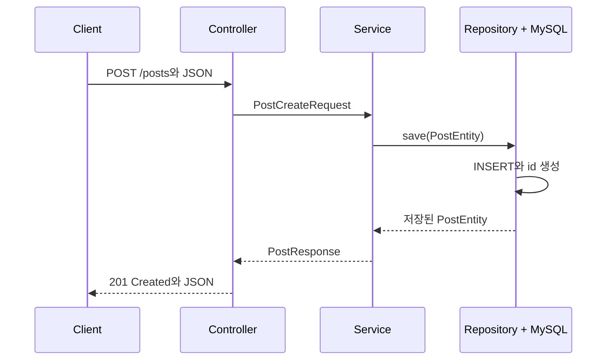
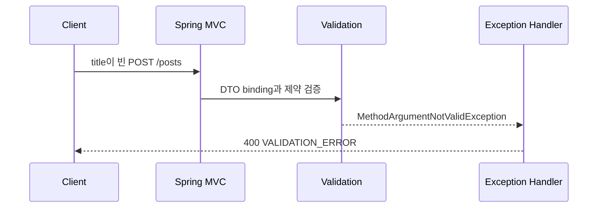
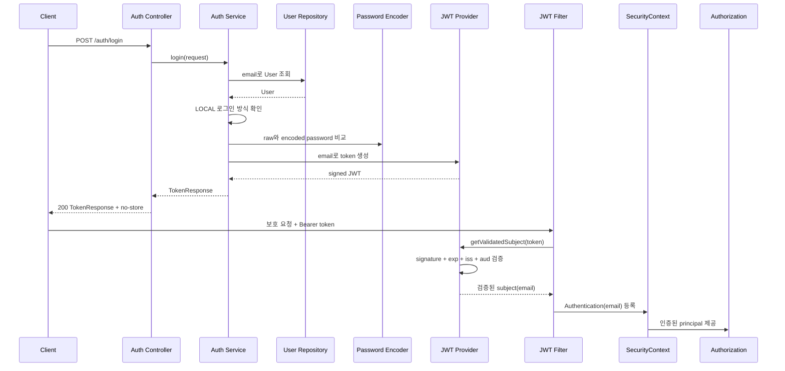
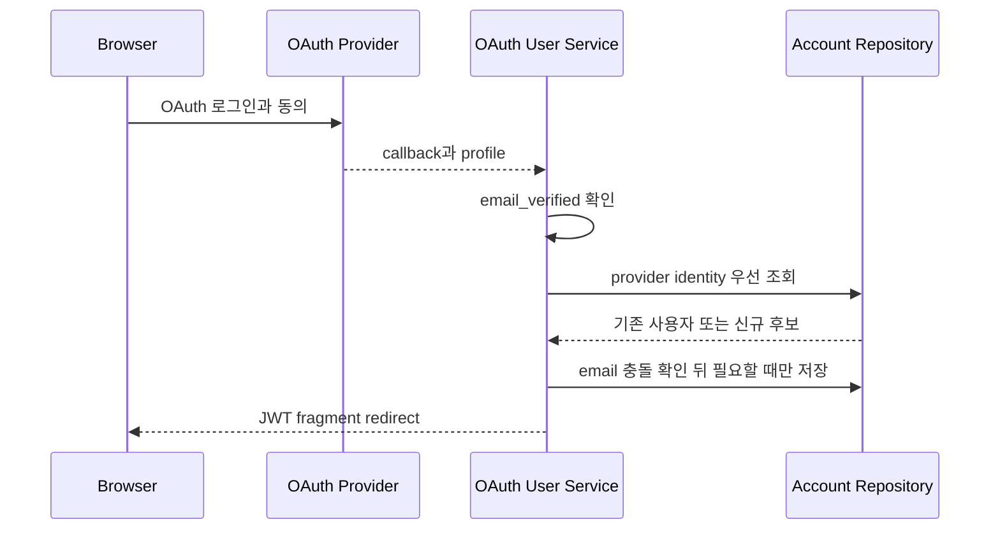
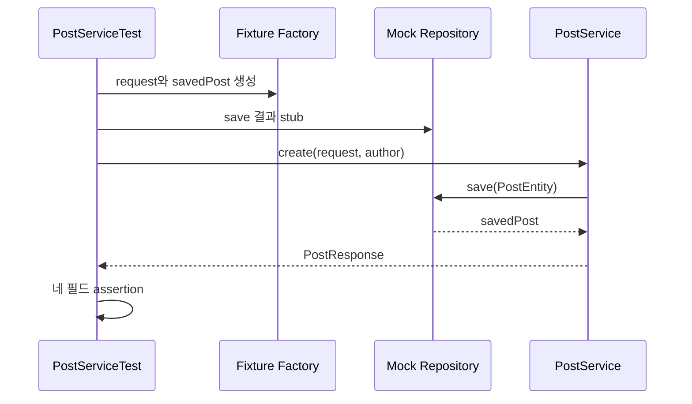

# DB Access, 요청 안전성, 인증, 테스트 이론 정리

## 1. 저장과 인증 흐름은 왜 한 번에 무너지기 쉬울까?

메모리 CRUD는 서버를 재시작하면 데이터가 사라집니다.
DB를 붙이면 데이터는 남지만 Entity, Repository, transaction, 예외 처리, 인증 사용자 같은 새 책임이 함께 생깁니다.

요청 검증 없이 DB까지 내려가면 잘못된 값이 저장될 수 있습니다.
로그인 없이 보호 API를 열어 두면 누가 쓴 글인지 구분할 수 없습니다.
테스트 없이 기능을 이어 붙이면 정상 케이스와 실패 케이스가 섞여 어디가 깨졌는지 찾기 어렵습니다.

## 2. 02~06에서 어떤 책임이 차례로 쌓일까?

이 레포는 하나의 흐름을 단계별로 키웁니다.

1. `02`: Repository와 Entity로 DB 저장을 붙입니다.
2. `03`: DTO Validation과 `GlobalExceptionHandler`로 잘못된 요청을 정리합니다.
3. `04`: 로그인 요청에서 JWT를 발급하고 보호 API에서 검증합니다.
4. `05`: 외부 인증과 계정 복구를 별도 책임으로 분리합니다.
5. `06`: fixture와 mock으로 정상/실패 케이스를 재현합니다.

## 3. 한 요청의 경계를 따라 책임을 분리합니다

저장 흐름은 `Controller -> Service -> Repository -> Entity`로 둡니다.
요청 검증은 DTO에서 먼저 막고, 실패 응답은 전역 예외 처리에서 통일합니다.
인증은 로그인 성공 시 token을 발급하고, 보호 API 요청에서 token을 다시 읽어 현재 사용자를 구분합니다.
테스트는 Service 단위에서 Repository 결과만 mock으로 고정합니다. `AuthServiceTest`는 실제 `BCryptPasswordEncoder`와 `JwtTokenProvider`를 사용하므로 password와 token 규칙도 함께 실행됩니다.

<a id="seq-02"></a>
## 4. Sequence 02: 요청 데이터를 DB row로 남기기

메모리 저장과 달리 DB 저장은 `PostEntity`가 Repository를 거쳐 row가 되는 지점을 확인해야 합니다.
생성 응답의 id는 요청이 정한 값이 아니라 DB 저장 뒤 확정된 식별자이며, 조회는 그 row를 다시 Entity와 응답 DTO로 복원합니다.



| 단계 | 들어온 것 | 한 일 | 나간 것 또는 상태 |
| --- | --- | --- | --- |
| 1 | 생성 JSON | Controller가 요청 DTO로 binding | `PostCreateRequest` |
| 2 | 요청 DTO | Service가 `PostEntity`를 구성 | 저장 전 Entity |
| 3 | Entity | Repository가 `INSERT` 실행 | DB에 게시글 row 생성 |
| 4 | 생성된 row | DB가 id를 포함한 Entity 상태를 반환 | 저장된 `PostEntity` |
| 5 | 저장된 Entity | 응답 DTO로 변환 | `201 Created`와 `PostResponse` |

```kotlin
// 02의 생성 요청 값만 Entity로 옮겨 Repository에 저장합니다.
val savedPost = postRepository.save(
    PostEntity(
        title = request.title,
        content = request.content,
        author = request.author
    )
)
return PostResponse.from(savedPost)
```

요청 데이터는 메서드가 끝나면 사라지는 값에서 재시작 뒤에도 조회할 수 있는 DB row로 바뀝니다.

[Visual Lab에서 입력 조건을 보고 경로 예측하기](./visual-lab/sequences/02/)

<a id="seq-03"></a>
## 5. Sequence 03: 실패를 저장 전에 막고 같은 응답 계약으로 돌려주기

Validation 실패는 Service나 DB에 도달하기 전에 `400 Bad Request`로 끝납니다.
형식은 유효하지만 id에 해당하는 row가 없으면 Repository 조회 뒤 `PostNotFoundException`이 발생하고 `404 Not Found`가 됩니다.
따라서 status만 보지 말고 실패가 binding 경계인지 조회 경계인지 함께 찾아야 합니다.



| 단계 | 들어온 것 | 한 일 | 나간 것 또는 상태 |
| --- | --- | --- | --- |
| 1 | 빈 `title`의 JSON | Spring MVC가 `@RequestBody`로 DTO binding | 검증 전 `PostCreateRequest` |
| 2 | 요청 DTO | `@NotBlank` 제약 확인 | Validation 실패 |
| 3 | field error | 전역 handler가 오류 구조로 변환 | `VALIDATION_ERROR` |
| 4 | `ErrorResponse` | HTTP 상태와 함께 반환 | `400 Bad Request`, DB 변경 없음 |

이 실패는 Controller method 본문과 Service에 도달하기 전에 Spring MVC의 Bean Validation 경계에서 끝납니다.

```kotlin
// 제목, 본문, 작성자 중 빈 값은 Service 호출 전에 Validation에서 거절합니다.
data class PostCreateRequest(
    @field:NotBlank(message = "title은 비어 있을 수 없습니다.") val title: String,
    @field:NotBlank(message = "content는 비어 있을 수 없습니다.") val content: String,
    @field:NotBlank(message = "author는 비어 있을 수 없습니다.") val author: String
)
```

빈 문자열 요청은 저장 후보에서 field error를 가진 `400` 응답 상태로 바뀌며 DB row는 생성되지 않습니다.

[Visual Lab에서 입력 조건을 보고 경로 예측하기](./visual-lab/sequences/03/)

<a id="seq-04"></a>
## 6. Sequence 04: 로그인 증명을 다음 보호 요청의 현재 사용자로 연결하기

회원가입은 LOCAL 계정을 만드는 경로이고 로그인은 이미 저장된 LOCAL 계정의 email과 password를 확인하는 별도 경로입니다. 로그인 판정과 token 발급은 `AuthService`가 수동으로 처리하고, 이후 HTTP 요청의 인증·인가는 Spring Security filter chain이 처리합니다.
다음 보호 요청은 `Authorization: Bearer ...` header를 다시 검증해 `SecurityContext`에 email 기반 Authentication을 넣습니다.
header가 없거나 token이 유효하지 않으면 filter는 Authentication 없이 chain을 계속합니다. 공개 GET은 현재 정책대로 실행될 수 있지만, 보호 API는 인가 단계가 거절해 entry point가 `WWW-Authenticate: Bearer`를 포함한 `401`을 씁니다. 인증은 됐지만 작성자가 다르면 Service의 작성자 gate가 DB 변경 전에 `403` 흐름으로 보냅니다.

Authentication은 요청한 사용자가 누구인지 확인하는 단계입니다. Authorization은 확인된 사용자가 해당 endpoint나 게시글에 접근할 수 있는지 판단하는 단계입니다.



| 단계 | 들어온 것 | 한 일 | 나간 것 또는 상태 |
| --- | --- | --- | --- |
| 1 | email과 password | Auth Service로 로그인 요청 전달 | `LoginRequest` |
| 2 | email | 저장된 사용자를 조회 | User 또는 인증 실패 |
| 3 | raw/encoded password | `matches` 결과를 판정 | 일치하면 token 단계 진행 |
| 4 | 사용자 email | JWT를 생성 | 서명된 access token |
| 5 | `TokenResponse` | HTTP 응답으로 반환 | `200 OK`와 access token |
| 6 | 다음 요청의 Bearer token | filter가 검증 후 Authentication 등록 | 보호 API가 읽을 현재 사용자 |

```kotlin
// email은 Locale.ROOT로 소문자 정규화하고 password 원문은 trim하지 않습니다.
val email = request.email.lowercase(Locale.ROOT)
val rawPassword = request.password
val user = userRepository.findByEmail(email)
        .orElseThrow { InvalidCredentialsException() }
if (user.authProvider != AuthProvider.LOCAL) {
    throw InvalidCredentialsException()
}
if (!passwordEncoder.matches(rawPassword, user.password)) {
    throw InvalidCredentialsException()
}
return TokenResponse(
    accessToken = jwtTokenProvider.createToken(user.email),
    expiresIn = jwtTokenProvider.expirationSeconds
)
```

검증되지 않은 자격 증명은 token이 없는 실패 상태로, email 조회와 password 비교를 통과한 자격 증명은 다음 요청에 제시할 access token으로 바뀝니다.

```kotlin
// JWT는 한 번 파싱하고 검증된 subject가 있을 때만 새 context를 만듭니다.
if (SecurityContextHolder.getContext().authentication == null) {
    resolveToken(request)
        ?.let(jwtTokenProvider::getValidatedSubject)
        ?.let { email -> setAuthentication(request, email) }
}
```

유효한 token이 있으면 비어 있던 요청 인증 상태가 email을 가진 Authentication으로 바뀌고, token이 없으면 비어 있는 상태로 인가 단계에 전달됩니다.

현재 04 흐름은 Access Token only입니다. Refresh Token과 Redis 기반 token 저장·회수는 이번 범위 밖입니다. subject=email과 빈 authorities는 교육용 단순화이며, 운영에서는 불변 userId와 별도 권한 정책을 권장합니다. JWT payload는 암호화된 비밀 영역이 아니므로 민감 정보를 넣지 않습니다. 브라우저 쿠키 저장으로 바꾸면 CSRF 정책을 다시 검토해야 합니다.

`JWT_SECRET`은 환경 변수로 주입하고 UTF-8 기준 32바이트 이상이어야 합니다. 발급과 검증은 HS256, issuer, audience, issuedAt, expiration을 같은 계약으로 확인합니다. single-key 구조에서 secret, issuer 또는 audience를 바꾸면 기존 토큰은 모두 401이 되며, 개별 access token을 즉시 회수하는 저장소는 이번 범위에 없습니다.

[Visual Lab에서 입력 조건을 보고 경로 예측하기](./visual-lab/sequences/04/)

<a id="seq-05"></a>
## 7. Sequence 05: 외부 프로필을 내부 계정으로 받아들이는 경계

현재 `05-implementation`과 `05-answer`는 같은 완성 코드와 설명 주석을 사용합니다. `normalizePrincipal`, `handleOAuthLogin`, `onAuthenticationSuccess`, `requestPasswordReset`, `confirmPasswordReset`, `sendPasswordResetMail` 순서로 외부 profile부터 메일 adapter까지 실행 경계를 읽고 검증합니다.

외부 프로필의 email은 `email_verified=true`인 경우만 내부 식별 후보가 됩니다. 기존 외부 사용자는 `provider + providerId`로 찾고 DB에 저장된 내부 email을 유지합니다. 같은 email의 LOCAL 또는 다른 외부 계정이 있으면 소유 확인 없이 자동 연결하지 않고 `link_required`로 중단합니다. 성공한 경우에만 우리 API용 JWT를 발급해 URL fragment로 전달하며, 실습 화면은 token을 메모리로 옮긴 직후 URL을 지웁니다.



| 단계 | 들어온 것 | 한 일 | 나간 것 또는 상태 |
| --- | --- | --- | --- |
| 1 | 사용자 동의 | provider가 인증 | callback profile |
| 2 | 외부 profile | `email_verified`를 gate로 확인 | 신뢰 가능한 email 또는 로그인 중단 |
| 3 | 검증된 profile | provider identity 우선 조회 | 기존 사용자 또는 신규 후보 |
| 4 | 신규 후보 | email 충돌 확인 뒤 내부 계정 저장 | 내부 OAuth 사용자 또는 `link_required` |
| 5 | 내부 사용자 | 데모 token을 fragment에 담아 redirect | browser가 읽을 로그인 결과 |

계정 복구는 단순한 link 생성이 아닙니다. LOCAL 사용자를 lock으로 읽고 32-byte 난수 raw token을 Base64URL로 만들지만, DB에는 SHA-256 hash만 저장합니다. 사용자당 한 행을 회전해 이전 token을 무효화하고 기본 15분 만료·1분 재요청 제한을 적용합니다. 확정 요청은 token hash와 사용자 상태를 다시 lock으로 확인한 뒤 BCrypt 비밀번호 변경과 `usedAt` 기록을 같은 transaction에서 commit합니다.

```kotlin
val rawToken = tokenCodec.generateRawToken()
val tokenHash = tokenCodec.hash(rawToken)
val expiresAt = now.plus(tokenTtl)
existingToken.rotate(tokenHash, now, expiresAt)
```

복구 요청은 token transaction을 먼저 commit하고 같은 HTTP request thread에서 실제 SMTP 호출을 기다립니다. SMTP 서버가 요청을 수락하면 no-store `200 RECOVERY_MAIL_SENT`, reset 가능한 LOCAL 계정이 없으면 `422`, cooldown이면 `Retry-After`가 있는 `429`, 인증 또는 전송 실패면 `424`를 반환합니다. SMTP 실패 시 별도 transaction이 `id + tokenHash + usedAt is null` 조건으로 이번 요청의 token만 정리합니다.

`200`은 SMTP 서버의 요청 수락 범위이며 받은 편지함 도착이나 반송 없음까지 증명하지 않습니다. `422/429` 구분은 계정 상태를 추측하게 만들 수 있으므로 실패 경계를 관찰하는 실습용 계약이며 공개 운영 API에 그대로 적용하지 않습니다. 자동 테스트는 이 내부 계약을 외부 네트워크 없이 확인하지만 실제 Google callback과 Gmail 수신은 credential이 필요한 수동 E2E입니다.

[Visual Lab에서 입력 조건을 보고 경로 예측하기](./visual-lab/sequences/05/)

<a id="seq-06"></a>
## 8. Sequence 06: 테스트가 고정한 조건과 실제로 증명한 결과 구분하기

Service 단위 테스트는 fixture로 입력을 만들고 Repository 결과를 stub한 뒤, 반환값이나 예외를 assertion합니다.
`PostServiceTest`의 생성 테스트는 id, title, content, author를 확인하지만 `save` 호출 횟수까지 검증하지는 않습니다.
`AuthServiceTest`는 `UserRepository`만 mock으로 두고 실제 `BCryptPasswordEncoder`와 `JwtTokenProvider`를 사용합니다. 반면 HTTP `400/401/403` 응답은 이 Service 테스트의 직접 증거가 아니므로 별도 통합 테스트가 필요합니다.



| 단계 | 들어온 것 | 한 일 | 나간 것 또는 상태 |
| --- | --- | --- | --- |
| 1 | fixture 기본값 | 요청과 저장 결과를 구성 | 재현 가능한 test data |
| 2 | 저장될 Entity | mock Repository 반환값을 고정 | `savedPost` stub |
| 3 | request와 author | 실제 Service `create` 실행 | Repository 호출과 DTO 변환 |
| 4 | `savedPost` | Service가 응답으로 변환 | `PostResponse` |
| 5 | 응답 | id, title, content, author 비교 | 성공 조건 통과 또는 실패 위치 |

```kotlin
// 생성 결과의 식별자와 세 입력 필드가 응답에 보존됐는지 확인합니다.
val result = postService.create(request, "owner@example.com")
assertEquals(1L, result.id)
assertEquals(request.title, result.title)
assertEquals(request.content, result.content)
assertEquals("owner@example.com", result.author)
```

Service 실행 전에는 기대값이 가설이지만, assertion이 통과하면 주어진 stub 조건에서 네 필드가 보존됐다는 테스트 근거가 됩니다.

[Visual Lab에서 입력 조건을 보고 경로 예측하기](./visual-lab/sequences/06/)

## 9. 06 답안 테스트가 직접 확인하는 것은 무엇일까?

로컬 실행은 DB가 필요하므로 의존 서비스를 먼저 띄웁니다.

```bash
docker compose up -d
./gradlew test
```

06 답안의 Service 테스트는 다음 네 경우를 확인합니다.

- 게시글 생성 성공: `create(request, "owner@example.com")` 결과의 id, title, content, author
- 없는 게시글 조회: `findById(999L)`가 비어 있을 때 `PostNotFoundException`
- 로그인 성공: 올바른 password로 실제 JWT 발급
- 로그인 실패: `wrong-password`일 때 `InvalidCredentialsException`

HTTP `400/401/403` 응답은 이 단위 테스트만으로 증명되지 않습니다.

## 10. 이 테스트 범위 밖에는 무엇이 남을까?

이 레포는 DB, Validation, JWT, 외부 인증, 테스트를 한 흐름으로 묶어 보여줍니다.
하지만 Redis 캐시, WebSocket, 배포 자동화는 별도 레포에서 다룹니다.
DB 조회가 반복되어 느려지는 문제는 다음 Redis Cache 시퀀스에서 cache-aside 흐름으로 이어집니다.
