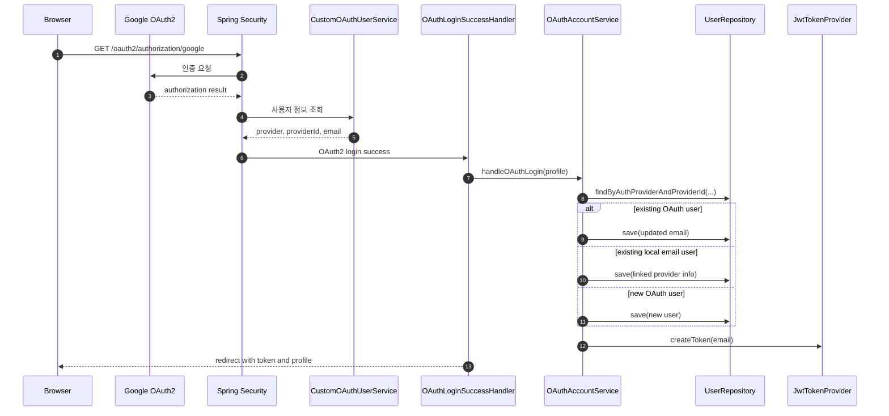
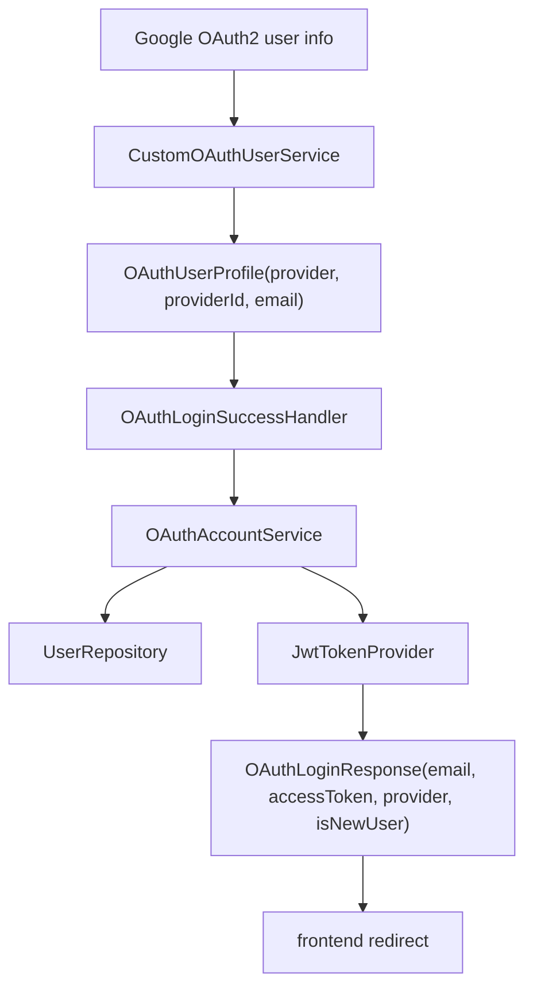
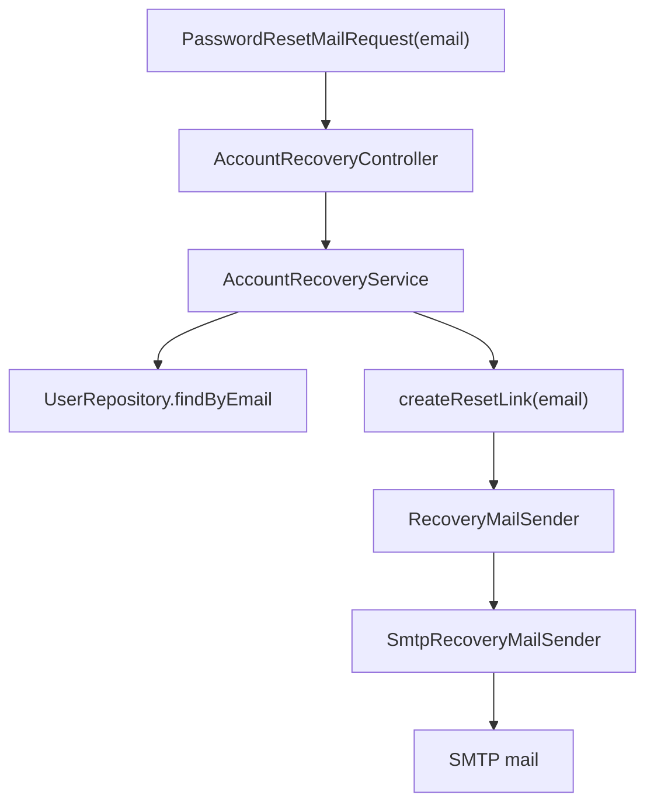

# 이론 정리

> 이번 시퀀스는 기존 JWT 인증 흐름 위에 Google OAuth2 로그인과 SMTP 기반 비밀번호 재설정 메일 요청을 붙여 보는 단계입니다.
> 이 브랜치에서는 외부 인증 결과를 내부 사용자와 연결하고, 계정 복구 메일 요청을 안전하게 처리한 구현을 기준으로 흐름을 비교합니다.

## 1. Problem - 왜 외부 인증과 계정 복구가 필요한가

자체 회원가입과 로그인만 있으면 서비스가 모든 인증 책임을 직접 처리합니다. 실제 서비스에서는 사용자가 Google 계정으로 로그인하거나, 비밀번호를 잊었을 때 복구 메일을 요청하는 흐름이 함께 필요합니다.

문제는 OAuth2와 SMTP를 붙이는 것만으로 끝나지 않는다는 점입니다.

- Google 로그인 성공 결과를 우리 서비스 사용자와 연결해야 합니다.
- OAuth2 성공 후에도 우리 API 요청을 위한 자체 JWT가 필요합니다.
- 같은 email의 로컬 사용자와 OAuth 사용자가 충돌할 수 있습니다.
- 계정 복구 요청은 계정 존재 여부와 reset link를 민감하게 다뤄야 합니다.
- SMTP 세부 구현이 service 로직에 직접 섞이면 테스트와 교체가 어려워집니다.

## 2. Analyze - 정답 구현에서 선택한 기준

### 2.1 OAuth2 계정 연결 기준

정답 구현은 OAuth2 성공 후 사용자를 아래 순서로 판단합니다.

| 우선순위 | 판단 기준 | 의도 |
|---:|---|---|
| 1 | `provider + providerId`가 이미 있는가 | 같은 외부 사용자의 재로그인을 처리합니다. |
| 2 | 같은 `email`의 기존 로컬 사용자가 있는가 | 로컬 계정을 OAuth 계정과 연결합니다. |
| 3 | 둘 다 없는가 | 신규 OAuth 사용자를 생성합니다. |

이 기준은 `email`만으로 외부 사용자를 식별하지 않고, 외부 제공자의 고유 식별자인 `providerId`를 함께 사용합니다. 동시에 같은 email의 로컬 사용자를 완전히 무시하지 않아 계정이 중복 생성되는 위험을 줄입니다.

### 2.2 SMTP 계정 복구 기준

정답 구현은 계정 복구 메일 요청에서 아래 기준을 둡니다.

| 기준 | 의도 |
|---|---|
| 존재하지 않는 email은 외부에 자세히 드러내지 않습니다. | 계정 존재 여부 추측을 줄입니다. |
| reset link 생성과 메일 발송을 분리합니다. | 계정 복구 정책과 SMTP 구현 책임을 나눕니다. |
| `RecoveryMailSender` 인터페이스에 의존합니다. | 테스트와 구현 교체가 가능해집니다. |
| token과 SMTP password를 민감정보로 봅니다. | 로그, 응답, 문서 노출을 줄입니다. |

## 3. API / 실행 시퀀스 다이어그램

### 3.1 Google OAuth2 로그인 흐름

이 흐름에서 `CustomOAuthUserService`는 외부 사용자 정보를 읽고, `OAuthAccountService`는 내부 사용자 연결 정책을 결정합니다. `OAuthLoginSuccessHandler`는 성공 결과를 프론트 redirect로 정리하는 역할에 집중합니다.

### 3.2 비밀번호 재설정 메일 요청 흐름

정답 구현은 계정이 없을 때도 외부로 과한 오류를 드러내지 않는 방향을 택합니다. 계정 복구 API는 편의 기능처럼 보여도 인증 표면에 가까우므로 응답 차이를 조심해야 합니다.

## 4. 계층 / DTO / 메시지 흐름

### 4.1 OAuth2 계층 흐름

| 계층 | 정답 구현에서 확인할 책임 | 주요 파일 |
|---|---|---|
| Security | Google 응답을 읽고 성공 이벤트를 처리합니다. | `CustomOAuthUserService.kt`, `OAuthLoginSuccessHandler.kt` |
| Service | 외부 사용자와 내부 사용자를 연결하고 JWT 응답을 만듭니다. | `OAuthAccountService.kt` |
| Repository | `provider + providerId`, `email` 기준 조회를 제공합니다. | `UserRepository.kt` |
| DTO | OAuth profile과 로그인 응답을 명시적으로 분리합니다. | `OAuthUserProfile.kt`, `OAuthLoginResponse.kt` |

### 4.2 SMTP 계정 복구 흐름

| 계층 | 정답 구현에서 확인할 책임 | 주요 파일 |
|---|---|---|
| Controller | 요청 DTO를 받고 service로 전달합니다. | `AccountRecoveryController.kt` |
| Service | 사용자 조회, reset link 생성, 발송 요청을 조합합니다. | `AccountRecoveryService.kt` |
| Port | 메일 발송 책임을 인터페이스로 표현합니다. | `RecoveryMailSender.kt` |
| Adapter | `JavaMailSender`를 사용해 실제 메일을 보냅니다. | `SmtpRecoveryMailSender.kt` |
| DTO | 사용자가 보낸 email 값을 담습니다. | `PasswordResetMailRequest.kt` |

## 5. Action - 정답 구현에서 비교할 코드 흐름

### 5.1 OAuth2 사용자 정보 읽기

`CustomOAuthUserService.kt`는 기본 OAuth2 사용자 정보를 읽은 뒤 Google 응답의 `email`과 `sub`를 확인합니다. 이후 Handler와 Service가 같은 이름으로 읽을 수 있도록 `provider`, `providerId`, `email` 속성을 다시 담습니다.

비교 포인트:

- `sub`를 `providerId`로 보존했는가
- email이 없는 응답을 실패로 다루는가
- provider 이름을 내부 정책에서 일관되게 사용할 수 있게 정리했는가

### 5.2 내부 사용자 연결 정책

`OAuthAccountService.kt`는 정답 구현의 핵심입니다. 여기서는 단순 신규 생성이 아니라 재로그인, 로컬 계정 연결, 신규 OAuth 사용자 생성이 분리됩니다.

비교 포인트:

- 같은 `provider + providerId` 사용자를 먼저 찾는가
- 없을 때 같은 email의 기존 사용자를 연결하는가
- 둘 다 없을 때만 신규 사용자를 만드는가
- 마지막 응답은 우리 서비스 JWT를 포함하는가

### 5.3 계정 복구 메일 요청

`AccountRecoveryService.kt`는 email 기준으로 사용자를 찾고 reset link를 만든 뒤 `RecoveryMailSender`에 발송을 맡깁니다. 존재하지 않는 email 요청은 외부에 구체적인 실패 이유를 드러내지 않는 방향으로 처리합니다.

비교 포인트:

- 계정이 없을 때 응답 차이가 과하게 드러나지 않는가
- reset link 생성 책임이 service 안에서 설명 가능한가
- `SmtpRecoveryMailSender`가 SMTP 발송 세부 구현을 맡는가
- Service 테스트에서 sender를 대체할 수 있는 구조인가

## 6. Result - 확인할 결과와 남은 한계

정답 구현 기준으로 아래를 확인합니다.

- OAuth2 성공 후 내부 사용자 연결 결과가 `OAuthLoginResponse`로 정리됩니다.
- 기존 OAuth 사용자, 기존 로컬 사용자, 신규 사용자의 분기가 구분됩니다.
- OAuth2 성공 후 자체 JWT가 발급됩니다.
- 비밀번호 재설정 메일 요청은 `RecoveryMailSender`를 통해 발송됩니다.
- 존재하지 않는 email 요청이 계정 존재 여부를 과하게 드러내지 않습니다.

남는 한계도 함께 봅니다.

- reset token 저장소, 만료 검증, 재사용 방지는 이후 확장 대상입니다.
- 실제 Google client secret과 SMTP password는 코드에 넣지 않고 환경변수로만 다룹니다.
- 외부 Google 서버와 SMTP 서버에 직접 의존하는 통합 검증보다 service 흐름 검증이 우선입니다.

## 7. 실무 포인트

- OAuth2 성공은 외부 인증 성공이고, 우리 서비스 로그인 완료는 내부 사용자 연결과 JWT 발급까지 포함합니다.
- providerId를 저장하지 않으면 같은 외부 사용자의 재로그인을 안정적으로 식별하기 어렵습니다.
- 같은 email의 로컬 계정을 자동 연결하는 정책은 서비스 약관, 보안 안내, 사용자 고지와 함께 설계해야 합니다.
- 계정 복구 API는 계정 존재 여부를 알려주는 탐색 API가 되지 않도록 응답을 조심해야 합니다.
- reset link의 token은 비밀번호 변경 권한처럼 동작할 수 있으므로 로그와 응답에 남기지 않습니다.
- `RecoveryMailSender` 같은 포트를 두면 SMTP 구현 대신 fake sender로 service 테스트를 작성하기 좋습니다.

## 8. 용어 정리

### OAuth2

- 뜻
  외부 제공자가 사용자 인증을 처리하고, 우리 서비스가 그 결과를 받아오는 인증 흐름입니다.
- 왜 중요한가
  자체 로그인 외에 Google 같은 외부 계정 로그인을 제공할 수 있습니다.
- 이번 코드에서는 어디에 보이는가
  `SecurityConfig.kt`, `CustomOAuthUserService.kt`, `OAuthLoginSuccessHandler.kt`
- 짧은 상황 예시
  사용자가 Google 로그인 버튼을 누르면 Google이 인증을 처리하고, 서버는 성공 결과를 받습니다.

### provider / providerId

- 뜻
  `provider`는 외부 제공자 이름이고, `providerId`는 그 제공자 안에서 사용자를 구분하는 값입니다.
- 왜 중요한가
  정답 구현은 이 조합으로 기존 OAuth 사용자를 먼저 찾습니다.
- 이번 코드에서는 어디에 보이는가
  `OAuthUserProfile`, `User.authProvider`, `User.providerId`, `UserRepository.findByAuthProviderAndProviderId(...)`
- 짧은 상황 예시
  Google 재로그인 사용자는 같은 `GOOGLE + sub` 조합으로 다시 찾습니다.

### OAuthLoginResponse

- 뜻
  OAuth2 성공 후 프론트로 넘길 우리 서비스 로그인 결과입니다.
- 왜 중요한가
  외부 인증 결과를 그대로 쓰지 않고, 자체 JWT와 사용자 정보를 우리 응답으로 정리합니다.
- 이번 코드에서는 어디에 보이는가
  `OAuthAccountService.createSuccessResponse(...)`, `OAuthLoginResponse.kt`
- 짧은 상황 예시
  Google 로그인 후 redirect URL에는 provider, email, 신규 여부, 자체 token이 함께 들어갑니다.

### SMTP

- 뜻
  메일을 보내기 위한 전송 프로토콜입니다.
- 왜 중요한가
  비밀번호 재설정 링크를 사용자에게 전달할 때 필요합니다.
- 이번 코드에서는 어디에 보이는가
  `SmtpRecoveryMailSender.kt`, `spring.mail.*` 설정
- 짧은 상황 예시
  service가 reset link를 만들면 SMTP sender가 메일 본문에 링크를 담아 보냅니다.

### RecoveryMailSender

- 뜻
  계정 복구 메일 발송 책임을 표현하는 인터페이스입니다.
- 왜 중요한가
  계정 복구 service가 `JavaMailSender`에 직접 묶이지 않도록 합니다.
- 이번 코드에서는 어디에 보이는가
  `RecoveryMailSender.kt`, `SmtpRecoveryMailSender.kt`, `AccountRecoveryService.kt`
- 짧은 상황 예시
  테스트에서는 fake sender로 호출 여부를 확인하고, 운영에서는 SMTP sender를 사용합니다.

## 9. 다음 구현으로 연결되는 지점

`docs/implementation.md`와 `docs/answer-guide.md`를 볼 때는 코드가 “OAuth2를 붙였다”에서 끝나는지, 아니면 내부 사용자 연결과 자체 JWT 발급까지 정리하는지 확인합니다. SMTP 파트에서는 메일 발송 성공보다 계정 존재 여부 노출, reset link 민감도, sender 분리를 우선 확인합니다.

멘토용 설명 포인트

- 멘티가 “Google 로그인 성공”과 “우리 서비스 JWT 발급”을 구분해서 설명하는지 확인합니다.
- `provider + providerId` 우선 조회와 email 보조 연결 순서를 말로 설명하게 합니다.
- 계정 복구 요청에서는 존재하지 않는 email 처리와 reset token 민감도를 먼저 질문합니다.
- 정답 비교는 코드 줄보다 분기 정책, 책임 분리, 응답 노출 기준을 중심으로 진행합니다.

