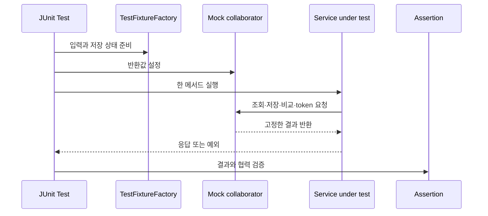

# 테스트와 검증 이론

> 넓은 회귀 suite를 보존하면서 작은 Service 테스트로 실패 원인을 좁히는 기준을 다룹니다.

<a id="seq-06"></a>
## 1. 기능이 많아질수록 테스트 범위를 나눠야 하는 이유

최신 05에는 OAuth2, 계정 복구, JWT, Validation과 게시글 권한까지 104개의 `@Test` 선언이 있습니다. 06의 목표는 이 suite를 더 작은 과거 버전으로 바꾸는 것이 아닙니다. 기존 회귀를 그대로 두고, 학생이 `PostService`와 `AuthService`의 판단 네 가지를 직접 단위 테스트로 고정합니다.

테스트가 실패했을 때 어느 책임을 먼저 볼 수 있는지가 범위를 나누는 기준입니다.

| 테스트 범위 | 주로 확인하는 것 | 이번 시퀀스에서의 위치 |
|---|---|---|
| Service unit test | 입력, collaborator 호출, 반환 DTO, 도메인 예외 | 신규 네 테스트 |
| HTTP integration test | Validation, Security filter, handler, status와 body | 최신 05에서 제공 |
| 실제 외부 E2E | Google callback, SMTP 인증과 수신 | credential이 필요한 수동 검증 |

단위 테스트 통과는 실제 HTTP 400·401·403이나 외부 provider 성공을 뜻하지 않습니다. 반대로 통합 테스트가 있어도 작은 Service 판단을 읽기 쉬운 단위 테스트로 남길 가치는 있습니다.

## 2. Given, When, Then으로 책임을 고정하기



| 단계 | 들어온 것 | 한 일 | 나간 것 또는 상태 |
|---|---|---|---|
| Given | 시나리오와 중요한 입력값 | fixture를 만들고 mock 결과를 정함 | 재현 가능한 테스트 조건 |
| When | 준비된 요청 | 실제 Service 메서드 한 번 실행 | 응답 또는 예외 |
| Then | 실제 결과와 호출 기록 | 기대값·예외·협력자 인자를 비교 | PASS 또는 원인이 드러난 FAIL |

Given이 너무 길면 핵심 조건이 묻히고, Then이 없으면 테스트가 실행돼도 무엇을 보장하는지 알 수 없습니다.

## 3. mock 경계는 Service 바깥에 둡니다

`AuthService.login`은 다음 순서만 조립합니다.

```kotlin
val user = userRepository.findByEmail(email)
    .orElseThrow { InvalidCredentialsException() }
if (!passwordEncoder.matches(rawPassword, requireNotNull(user.password))) {
    throw InvalidCredentialsException()
}
return TokenResponse(
    accessToken = jwtTokenProvider.createToken(requireNotNull(user.email)),
    expiresIn = jwtTokenProvider.expirationSeconds
)
```

이 테스트의 관심은 BCrypt 계산이나 JWT 서명 알고리즘이 아니라 호출 순서와 분기입니다. 따라서 `UserRepository`, `PasswordEncoder`, `JwtTokenProvider`를 mock으로 두고 다음을 확인합니다.

- email이 `Locale.ROOT` 규칙으로 정규화되어 조회되는가
- raw password와 저장 hash가 `matches`에 전달되는가
- 성공 뒤에만 token을 요청하는가
- token 문자열, 기본 `Bearer`, 만료 초가 응답으로 매핑되는가
- 비밀번호 불일치 뒤 JWT collaborator가 호출되지 않는가

BCrypt와 JWT 자체의 계약은 이미 제공된 별도 테스트가 맡습니다.

## 4. fixture가 숨겨도 되는 값

`TestFixtureFactory`는 네 객체만 만듭니다.

- `postCreateRequest`
- `postEntity`
- `loginRequest`
- `user`

기본 title, content와 email처럼 반복되는 값은 factory에 둘 수 있습니다. 그러나 분기를 결정하는 값은 호출부에 보여야 합니다.

예를 들어 mixed-case email, `wrong-password`, 저장 결과의 id, 인증된 author email은 테스트가 무엇을 검증하는지 드러내므로 override로 명시합니다. fixture를 production helper로 옮기거나 기존 104개 테스트를 일괄 치환하지 않습니다.

## 5. 반환값만 확인하면 놓치는 버그

`PostService.create` 테스트에서 mock Repository가 미리 만든 `PostEntity`를 반환하고 response만 비교하면 Service가 잘못된 title이나 author를 `save`에 넘겨도 통과할 수 있습니다.

따라서 생성 성공 테스트는 두 방향을 확인합니다.

1. `ArgumentCaptor`로 `save` 입력의 title, content, author를 확인합니다.
2. 저장 결과가 `PostResponse`의 id, title, content, author로 매핑되는지 확인합니다.

하나는 Service가 collaborator에 보낸 값이고, 다른 하나는 호출자에게 반환한 값입니다.

## 6. 정상과 실패를 한 테스트에 섞지 않습니다

이번에 추가하는 네 테스트는 다음 한 가지 판단만 각각 맡습니다.

| 테스트 | 고정할 조건 | 확인할 결과 |
|---|---|---|
| 게시글 생성 성공 | request, principal email, 저장 결과 | save 입력과 response mapping |
| 게시글 조회 실패 | `findById`가 empty 반환 | `PostNotFoundException` |
| 로그인 성공 | 사용자 조회, password 일치, token 결과 | 정규화·협력자 호출·`TokenResponse` |
| 로그인 실패 | 사용자는 있으나 password 불일치 | `InvalidCredentialsException`, JWT 미호출 |

실패 예외가 기대 결과라면 `assertThrows`가 통과하는 것이 정상입니다. 예상하지 않은 예외, 예외 없음, 다른 collaborator 호출은 실패로 남겨야 합니다.

## 7. 기존 회귀 suite가 맡는 HTTP 증거

최신 05의 `AuthIntegrationTest`, `PostAuthorizationIntegrationTest`, `SecurityErrorHandlerTest` 등은 이미 Validation 400, 인증 실패 401, 인가 실패 403을 실행합니다. 06에서는 이를 향후 후보로 미루지 않습니다.

새 Service 테스트는 실제 filter chain이나 exception handler를 통과하지 않으므로 HTTP status를 직접 보장하지 않습니다. 기존 통합 테스트를 보존해 두 범위의 증거를 함께 유지합니다.

외부 Google과 SMTP 연결은 자동 테스트에서 mock 또는 local 경계로 분리되어 있습니다. 실제 provider 성공과 메일 수신은 여전히 credential이 필요한 별도 수동 E2E입니다.

## 8. 회귀를 지키는 완료 조건

- 기존 104개 테스트 선언과 test source 삭제가 없습니다.
- 신규 네 테스트를 더해 최소 108개 `@Test` 선언이 있습니다.
- production, runtime 설정과 정적 화면은 최신 05와 같습니다.
- 좁은 대상 테스트와 전체 suite가 모두 통과합니다.
- 전체 suite를 `--rerun-tasks`로 다시 실행해 같은 결과를 확인합니다.
- Service 단위 증거와 HTTP·외부 E2E 증거를 구분해 설명할 수 있습니다.

[Visual Lab에서 조건을 고르고 테스트 경로 예측하기](./visual-lab/sequences/06/)

<details>
<summary>멘토용 설명 포인트</summary>

- mock 수가 많다는 이유만으로 실제 구현을 다시 넣지 말고 현재 테스트의 한 책임을 먼저 묻습니다.
- fixture가 판단값까지 숨기지 않는지 확인합니다.
- response와 Repository 입력이 서로 다른 관찰 지점임을 질문합니다.
- 비밀번호 불일치 뒤 JWT 미호출을 검증하는 이유를 설명하게 합니다.
- 400·401·403 회귀가 이미 존재하며 새 단위 테스트가 이를 대체하지 않는다는 점을 확인합니다.

</details>
