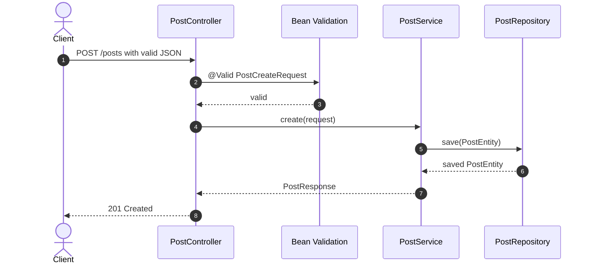
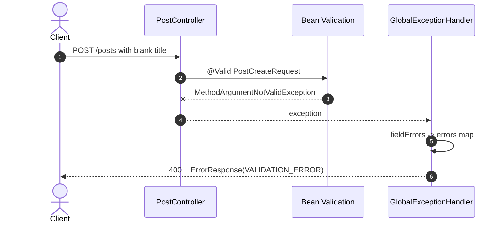
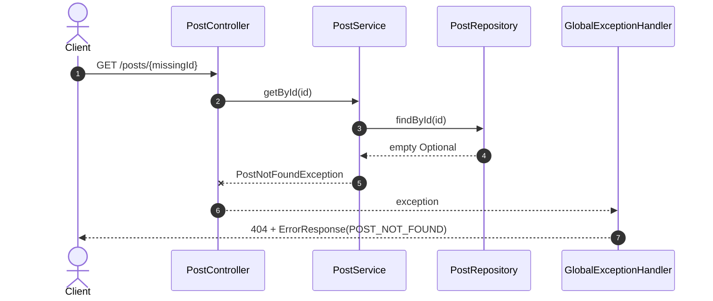

# 이론 정리

> 이 문서는 참고 구현을 기준으로 요청 DTO 검증, Service 비즈니스 예외, `GlobalExceptionHandler`, `ErrorResponse`가 어떻게 연결되는지 설명합니다. 성공 흐름뿐 아니라 실패 흐름도 API 계약의 일부로 읽는 것이 목표입니다.

## 1. Problem - 왜 실패 흐름도 API 설계에 포함해야 하는가

DB CRUD가 동작해도 잘못된 입력과 없는 데이터 요청을 다루지 않으면 API 사용자는 무엇이 잘못됐는지 알기 어렵습니다. 빈 제목이나 빈 작성자 같은 요청이 저장 로직까지 들어가면 불필요한 데이터 처리가 발생하고, 존재하지 않는 게시글 조회가 일반 예외로 터지면 클라이언트는 실패 종류를 구분하기 어렵습니다.

참고 구현은 요청 DTO에서 기본 입력을 막고, Service에서 게시글 없음 예외를 분리하며, 공통 Handler에서 실패 응답 모양을 통일합니다.

## 2. Analyze - 참고 구현에서 검증 실패와 비즈니스 예외를 나누는 기준

실패는 모두 같은 위치에서 처리되지 않습니다. 요청 body 자체가 잘못된 경우와 요청 형식은 맞지만 처리 대상이 없는 경우는 원인도 다르고 HTTP status도 다릅니다.

| 실패 종류 | 참고 구현의 위치 | 예시 | 응답 |
|---|---|---|---|
| 요청 형식 검증 실패 | `@Valid` + Request DTO annotation | 빈 `title`, 빈 `content`, 빈 `author` | `400 Bad Request`, `VALIDATION_ERROR` |
| 비즈니스 대상 없음 | `PostService.findPostById()` | 존재하지 않는 게시글 id | `404 Not Found`, `POST_NOT_FOUND` |
| 응답 변환 | `GlobalExceptionHandler` | 검증 실패와 게시글 없음 | `ErrorResponse` |

이번 구현은 기본 Bean Validation과 도메인 예외 변환에 집중합니다. 인증 실패, 권한 실패, JWT 오류는 다음 시퀀스 범위입니다.

## 3. API / 실행 시퀀스 다이어그램

### 3.1 정상 생성 흐름



정상 요청은 Request DTO 검증을 통과한 뒤 Service로 이동합니다. Service는 DB 흐름을 수행하고 `PostResponse`로 응답합니다.

### 3.2 Validation 실패 흐름



Validation 실패는 Service로 들어가지 않습니다. Handler는 필드별 오류를 `errors` map으로 모아 공통 실패 응답으로 변환합니다.

### 3.3 게시글 없음 예외 흐름



게시글 없음은 요청 body 검증 실패가 아닙니다. Service가 Repository 결과를 보고 도메인 의미를 가진 예외로 바꿉니다.

## 4. 계층 / DTO / 메시지 흐름

### 4.1 계층 흐름

```mermaid
flowchart LR
    Client[Client or Swagger] --> Controller[PostController]
    Controller --> Valid[@Valid]
    Valid --> RequestDTO[PostCreateRequest / PostUpdateRequest]
    RequestDTO --> Service[PostService]
    Service --> Repository[PostRepository]
    Repository --> DB[(DB)]
    Valid -. MethodArgumentNotValidException .-> Handler[GlobalExceptionHandler]
    Service -. PostNotFoundException .-> Handler
    Handler --> ErrorResponse[ErrorResponse]
    Service --> ResponseDTO[PostResponse]
    ResponseDTO --> Controller
    ErrorResponse --> Client
```

| 흐름 | 참고 구현의 타입 | 결과 |
|---|---|---|
| 정상 요청 | `PostCreateRequest`, `PostUpdateRequest`, `PostResponse` | 성공 응답 |
| 요청 검증 실패 | `MethodArgumentNotValidException` | `ErrorResponse(code=VALIDATION_ERROR, errors=...)` |
| 게시글 없음 | `PostNotFoundException` | `ErrorResponse(code=POST_NOT_FOUND)` |

### 4.2 DTO, Entity, ErrorResponse 구분

| 타입 | 책임 | 참고 구현에서 볼 지점 |
|---|---|---|
| Request DTO | 외부 요청값과 Bean Validation 규칙 | `@field:NotBlank` |
| Entity | DB 저장 모델 | 요청 검증 annotation을 몰아넣지 않습니다. |
| Response DTO | 정상 응답 모델 | `PostResponse.from(entity)` |
| ErrorResponse | 실패 응답 모델 | `code`, `message`, `errors` |

정상 응답과 실패 응답을 같은 DTO로 처리하지 않습니다. 성공은 `PostResponse`, 실패는 `ErrorResponse`로 나누어 클라이언트가 응답 의미를 안정적으로 읽게 합니다.

## 5. Action - 참고 구현에서 비교할 코드 흐름

### 5.1 Request DTO annotation

`PostCreateRequest`와 `PostUpdateRequest`는 각 필드에 `@field:NotBlank`를 둡니다. Kotlin에서 annotation target을 `field`로 지정해야 Bean Validation이 필드 검증을 읽을 수 있습니다.

리뷰 질문:

- 생성/수정 DTO 모두 같은 기본 검증을 갖나요?
- Entity가 아니라 Request DTO에 검증 규칙을 두었나요?
- non-null 타입과 `@NotBlank`의 역할 차이를 설명하나요?

### 5.2 Controller의 `@Valid`

Controller의 생성/수정 request body에는 `@Valid`가 연결됩니다. DTO annotation만 있고 `@Valid`가 빠지면 검증 흐름이 시작되지 않을 수 있습니다.

리뷰 질문:

- `create()`와 `update()` 모두 request body에 `@Valid`를 사용하나요?
- 빈 문자열 요청이 Service까지 들어가지 않나요?
- 실패 요청을 Swagger에서 직접 확인했나요?

### 5.3 Service의 `PostNotFoundException`

Service는 `findPostById(id)`에서 Repository 조회 결과가 비어 있으면 `PostNotFoundException`을 던집니다. 이 예외는 요청 형식 문제가 아니라 비즈니스 대상 없음이라는 의미를 가집니다.

리뷰 질문:

- 없는 id 조회/수정/삭제가 같은 helper 흐름을 사용하나요?
- 일반 예외보다 도메인 의미가 드러나는 예외를 사용하나요?
- 이 실패가 `400`이 아니라 `404`로 변환되는 이유를 설명하나요?

### 5.4 `GlobalExceptionHandler`와 `ErrorResponse`

`GlobalExceptionHandler`는 Validation 실패와 게시글 없음 예외를 각각 `ErrorResponse`로 변환합니다. Validation 실패는 필드별 오류를 `errors`에 담고, 게시글 없음은 code와 message 중심으로 내려갑니다.

리뷰 질문:

- Validation 실패 응답의 code가 안정적인 값인가요?
- 필드별 오류가 `errors` map에 들어가나요?
- 게시글 없음 실패와 Validation 실패를 다른 Handler 메서드로 구분하나요?

## 6. Result - 확인할 결과와 남은 한계

완료 후에는 다음을 확인합니다.

- `./gradlew test`가 통과합니다.
- 정상 생성/조회 요청은 기존 CRUD 흐름으로 동작합니다.
- 빈 필드 요청은 `400`과 `VALIDATION_ERROR`로 내려갑니다.
- 존재하지 않는 id 요청은 `404`와 `POST_NOT_FOUND`로 내려갑니다.
- `ErrorResponse`의 `code`, `message`, `errors` 구조를 설명할 수 있습니다.

남은 한계는 다음 단계로 넘깁니다. 이번 시퀀스는 기본 Bean Validation과 도메인 예외 응답 통일에 집중하며, 인증 실패, 권한 실패, JWT 토큰 오류, 커스텀 Validation 심화는 직접 구현하지 않습니다.

## 7. 실무 포인트

- 요청 검증은 API 경계에서 시작해야 저장 로직이 잘못된 입력을 받지 않습니다.
- Kotlin non-null은 null 안정성에 도움을 주지만 빈 문자열과 길이 같은 규칙을 대신하지 않습니다.
- `@field:NotBlank`처럼 annotation target을 명시해야 Kotlin property와 Bean Validation 연결을 오해하지 않습니다.
- 실패 응답 code는 클라이언트가 분기 처리하기 쉬운 안정적인 값이어야 합니다.
- 정상 요청과 실패 요청을 함께 테스트해야 API 계약을 더 정확히 설명할 수 있습니다.

## 8. 용어 정리

`Bean Validation`
: annotation을 사용해 요청값의 기본 조건을 검사하는 검증 방식입니다.

`@Valid`
: Controller에서 DTO validation을 실행하도록 연결하는 annotation입니다.

`@NotBlank`
: 문자열이 null이 아니고 공백만으로 구성되지 않도록 검사하는 annotation입니다.

`Request DTO`
: 외부 요청 body를 받는 타입입니다.

`Entity`
: DB 테이블과 연결되는 내부 저장 모델입니다.

`Business Exception`
: 요청 형식은 맞지만 서비스 규칙이나 대상 상태가 맞지 않을 때 던지는 예외입니다.

`GlobalExceptionHandler`
: 예외를 HTTP 실패 응답으로 바꾸는 공통 처리 계층입니다.

`ErrorResponse`
: 실패 응답의 공통 DTO입니다.

`MethodArgumentNotValidException`
: `@Valid` 검증 실패 시 Spring MVC가 발생시키는 예외입니다.

`HTTP 400`
: 요청 형식이나 입력값이 잘못되었음을 나타내는 상태 코드입니다.

`HTTP 404`
: 요청 대상 리소스를 찾을 수 없음을 나타내는 상태 코드입니다.

## 9. 다음 구현으로 연결되는 지점

다음 시퀀스에서는 회원가입, 로그인, JWT 발급, 보호 API 흐름을 다룹니다. 이번 시퀀스에서 실패 응답 구조를 통일해 두면 인증 실패와 보호 API 실패도 같은 API 안정성 관점에서 비교할 수 있습니다.

<details>
<summary>멘토용 설명 포인트</summary>

- starter와 비교할 때 DTO annotation, Controller `@Valid`, Service 예외, Handler 응답 변환 순서로 봅니다.
- 멘티가 Validation을 Service 조건문으로만 이해하면 요청 초입에서 막는 흐름을 다시 짚습니다.
- 커스텀 Validation은 이번 직접 구현 범위 밖으로 두고, 기본 검증으로 막기 어려운 규칙이 생길 때 확장한다고 설명합니다.
- 실패 요청을 직접 실행하게 하고 status code와 `ErrorResponse`를 함께 읽게 합니다.

</details>
