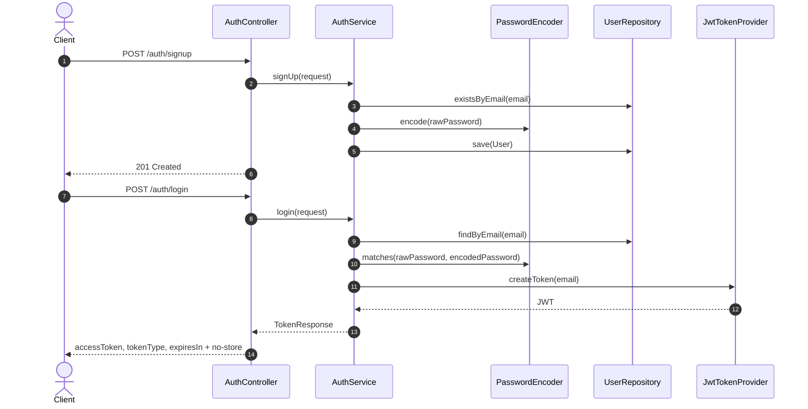
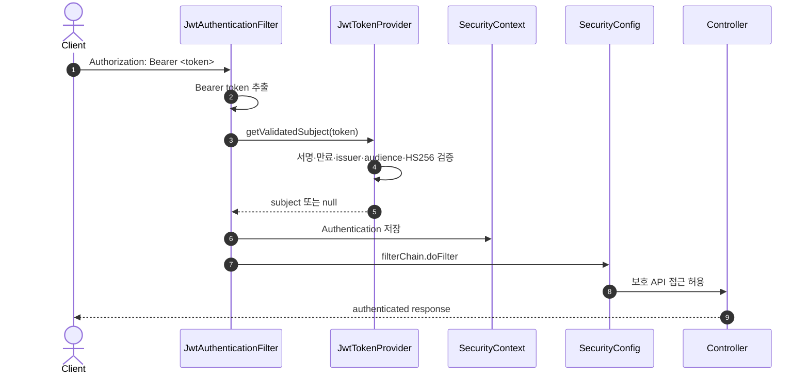
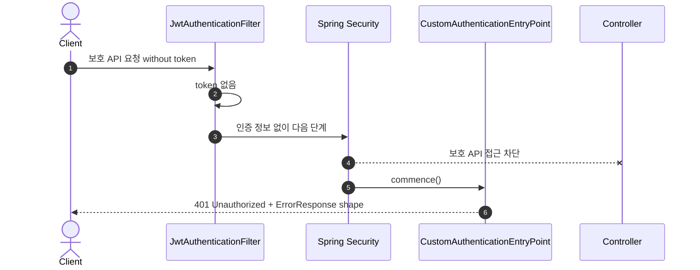
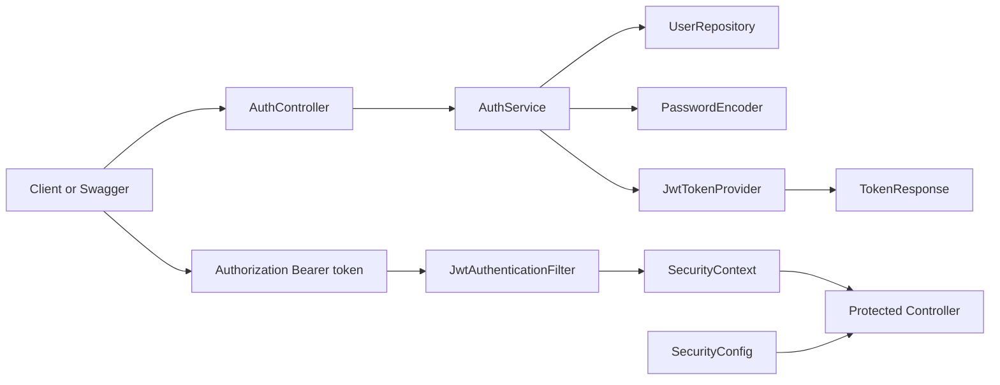

# 이론 정리

> 이번 시퀀스는 03의 Validation을 인증 입력에 다시 적용하고, 회원가입, 로그인, JWT 발급, JWT 검증, 공개 API와 보호 API, 게시글 소유권 인가를 다룹니다. 목표는 토큰 문자열 자체를 외우는 것이 아니라 "어떤 입력을 받을 수 있는가", "누가 요청했는가", "그 요청자가 이 작업을 할 수 있는가"를 서버가 어떻게 판단하는지 설명하는 것입니다.

## 1. Problem - 왜 인증과 JWT가 필요한가

CRUD와 Validation만으로는 요청자가 누구인지 알 수 없습니다. 게시글을 작성하거나 현재 사용자 정보를 조회하려면 서버가 요청자를 식별해야 합니다. 모든 API를 공개해 두면 로그인하지 않은 사용자도 보호되어야 할 기능을 호출할 수 있습니다.

HTTP는 기본적으로 요청마다 독립적입니다. 로그인 요청이 한 번 성공했다고 해서 이후 요청에서 서버가 자동으로 사용자를 기억하지 않습니다. JWT는 로그인 성공 후 클라이언트가 들고 다니는 인증 증표로 사용되고, 서버는 이후 요청마다 토큰을 검증해 인증 정보를 구성합니다.

## 2. Analyze - 인증, 토큰 발급, 토큰 검증, 인가를 어떻게 나눌 것인가

JWT 흐름에서 자주 섞이는 개념은 발급과 검증, 인증과 인가입니다. 로그인은 토큰을 발급받는 시작점이고, 인증 필터는 이후 요청에서 토큰을 검증하는 위치입니다. 인가는 인증된 사용자가 특정 작업을 할 수 있는지 판단하는 단계입니다.

| 구분 | 질문 | 이번 시퀀스에서 보는 위치 |
|---|---|---|
| 회원가입 | 사용자를 저장할 수 있는가? | `User`, `UserRepository`, `AuthService.signUp()` |
| 로그인 | 비밀번호가 맞는 사용자인가? | `AuthService.login()` |
| 토큰 발급 | 인증 성공 후 어떤 증표를 주는가? | `JwtTokenProvider.createToken()` |
| 토큰 검증 | 다음 요청에서 토큰이 유효하며 subject를 신뢰할 수 있는가? | `JwtAuthenticationFilter`, `JwtTokenProvider.getValidatedSubject()` |
| 인증 경계 | 어떤 API가 로그인 필요인가? | `SecurityConfig` |
| 인증·인가 실패 | 401과 403을 어떤 JSON으로 응답하는가? | `CustomAuthenticationEntryPoint`, `JsonAccessDeniedHandler` |
| 인가 경계 | 인증된 사용자가 이 리소스를 바꿀 수 있는가? | `PostEntity.isWrittenBy()`, `PostService.validateAuthor()` |

이번 단계에서는 자체 회원가입/로그인과 access token 중심 흐름을 다룹니다. OAuth2, SMTP, refresh token, Redis 기반 토큰 저장은 직접 구현 범위가 아닙니다.

### 2.1 인증 전에 입력 경계를 먼저 닫습니다

회원가입과 로그인은 공개 API이므로 인증되지 않은 입력도 서버에 도달합니다. DTO는 허용할 입력의 형식과 길이를 제한하고, Controller의 Validation 연결은 Service로 잘못된 값이 넘어가기 전에 요청을 중단합니다. body, path/query parameter, 읽을 수 없는 JSON은 실패 원인이 다르지만 모두 사용자가 수정할 수 있는 400 응답으로 정리합니다.

Kotlin DTO의 제약 조건은 실제 field에 적용되는지 확인해야 합니다. 같은 field에서 여러 제약이 동시에 실패할 수 있으므로 오류 Map은 순서에 따라 우연히 덮어쓰지 않고 첫 오류를 결정적으로 선택합니다.

게시글의 `author`는 요청 DTO에 포함하지 않습니다. 로그인한 사용자의 `Principal.name`에서 가져와야 클라이언트가 다른 작성자인 것처럼 값을 바꿔 보낼 수 없습니다.

### 2.2 계정 생성은 정규화와 DB 경쟁까지 고려합니다

email은 가입, 로그인, 현재 사용자 조회에서 모두 같은 규칙으로 정규화해야 합니다. 서버의 기본 언어 설정에 따라 결과가 바뀌지 않도록 `lowercase(Locale.ROOT)`를 사용하고, password는 공백까지 사용자가 정한 자격 정보이므로 trim하지 않습니다.

중복 email 사전 조회는 흔한 실패를 빠르게 막지만 동시에 들어온 두 요청을 완전히 막지는 못합니다. 따라서 DB의 unique 제약을 최종 경계로 두고, 쓰기 transaction 안에서 `saveAndFlush()`로 위반을 확인해 동일한 409 도메인 오류로 바꿉니다.

## 3. API / 실행 시퀀스 다이어그램

### 3.1 회원가입과 로그인, 토큰 발급 흐름

회원가입은 사용자 저장 흐름이고, 로그인은 비밀번호 확인 후 JWT를 발급하는 흐름입니다. 비밀번호는 평문 저장 대상이 아니므로 저장 전 암호화합니다. 로그인 응답은 기존 `accessToken`과 함께 전달 방식인 `tokenType="Bearer"`, 초 단위 남은 수명인 `expiresIn`을 제공합니다. 토큰 발급 응답이 중간 캐시에 남지 않도록 Controller는 `Cache-Control: no-store`를 설정합니다.

### 3.2 보호 API 요청과 인증 필터 흐름

토큰 검증은 Controller 전에 실행됩니다. 검증과 subject 추출을 별도 메서드로 나누면 같은 JWT를 두 번 파싱할 수 있으므로 `getValidatedSubject()`가 한 번의 파싱으로 두 작업을 끝냅니다. 발급과 검증은 HS256, issuer, audience를 같은 계약으로 사용하고, 주입한 `Clock`을 기준으로 `issuedAt`과 `expiration`을 다뤄 시간 테스트를 실제 대기 없이 재현합니다. 필터는 검증된 subject가 있을 때만 새 `SecurityContext`에 인증 정보를 넣고, 이미 존재하는 Authentication은 덮어쓰지 않습니다.

### 3.3 인증 실패와 경계 확인 흐름

인증 실패는 "누구인지 확인되지 않았다"는 뜻입니다. 보호 API의 401은 `WWW-Authenticate: Bearer`와 공통 `ErrorResponse` JSON을 반환합니다. 인가는 "누구인지는 확인되었지만 이 작업을 할 권한이 있는가"를 묻는 단계입니다. Spring Security가 막은 403도 JSON으로 직렬화하고, 게시글 작성자 기준 수정·삭제는 Step03의 소유권 판단을 Step08에서 호출해 403으로 변환합니다.

## 4. 계층 / DTO / 메시지 흐름

### 4.1 계층 흐름

| 흐름 | 주요 타입 | 책임 |
|---|---|---|
| 회원가입 | `UserSignUpRequest`, `User`, `UserRepository` | 사용자 정보를 저장하고 중복을 막습니다. |
| 로그인 | `LoginRequest`, `PasswordEncoder`, `TokenResponse` | 비밀번호를 확인하고 JWT와 전달 방식·만료 정보를 반환합니다. |
| 토큰 생성/검증 | `JwtTokenProvider` | email subject, issuer, audience, 시간, HS256 서명을 다룹니다. |
| 요청 인증 | `JwtAuthenticationFilter`, `SecurityContext` | Authorization header를 인증 정보로 바꿉니다. |
| 보안 경계 | `SecurityConfig` | 공개 API와 보호 API를 나눕니다. |
| 인증 실패 응답 | `CustomAuthenticationEntryPoint` | 인증되지 않은 보호 API 요청을 401로 응답합니다. |

### 4.2 DTO와 인증 메시지 구분

| 데이터 | 이동 방향 | 의미 |
|---|---|---|
| `UserSignUpRequest` | Client -> Auth API | 회원가입 입력입니다. |
| `LoginRequest` | Client -> Auth API | 로그인 입력입니다. |
| `TokenResponse` | Auth API -> Client | `accessToken`, `tokenType`, 초 단위 `expiresIn`을 전달합니다. |
| `Authorization: Bearer <token>` | Client -> Protected API | 이후 요청에서 인증 증표를 전달합니다. |
| `CurrentUserResponse` | Protected API -> Client | 토큰으로 확인된 현재 사용자 정보입니다. |

JWT는 사용자 정보를 서버 세션에 저장하는 방식과 다릅니다. 클라이언트가 토큰을 보관하고, 서버는 요청마다 토큰의 서명, 만료, issuer, audience를 검증합니다. JWT payload는 서명 대상이지 암호화된 비밀 영역이 아니므로 민감 정보를 넣지 않습니다.

## 5. Action - 구현에서 연결할 지점

### 5.0 03 Validation을 인증 입력에 다시 연결합니다

회원가입, 로그인, 게시글 요청 DTO에 빈 값·형식·길이 계약을 적용합니다. DTO의 최대 길이는 Entity 컬럼 저장 범위와 맞추고, `GlobalExceptionHandler`에서 request body, method parameter, malformed JSON 실패를 구분합니다.

확인 질문:

- 제약 조건이 Kotlin field에 적용되었나요?
- 같은 field의 여러 오류 중 어떤 메시지가 응답되는지 결정적인가요?
- 요청 body가 작성자를 선택할 수 없게 되어 있나요?

### 5.1 사용자 저장과 비밀번호 암호화를 확인합니다

회원가입은 사용자 email과 비밀번호를 저장하는 흐름입니다. 비밀번호는 평문으로 저장하지 않고 `PasswordEncoder`를 통해 암호화된 값으로 저장해야 합니다.

확인 질문:

- 중복 email 요청을 어떻게 막나요?
- 동시에 들어온 중복 요청도 DB unique 제약에서 같은 409로 정리되나요?
- email 정규화가 서버 Locale에 따라 달라지지 않나요?
- 비밀번호가 저장 전에 암호화되나요?
- 회원가입 요청 DTO와 `User` Entity 역할을 구분할 수 있나요?

### 5.2 로그인과 JWT 발급 위치를 구분합니다

로그인은 저장된 사용자와 비밀번호를 확인하고, 성공 시 JWT를 발급합니다. JWT 발급은 로그인 성공의 결과이지, 이후 요청 인증 자체와 같은 단계가 아닙니다.

확인 질문:

- 로그인 실패가 성공 응답으로 내려가지 않나요?
- `TokenResponse`의 `accessToken`, `tokenType`, `expiresIn`은 각각 무엇을 뜻하나요?
- 로그인 응답에 `Cache-Control: no-store`가 필요한 이유는 무엇인가요?
- 토큰 subject로 어떤 사용자 식별 값을 사용하나요?

### 5.3 JWT 필터가 Controller보다 먼저 동작합니다

`JwtAuthenticationFilter`는 Authorization header에서 Bearer token을 꺼내고, 유효하면 인증 정보를 `SecurityContext`에 넣습니다. 이 과정은 Controller 메서드가 실행되기 전에 일어납니다.

확인 질문:

- Authorization header 형식이 `Bearer <token>`인가요?
- 검증과 subject 조회가 한 번의 파싱으로 끝나나요?
- 토큰이 없거나 서명·만료·issuer·audience가 잘못된 경우 보호 API가 JSON 401로 실패하나요?
- 유효한 토큰이면 현재 사용자 API에서 email을 확인할 수 있나요?

### 5.4 공개 API와 보호 API 경계를 확인합니다

회원가입과 로그인은 토큰이 없어도 접근 가능해야 합니다. 현재 사용자 조회 같은 보호 API는 토큰이 필요합니다. 게시글 작성/수정/삭제는 커리큘럼상 인증/인가 경계로 확인해야 하므로 `SecurityConfig`와 Service 정책을 함께 점검합니다.

확인 질문:

- `/auth/signup`, `/auth/login`은 공개 API인가요?
- `/auth/me`는 인증된 요청에서만 성공하나요?
- Spring Security의 401과 403이 같은 기본 JSON 응답 구조를 사용하나요?
- Step03의 `isWrittenBy()`와 Step08의 `validateAuthor()`가 인증과 별도로 어떤 인가 정책을 표현하나요?

## 6. Result - 무엇을 확인하고 어떤 한계가 남는가

이번 시퀀스를 마치면 다음을 확인합니다. 제공된 연결 코드와 60개 테스트는 Step01부터 Step08까지의 TODO와 같은 계약을 사용합니다. 시작 상태의 테스트 실패를 테스트 수정으로 숨기지 않고, TODO를 모두 구현한 뒤 전체 테스트가 통과해야 합니다.

- `./gradlew test`가 통과합니다.
- 회원가입과 로그인 요청이 동작합니다.
- 잘못된 인증·게시글 입력은 Service에 도달하기 전에 400으로 거절됩니다.
- 로그인 성공 시 JWT가 발급됩니다.
- 로그인 응답이 token 전달 방식과 초 단위 만료 정보를 제공하고 캐시되지 않습니다.
- `Authorization: Bearer <token>`이 있는 요청과 없는 요청의 차이를 확인합니다.
- JWT 발급 위치와 단일 파싱 검증 위치를 구분합니다.
- 인증되지 않은 요청의 401과 인증됐지만 소유권이 없는 요청의 403을 구분합니다.
- 인증과 인가의 차이를 설명합니다.

남은 한계도 분명히 둡니다. 이번 시퀀스는 자체 회원가입/로그인과 access token 기반 인증 흐름에 집중합니다. OAuth2 로그인, SMTP 계정 복구, refresh token, Redis 기반 토큰 저장, 고급 권한 모델은 다음 시퀀스나 확장 주제로 남깁니다.

## 7. 실무 포인트

- JWT secret은 운영 민감값입니다. 코드에 고정하기보다 환경 변수나 비밀 관리 체계로 분리해야 합니다.
- issuer와 audience는 토큰을 발급한 주체와 사용할 대상을 제한하며, secret 검증만으로 대신할 수 없습니다.
- `Clock` 주입은 만료 정책을 실제 대기 없이 같은 시각으로 재현하게 합니다.
- 검증과 subject 조회는 한 번의 파싱으로 끝내야 같은 토큰을 중복 해석하지 않습니다.
- access token은 탈취되면 만료 전까지 악용될 수 있습니다. 실제 서비스에서는 만료 시간과 재발급 전략을 함께 설계합니다.
- 로그인 응답의 `Cache-Control: no-store`는 발급된 token이 공유·브라우저 캐시에 저장되지 않게 하는 HTTP 경계입니다.
- 인증 필터는 Controller보다 먼저 실행됩니다. Controller에 도달하지 못하는 실패도 정상적인 보안 흐름입니다.
- 401은 인증 실패, 403은 인가 실패로 구분해서 읽습니다.
- 400은 요청 형식이나 입력 계약이 잘못된 경우이며 401과 섞지 않습니다.
- 공개 API와 보호 API 경계는 문서와 코드가 반드시 일치해야 합니다. `SecurityConfig`는 리뷰 우선순위가 높은 파일입니다.

## 8. 용어 정리

`Authentication`
: 요청자가 누구인지 확인하는 과정입니다.

`Authorization`
: 인증된 사용자가 특정 작업을 할 수 있는지 판단하는 과정입니다.

`JWT`
: 서명된 토큰 형식의 인증 증표입니다.

`Bearer Token`
: `Authorization: Bearer <token>` 형식으로 전달하는 토큰입니다.

`SecurityContext`
: 현재 요청의 인증 정보를 담는 Spring Security 컨텍스트입니다.

`Authentication Filter`
: Controller 전에 요청을 검사하고 인증 정보를 구성하는 필터입니다.

`PasswordEncoder`
: 비밀번호를 안전한 저장 형태로 바꾸고 검증하는 컴포넌트입니다.

`TokenResponse`
: 로그인 성공 후 access token, Bearer 전달 방식, 초 단위 남은 만료 시간을 내려주는 응답 DTO입니다.

`AuthenticationEntryPoint`
: 인증 실패 시 HTTP 응답을 만드는 Spring Security 확장 지점입니다.

`Stateless`
: 서버가 요청 사이의 로그인 상태를 세션으로 저장하지 않는 방식입니다.

## 9. 다음 구현으로 연결되는 지점

다음 시퀀스에서는 Google OAuth2 로그인과 SMTP 계정 복구 흐름을 다룹니다. 이번 단계에서 자체 로그인과 JWT 발급/검증 흐름을 이해해 두면 외부 인증 결과를 자체 사용자와 연결하고 다시 JWT로 응답하는 이유를 설명할 수 있습니다.

멘토용 설명 포인트

- JWT를 서버에 저장된 세션처럼 설명하지 않게 하고, 요청마다 검증하는 증표라는 관점으로 정리합니다.
- 힌트는 `AuthService`, `JwtTokenProvider`, `JwtAuthenticationFilter`, `SecurityConfig` 순서로 제공합니다.
- 토큰 문자열 자체보다 발급 위치와 검증 위치를 구분하게 합니다.
- 이중 파싱, email 정규화, unique 경쟁, JSON 401/403, 소유권 인가를 각각 어느 Step에서 책임지는지 질문합니다.
- 60개 테스트는 TODO와 같은 계약을 검증하며, 테스트를 완화하는 방식으로 해결하지 않게 안내합니다.
- OAuth2나 SMTP 질문은 다음 시퀀스 범위로 분리하고, 이번에는 자체 로그인과 JWT 인증 경계에 집중합니다.

