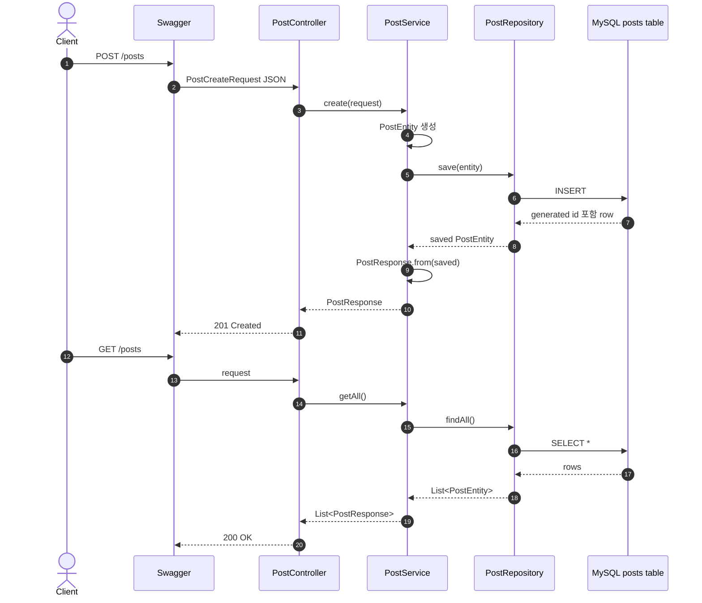
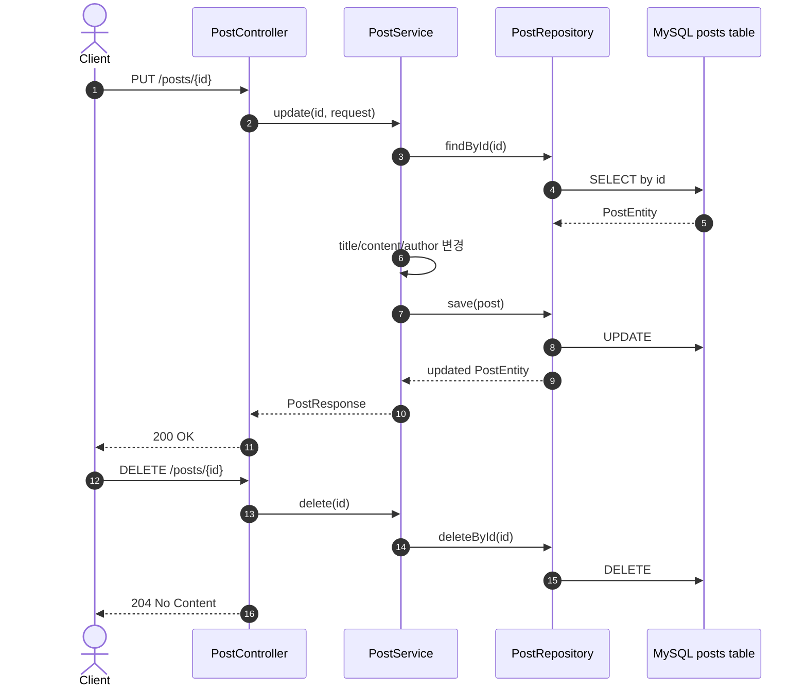
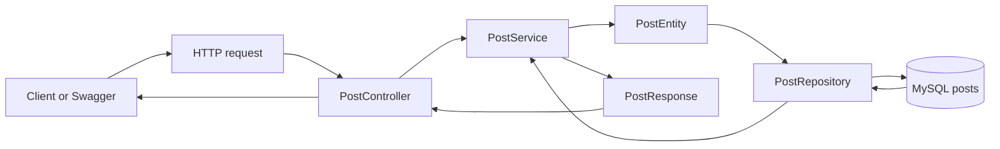

# 이론 정리

> 이 문서는 참고 구현을 기준으로 메모리 CRUD를 MySQL/JPA 기반 CRUD로 바꾼 흐름을 설명합니다. 핵심은 단일 테이블 게시글 CRUD에서 Entity, Repository, Service, Controller, DTO 책임을 분리해 읽는 것입니다.

## 1. Problem - 왜 DB 저장과 계층 분리가 필요한가

메모리 저장소는 서버 프로세스 안에 데이터를 보관합니다. 서버가 재시작되면 데이터가 사라지고, 다른 애플리케이션 인스턴스와 같은 데이터를 공유하기 어렵습니다.

DB 저장은 데이터를 애플리케이션 밖에 남깁니다. 하지만 Service가 DB 접근 세부사항을 모두 직접 알게 만들면 처리 흐름과 저장 기술이 강하게 묶입니다. 참고 구현은 `PostRepository`를 통해 DB 접근을 분리하고, `PostService`가 CRUD 흐름을 조립하게 합니다.

## 2. Analyze - 참고 구현에서 선택한 구조 기준

메모리 저장에서 DB 저장으로 넘어가면 저장 위치뿐 아니라 id 생성, Entity/DTO 경계, 테스트 DB와 런타임 DB 구분까지 함께 봐야 합니다.

| 비교 기준 | 참고 구현의 선택 | 리뷰할 지점 |
|---|---|---|
| 저장 모델 | `PostEntity`를 `posts` 테이블과 연결합니다. | Entity를 API 응답처럼 쓰지 않는지 봅니다. |
| DB 접근 | `PostRepository : JpaRepository<PostEntity, Long>` | Service가 Repository 경계를 통해 DB에 접근하는지 봅니다. |
| 생성 | request DTO를 Entity로 바꾼 뒤 저장합니다. | id는 DB/JPA 저장 과정에서 정해지는지 봅니다. |
| 조회 | Repository 결과를 `PostResponse`로 변환합니다. | Entity가 외부에 그대로 노출되지 않는지 봅니다. |
| 테스트 | H2 test datasource를 사용합니다. | 런타임 MySQL 설정과 혼동하지 않는지 봅니다. |

이번 구현은 단일 테이블 CRUD입니다. Validation, 전역 예외 응답, 인증/인가, 관계 매핑, N+1 해결은 직접 구현하지 않습니다.

## 3. API / 실행 시퀀스 다이어그램

### 3.1 생성과 조회 흐름

생성 요청에서 `PostCreateRequest`는 API 입력이고, `PostEntity`는 DB 저장 기준이며, `PostResponse`는 API 출력입니다. 같은 게시글 데이터라도 경계가 다르기 때문에 타입을 나누어 읽습니다.

### 3.2 수정과 삭제 흐름

수정은 id로 기존 Entity를 찾은 뒤 값을 바꾸고 다시 저장합니다. 삭제는 id 기준으로 DB row를 제거합니다. 두 흐름 모두 Controller가 Repository를 직접 호출하지 않습니다.

## 4. 계층 / DTO / 메시지 흐름

### 4.1 계층 흐름

| 계층 | 참고 구현의 타입 | 책임 |
|---|---|---|
| API 입력 | `PostCreateRequest`, `PostUpdateRequest` | 생성/수정 요청 body를 표현합니다. |
| Controller | `PostController` | HTTP endpoint와 Service 호출을 연결합니다. |
| Service | `PostService` | DTO, Entity, Repository, 응답 변환 흐름을 조립합니다. |
| Entity | `PostEntity` | `posts` 테이블과 연결되는 저장 모델입니다. |
| Repository | `PostRepository` | JPA 기반 DB 저장과 조회를 맡습니다. |
| DB | MySQL `posts` table | 데이터를 애플리케이션 밖에 저장합니다. |
| API 출력 | `PostResponse` | 클라이언트에게 돌려줄 응답 모양입니다. |

### 4.2 DTO, Entity, DB 메시지 구분

| 흐름 | 데이터 | 참고 구현에서 볼 지점 |
|---|---|---|
| 요청 -> Service | `PostCreateRequest`, `PostUpdateRequest` | API 입력이며 Entity annotation을 갖지 않습니다. |
| Service -> Repository | `PostEntity` | DB 테이블과 id 생성 전략을 갖습니다. |
| Repository -> DB | INSERT, SELECT, UPDATE, DELETE | JPA가 Entity 작업을 SQL로 연결합니다. |
| Service -> Controller | `PostResponse` | 외부 응답 전용 DTO로 변환합니다. |

Entity와 DTO를 나누면 DB 구조와 API 계약을 같은 이유로 바꾸지 않아도 됩니다. 이번 시퀀스에서는 이 경계를 단일 테이블 CRUD에서 먼저 확인합니다.

## 5. Action - 참고 구현에서 비교할 코드 흐름

### 5.1 `PostEntity`와 테이블 연결

`PostEntity`는 `@Entity`, `@Table(name = "posts")`, `@Id`, `@GeneratedValue`를 통해 DB 테이블과 id 생성 전략을 표현합니다. 요청 DTO나 응답 DTO와 달리 DB 저장의 기준입니다.

리뷰 질문:

- `PostEntity`가 어떤 테이블과 연결되나요?
- id 생성 전략을 어디서 읽을 수 있나요?
- Entity를 응답으로 직접 반환하지 않나요?

### 5.2 `PostRepository` 선언

`PostRepository`는 `JpaRepository<PostEntity, Long>`을 상속해 기본 CRUD 메서드를 제공합니다. Service는 이 Repository를 통해 저장과 조회를 수행합니다.

리뷰 질문:

- Repository의 Entity 타입과 id 타입이 맞나요?
- Controller가 Repository를 직접 호출하지 않나요?
- Service가 DB 접근 세부 구현보다 처리 흐름에 집중하나요?

### 5.3 `PostService` CRUD 흐름

생성은 request DTO를 Entity로 만들고 `save()` 결과를 `PostResponse`로 변환합니다. 조회는 Repository 결과를 응답 DTO로 바꿉니다. 수정은 id로 Entity를 찾고 값을 바꾼 뒤 다시 저장합니다. 삭제는 id 기준으로 제거합니다.

리뷰 질문:

- create, getAll, getById, update, delete가 같은 계층 흐름을 따르나요?
- Entity와 Response DTO 변환 지점이 분명한가요?
- 없는 id 조회/수정의 한계를 다음 시퀀스와 연결해서 설명하나요?

### 5.4 실행 환경과 테스트 환경 구분

런타임 서버는 MySQL 설정을 사용합니다. 테스트는 `src/test/resources/application.yaml`의 H2 설정을 사용할 수 있습니다. 두 환경을 구분해야 "테스트는 통과했지만 서버 실행은 DB 연결에서 실패"하는 상황을 설명할 수 있습니다.

리뷰 질문:

- `docker compose up -d`가 필요한 실행 흐름을 설명하나요?
- `./gradlew test`가 어떤 datasource를 사용하는지 확인하나요?
- Swagger 실행과 테스트 실행의 목적을 구분하나요?

## 6. Result - 확인할 결과와 남은 한계

완료 후에는 다음을 확인합니다.

- `./gradlew test`가 통과합니다.
- MySQL 컨테이너 실행 후 애플리케이션이 DB에 연결됩니다.
- Swagger에서 생성, 전체 조회, 단건 조회, 수정, 삭제가 동작합니다.
- 서버 재시작 후에도 데이터가 DB에 남는 것을 확인합니다.
- Entity, Repository, Service, Controller, DTO 역할을 구분해서 설명합니다.

남은 한계는 이후 시퀀스로 넘깁니다. 현재 구현은 단일 테이블 CRUD이고, 잘못된 입력 검증, 전역 예외 응답, 인증/인가, 관계 매핑과 N+1 해결은 다루지 않습니다.

## 7. 실무 포인트

- Entity를 API 응답 모델로 직접 쓰면 DB 변경이 API 계약에 영향을 줄 수 있습니다.
- Repository는 저장 기술 경계입니다. Service는 Repository를 통해 저장과 조회를 요청합니다.
- 테스트 DB와 런타임 DB 설정을 분리해서 읽어야 재현 환경을 정확히 설명할 수 있습니다.
- `ddl-auto: update`는 학습에는 편하지만 운영 스키마 관리 전략으로 보기에는 부족합니다.
- 없는 id 처리와 입력 검증은 DB 접근보다 API 안정성 문제에 가깝기 때문에 다음 시퀀스에서 분리해 다룹니다.

## 8. 용어 정리

`Persistence`
: 애플리케이션 종료 후에도 데이터가 저장소에 남는 성질입니다.

`Entity`
: DB 테이블과 연결되는 서버 내부 모델입니다.

`Repository`
: 데이터 저장과 조회를 맡는 계층입니다.

`JPA`
: 객체와 관계형 DB 사이의 저장/조회 작업을 도와주는 Java 표준 기술입니다.

`JpaRepository`
: Spring Data JPA가 제공하는 Repository 인터페이스입니다.

`Primary Key`
: DB row를 구분하는 대표 값입니다.

`DTO`
: API 요청/응답 경계에서 데이터를 전달하는 객체입니다.

`H2`
: 테스트에서 자주 쓰는 인메모리 DB입니다.

`MySQL`
: 이번 런타임 실습에서 사용하는 관계형 DB입니다.

`Swagger`
: 브라우저에서 API를 실행하고 요청/응답을 확인하는 도구입니다.

## 9. 다음 구현으로 연결되는 지점

다음 시퀀스에서는 현재 CRUD 흐름 위에 Validation과 전역 예외 응답을 붙입니다. 이번 시퀀스에서 Entity/DTO 경계와 Repository 흐름을 분리해 두면 없는 id나 잘못된 요청을 어디에서 처리해야 하는지 더 명확하게 볼 수 있습니다.

멘토용 설명 포인트

- starter와 비교할 때 Entity annotation, Repository 선언, Service의 Repository 호출 흐름 순서로 봅니다.
- 멘티가 Entity를 API 응답 객체처럼 이해하면 DB 내부 모델과 외부 응답 DTO 차이를 다시 짚습니다.
- 관계 매핑이나 N+1 질문은 이번 직접 구현 범위 밖으로 정리합니다.
- 런타임 MySQL과 테스트 H2 설정을 구분해서 설명하게 합니다.

