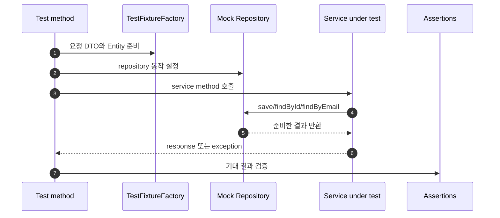
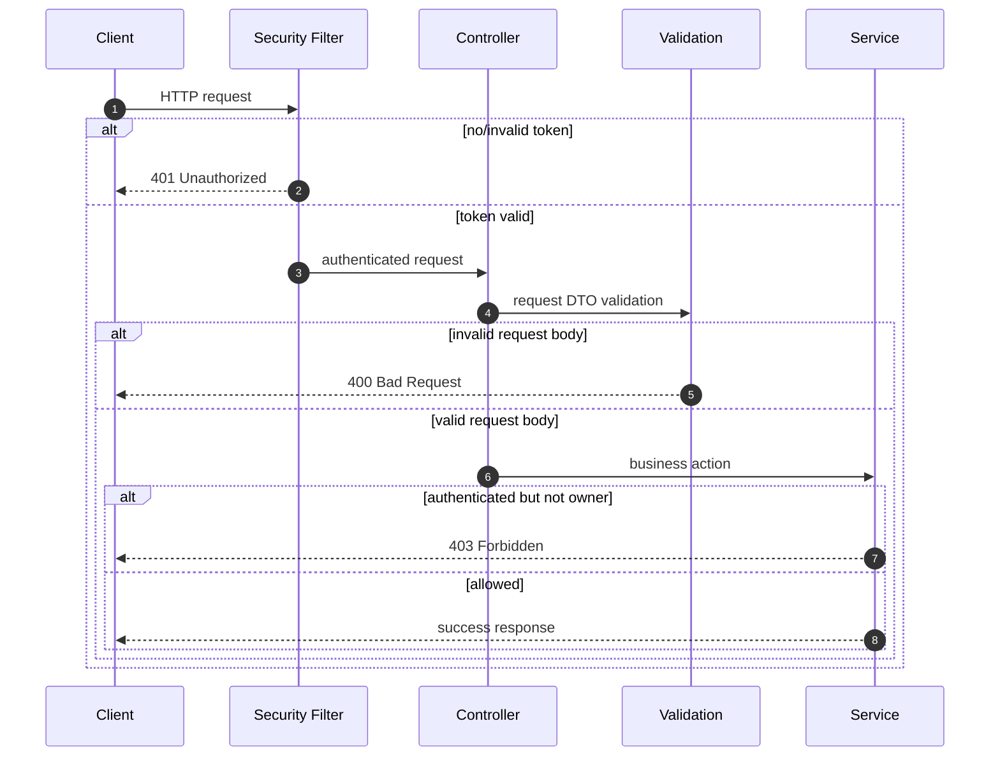
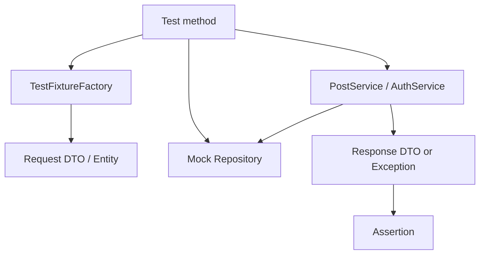

# 이론 정리

> 이번 시퀀스는 지금까지 만든 Service 흐름을 테스트로 다시 확인하는 단계입니다.
> 기능을 더 붙이기보다, 정상 케이스와 실패 케이스를 실행 가능한 문서처럼 남겨 변경 후에도 동작을 믿을 수 있게 만드는 것이 목표입니다.

## 1. Problem - 왜 테스트와 검증이 필요한가

05 시퀀스까지 오면 게시글 CRUD, DB 저장, Validation, JWT 인증, OAuth2, 계정 복구 흐름이 이어져 있습니다. 기능이 늘어날수록 “수정한 뒤에도 기존 동작이 그대로인가?”를 사람이 기억으로 확인하기 어렵습니다.

테스트가 없으면 아래 문제가 생깁니다.

- 정상 케이스만 직접 실행하고 실패 케이스를 놓칩니다.
- 로그인 실패, 없는 게시글 조회 같은 예외 흐름이 깨져도 늦게 발견합니다.
- Service 책임을 확인하려는데 DB나 HTTP 설정 문제와 섞입니다.
- 반복 입력값이 길어져 테스트 본문에서 의도가 보이지 않습니다.
- 인증 실패 401과 인가 실패 403을 같은 실패로 이해합니다.

이번 시퀀스는 모든 테스트 종류를 넓히는 단계가 아닙니다. Service 단위 테스트를 중심으로 fixture와 mock을 사용해 핵심 판단을 검증하고, API 상태 코드는 어떤 관점으로 확인해야 하는지 함께 정리합니다.

## 2. Analyze - 어떤 테스트 범위를 선택할 것인가

테스트는 범위가 넓을수록 실제 실행 환경에 가까워지지만, 원인을 좁히는 데 시간이 더 걸립니다. 이번 시퀀스에서는 아래 기준으로 범위를 나눕니다.

| 범위 | 확인하는 것 | 이번 시퀀스의 사용 방식 |
|---|---|---|
| Service 단위 테스트 | Service의 정상/실패 판단 | `PostServiceTest`, `AuthServiceTest` 중심 |
| fixture | 반복 입력과 객체 생성 | `TestFixtureFactory`로 준비 코드 정리 |
| mock | Repository 같은 의존성 동작 대체 | `PostRepository`, `UserRepository`를 테스트 안에서 설정 |
| HTTP 정책 검증 | validation 400, 인증 401, 인가 403 | 이후 통합 테스트로 확장할 기준을 이론에서 구분 |

이번 단계에서 Service 테스트를 먼저 보는 이유는, 비즈니스 판단을 가장 작은 단위로 분리해 읽을 수 있기 때문입니다. 예를 들어 “없는 게시글이면 예외가 나야 한다”는 판단은 DB 연결보다 `PostService.getById(...)`의 책임입니다.

## 3. API / 실행 시퀀스 다이어그램

### 3.1 Service 단위 테스트 실행 흐름

이 흐름에서는 Spring 전체 컨텍스트보다 Service 판단에 집중합니다. 테스트 본문은 “given 준비, when 호출, then 검증” 순서로 읽히는 것이 좋습니다.

### 3.2 API 상태 코드 검증 관점

현재 starter의 직접 구현 대상은 Service 테스트입니다. 다만 인증 흐름을 가진 프로젝트에서는 400, 401, 403을 같은 실패로 보지 않는 감각이 중요합니다. 이후 HTTP 통합 테스트를 붙일 때 이 다이어그램이 기준이 됩니다.

## 4. 계층 / DTO / 메시지 흐름

### 4.1 Service 테스트 계층 흐름

| 구성 요소 | 책임 | 직접 확인할 파일 |
|---|---|---|
| Test method | 하나의 동작을 준비하고 실행하고 검증합니다. | `PostServiceTest.kt`, `AuthServiceTest.kt` |
| Fixture | 테스트 입력값과 Entity를 반복 없이 준비합니다. | `TestFixtureFactory.kt` |
| Mock | Repository 결과를 테스트 안에서 통제합니다. | `mock(...)`, `when(...)` 설정 |
| Service | 실제로 검증할 비즈니스 판단을 담습니다. | `PostService.kt`, `AuthService.kt` |
| Assertion | 기대값과 실제 결과를 비교합니다. | `assertEquals`, `assertThrows`, `assertFalse` |

### 4.2 DTO와 메시지 흐름

| 흐름 | 입력 | 대상 Service | 기대 결과 |
|---|---|---|---|
| 게시글 생성 성공 | `PostCreateRequest` | `PostService.create(...)` | `PostResponse` |
| 없는 게시글 조회 | `id` | `PostService.getById(...)` | `PostNotFoundException` |
| 로그인 성공 | `LoginRequest` | `AuthService.login(...)` | `TokenResponse` |
| 로그인 실패 | `LoginRequest` | `AuthService.login(...)` | `InvalidCredentialsException` |

테스트는 이 표의 각 행을 실행 가능한 형태로 바꾸는 작업입니다. 입력, 대상, 기대 결과가 분리되면 테스트 이름도 더 분명해집니다.

## 5. Action - 이번 구현에서 연결할 지점

### 5.1 fixture로 입력 정리하기

`TestFixtureFactory.kt`는 테스트마다 반복되는 DTO와 Entity 생성을 모읍니다. fixture는 테스트를 감추기 위한 도구가 아니라, 테스트 본문이 “무엇을 검증하는지” 보이게 만드는 도구입니다.

확인 질문:

- 테스트 본문에서 중요한 값과 반복 준비 값이 구분되나요?
- fixture 기본값을 바꿔도 테스트 의도가 유지되나요?
- 실패 케이스에 필요한 값은 테스트 안에서 분명히 드러나나요?

### 5.2 mock으로 의존성 결과 정하기

Service 테스트에서는 Repository를 실제 DB에 연결하지 않고, 테스트 안에서 기대하는 반환값을 정합니다. 이렇게 하면 Service의 분기와 예외 흐름을 좁게 확인할 수 있습니다.

확인 질문:

- `save(...)`, `findById(...)`, `findByEmail(...)`의 반환값을 테스트가 통제하나요?
- 실패 케이스를 만들기 위해 mock이 어떤 값을 돌려줘야 하나요?
- 테스트가 Repository 자체를 검증하려는 것처럼 넓어지지 않았나요?

### 5.3 정상 케이스와 실패 케이스 나누기

정상 테스트는 기대한 DTO나 token이 나오는지 봅니다. 실패 테스트는 기대한 예외가 나오는지 봅니다. 둘 중 하나만 있으면 Service 판단을 충분히 설명하기 어렵습니다.

확인 질문:

- 게시글 생성 성공과 없는 게시글 조회 실패가 분리되어 있나요?
- 로그인 성공과 비밀번호 불일치 실패가 분리되어 있나요?
- 테스트 이름만 읽어도 어떤 동작을 보장하는지 알 수 있나요?

## 6. Result - 무엇을 확인하고 어떤 한계가 남는가

이번 시퀀스를 마치면 아래를 설명할 수 있어야 합니다.

- 테스트가 회귀를 줄이는 이유
- Service 단위 테스트와 HTTP 통합 테스트의 차이
- fixture와 mock을 사용하는 이유
- 정상 케이스와 실패 케이스를 나눠야 하는 이유
- validation 400, 인증 실패 401, 인가 실패 403의 차이

남는 한계도 분명히 봅니다.

- 현재 starter는 Service 테스트 구현에 집중합니다.
- HTTP 상태 코드 검증은 이후 통합 테스트로 확장할 수 있는 기준입니다.
- mock 기반 테스트는 Repository 쿼리와 Spring MVC 연결 자체를 검증하지 않습니다.

## 7. 실무 포인트

- 테스트는 코드 설명이 아니라 실행 가능한 검증입니다.
- 단위 테스트는 원인을 좁게 찾는 데 유리하고, 통합 테스트는 연결 흐름을 확인하는 데 유리합니다.
- fixture는 테스트 데이터를 숨기는 곳이 아니라 반복 준비를 줄이는 곳입니다.
- mock은 Service 판단을 분리하기 위해 사용하며, 모든 테스트를 mock으로 바꾸는 것이 목표는 아닙니다.
- 실패 케이스는 예외 타입, 상태 코드, 메시지 정책이 흐트러지지 않게 해줍니다.
- 401은 인증 실패, 403은 인증된 사용자의 권한 부족입니다. 두 상태 코드는 리뷰에서 반드시 구분합니다.

## 8. 용어 정리

### Unit Test

- 뜻
  작은 범위의 코드가 기대한 결과를 내는지 확인하는 테스트입니다.
- 왜 중요한가
  실패 원인을 좁게 찾고 빠르게 반복 실행할 수 있습니다.
- 이번 코드에서는 어디에 보이는가
  `PostServiceTest.kt`, `AuthServiceTest.kt`
- 짧은 상황 예시
  `PostService.getById(999L)`가 없는 게시글 예외를 내는지만 확인합니다.

### Fixture

- 뜻
  테스트에서 반복해서 사용할 입력값과 객체를 미리 준비하는 도구입니다.
- 왜 중요한가
  테스트 본문이 준비 코드보다 검증 의도에 집중할 수 있습니다.
- 이번 코드에서는 어디에 보이는가
  `TestFixtureFactory.postCreateRequest()`, `TestFixtureFactory.user()`
- 짧은 상황 예시
  로그인 성공 테스트에서 매번 email과 password 객체를 새로 만들지 않고 fixture로 준비합니다.

### Mock

- 뜻
  실제 의존성 대신 테스트가 원하는 동작을 하도록 만든 대체 객체입니다.
- 왜 중요한가
  Service 테스트에서 DB 연결 없이 Repository 결과를 통제할 수 있습니다.
- 이번 코드에서는 어디에 보이는가
  `mock(PostRepository::class.java)`, `when(userRepository.findByEmail(...))`
- 짧은 상황 예시
  `findById(999L)`가 빈 결과를 돌려주는 상황을 만들어 실패 케이스를 검증합니다.

### Assertion

- 뜻
  실제 결과가 기대 결과와 같은지 확인하는 검증 문장입니다.
- 왜 중요한가
  테스트가 무엇을 보장하는지 코드로 드러냅니다.
- 이번 코드에서는 어디에 보이는가
  `assertEquals`, `assertThrows`, `assertFalse`
- 짧은 상황 예시
  로그인 성공 후 access token이 비어 있지 않은지 확인합니다.

### 401 / 403

- 뜻
  401은 인증 실패, 403은 인증은 되었지만 권한이 부족한 상태입니다.
- 왜 중요한가
  보호 API에서 실패 원인을 정확히 나누기 위해 필요합니다.
- 이번 코드에서는 어디에 보이는가
  `SecurityConfig.kt`, `JwtAuthenticationFilter.kt`, 작성자 검증 흐름
- 짧은 상황 예시
  토큰이 없으면 401, 다른 사용자의 글을 수정하려 하면 403으로 보는 것이 자연스럽습니다.

## 9. 다음 구현으로 연결되는 지점

`docs/implementation.md`에서는 `@Disabled`된 테스트를 하나씩 살려 fixture, mock, assertion을 채웁니다. 먼저 Service 단위 테스트의 흐름을 완성하고, 이후 프로젝트가 커지면 API 상태 코드 통합 테스트를 별도 범위로 추가할 수 있습니다.

멘토용 설명 포인트

- 멘티가 테스트를 “확인용 코드”가 아니라 “변경 후 신뢰를 남기는 코드”로 설명하는지 확인합니다.
- fixture가 많아졌을 때 오히려 테스트 의도를 숨기지 않는지 질문합니다.
- mock을 쓰는 이유를 “DB를 피하려고”가 아니라 “Service 판단을 분리하려고”로 설명하게 합니다.
- 401과 403 차이를 실제 API 상황으로 묻고, 상태 코드가 보안 정책 표현이라는 점을 연결합니다.

