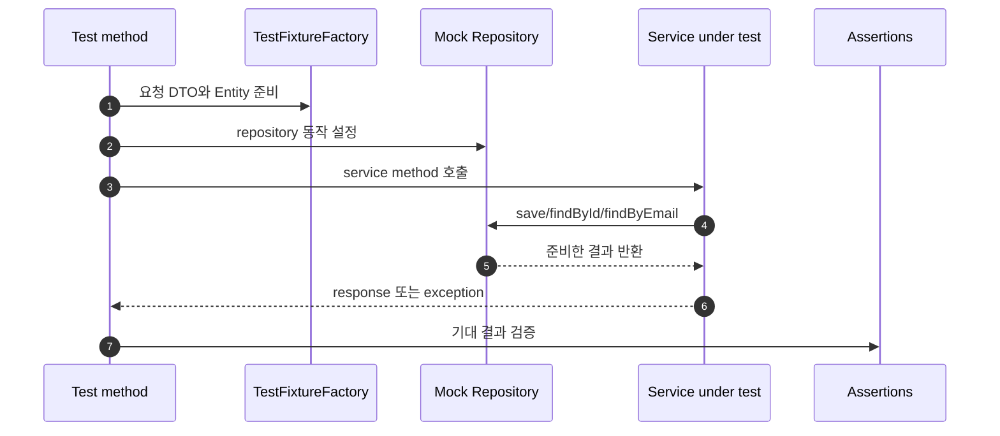
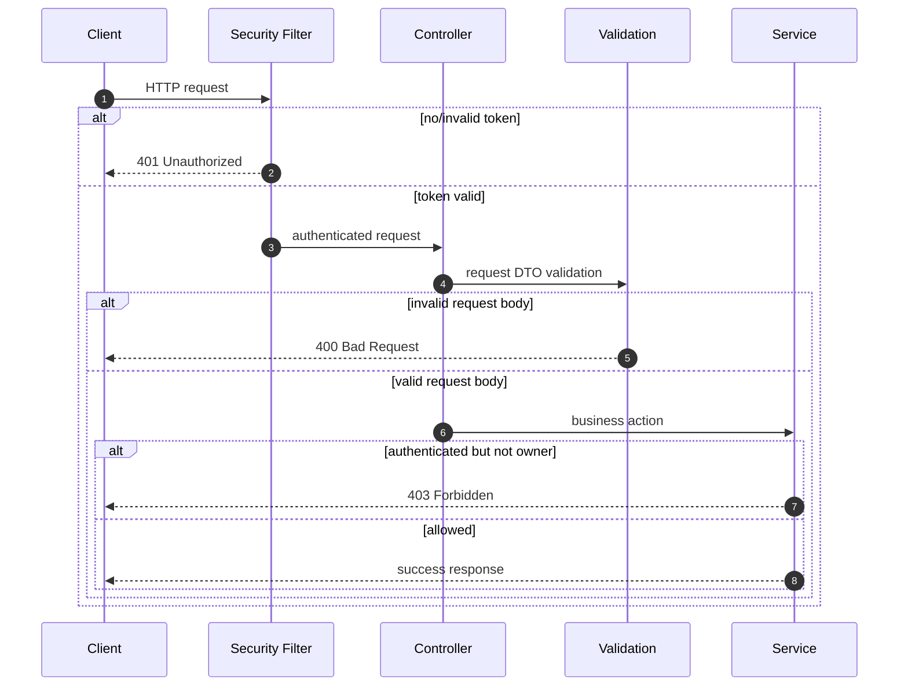
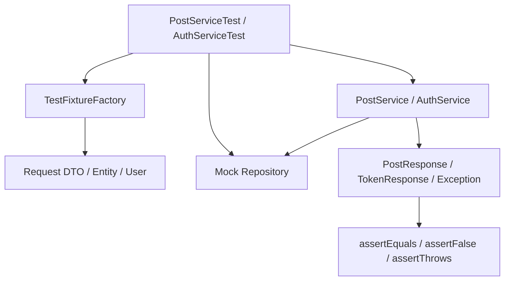

# 이론 정리

> 이번 시퀀스는 지금까지 만든 Service 흐름을 테스트로 다시 확인하는 단계입니다.
> 이 브랜치에서는 완성된 `PostServiceTest`, `AuthServiceTest`, `TestFixtureFactory`를 기준으로 fixture, mock, assertion이 어떤 검증 흐름을 만드는지 비교합니다.

## 1. Problem - 왜 테스트와 검증이 필요한가

기능이 늘어난 프로젝트에서는 “한 번 실행해 봤다”만으로 동작을 믿기 어렵습니다. 게시글 CRUD, 인증, OAuth2, 계정 복구 흐름이 이어진 상태에서 작은 수정이 기존 로그인이나 예외 흐름을 깨뜨릴 수 있습니다.

테스트가 없으면 아래 문제가 생깁니다.

- 정상 케이스만 확인하고 실패 케이스를 놓칩니다.
- 비밀번호 불일치, 없는 게시글 조회 같은 예외 흐름이 문서로만 남습니다.
- Service 판단을 보려는데 DB나 HTTP 연결 문제와 섞입니다.
- 반복 입력값 때문에 테스트 본문에서 검증 의도가 흐려집니다.
- 인증 실패 401과 인가 실패 403을 같은 실패처럼 다룹니다.

정답 구현은 Service 단위 테스트를 먼저 완성합니다. HTTP 상태 코드 검증은 별도 통합 테스트로 확장할 수 있는 관점으로 분리해 둡니다.

## 2. Analyze - 정답 구현에서 선택한 테스트 기준

| 기준 | 정답 구현의 선택 | 이유 |
|---|---|---|
| 테스트 대상 | `PostService`, `AuthService` | 핵심 비즈니스 판단을 좁게 확인합니다. |
| 입력 준비 | `TestFixtureFactory` | 반복 입력을 줄이고 테스트 본문을 읽기 좋게 만듭니다. |
| 의존성 처리 | Mockito mock | Repository 결과를 테스트가 통제합니다. |
| 정상 검증 | `assertEquals`, `assertFalse` | 응답 DTO와 token 결과를 확인합니다. |
| 실패 검증 | `assertThrows` | 예외 흐름이 유지되는지 확인합니다. |

이 선택은 “작은 범위를 먼저 신뢰한다”는 기준입니다. Service 단위 테스트가 통과한다고 모든 HTTP 연결이 검증되는 것은 아니지만, 비즈니스 판단이 깨졌는지는 빠르게 알 수 있습니다.

## 3. API / 실행 시퀀스 다이어그램

### 3.1 Service 단위 테스트 실행 흐름

정답 테스트는 이 흐름을 반복합니다. 게시글 생성 성공, 없는 게시글 조회 실패, 로그인 성공, 비밀번호 불일치 실패가 각각 독립된 테스트로 남아 있습니다.

### 3.2 API 상태 코드 검증 관점

정답 브랜치의 직접 완성 범위는 service 테스트입니다. 다만 리뷰에서는 400, 401, 403을 같은 실패로 묶지 않고, 어느 계층에서 결정되는지 말할 수 있어야 합니다.

## 4. 계층 / DTO / 메시지 흐름

### 4.1 완성 테스트 계층 흐름

| 구성 요소 | 정답 구현에서 확인할 책임 | 주요 파일 |
|---|---|---|
| Test method | 하나의 동작을 준비, 실행, 검증합니다. | `PostServiceTest.kt`, `AuthServiceTest.kt` |
| Fixture | 요청 DTO, Entity, User 기본값을 제공합니다. | `TestFixtureFactory.kt` |
| Mock | Repository 반환 결과를 테스트 안에서 정합니다. | `mock(...)`, `when(...)` |
| Service | 실제 검증 대상입니다. | `PostService.kt`, `AuthService.kt` |
| Assertion | 테스트가 보장하는 결과를 드러냅니다. | `assertEquals`, `assertThrows`, `assertFalse` |

### 4.2 DTO와 메시지 흐름

| 테스트 | 입력 | mock 설정 | 기대 결과 |
|---|---|---|---|
| 게시글 생성 성공 | `PostCreateRequest` | `postRepository.save(...)`가 저장 Entity 반환 | `PostResponse` 값 일치 |
| 없는 게시글 조회 | `id=999L` | `postRepository.findById(...)`가 empty 반환 | `PostNotFoundException` |
| 로그인 성공 | `LoginRequest` | `userRepository.findByEmail(...)`가 저장 User 반환 | 비어 있지 않은 access token |
| 로그인 실패 | 잘못된 password | 저장 User는 있으나 password 불일치 | `InvalidCredentialsException` |

이 표는 테스트 이름, 준비 값, 기대 결과가 서로 맞는지 리뷰할 때 기준이 됩니다.

## 5. Action - 정답 구현에서 비교할 코드 흐름

### 5.1 fixture로 테스트 준비 줄이기

`TestFixtureFactory.kt`는 `postCreateRequest()`, `postEntity()`, `loginRequest()`, `user()`를 제공합니다. 정답 구현은 테스트마다 같은 객체 생성을 반복하지 않고, 테스트에서 중요한 값만 override합니다.

비교 포인트:

- fixture가 테스트 의도를 숨기지 않나요?
- 테스트마다 달라야 하는 값은 메서드 인자로 드러나나요?
- Entity와 DTO 기본값이 현재 도메인과 맞나요?

### 5.2 mock으로 Repository 결과 통제하기

정답 구현은 Repository를 실제 DB에 연결하지 않고 mock으로 대체합니다. Service 테스트의 목적은 Repository 기능 검증이 아니라 Service 판단 검증이기 때문입니다.

비교 포인트:

- `postRepository.save(...)`가 저장 결과를 반환하도록 설정했나요?
- 없는 게시글 상황을 `Optional.empty()`로 만들었나요?
- 로그인 성공/실패에서 `userRepository.findByEmail(...)` 결과를 명확히 나눴나요?

### 5.3 assertion으로 보장 범위 드러내기

정답 구현은 성공 결과와 실패 예외를 assertion으로 명확히 남깁니다.

비교 포인트:

- 게시글 생성 결과의 id, title, content, author를 모두 확인하나요?
- 없는 게시글 조회에서 기대 예외 타입을 확인하나요?
- 로그인 성공 후 token이 비어 있지 않고 email을 복원할 수 있나요?
- 비밀번호 불일치에서 인증 실패 예외를 확인하나요?

## 6. Result - 확인할 결과와 남은 한계

정답 구현 기준으로 아래를 확인합니다.

- `PostService.create(...)`의 성공 결과가 검증됩니다.
- `PostService.getById(...)`의 없는 게시글 예외가 검증됩니다.
- `AuthService.login(...)`의 성공 token 발급이 검증됩니다.
- `AuthService.login(...)`의 비밀번호 불일치 예외가 검증됩니다.
- fixture와 mock으로 service 판단을 좁게 확인합니다.

남는 한계도 함께 봅니다.

- 이 테스트만으로 Controller validation 400을 검증하지는 않습니다.
- 이 테스트만으로 Security filter의 401을 검증하지는 않습니다.
- 이 테스트만으로 작성자 권한 실패 403을 검증하지는 않습니다.
- 위 상태 코드는 이후 HTTP 통합 테스트로 확장할 검증 기준입니다.

## 7. 실무 포인트

- 테스트 이름은 실패했을 때 무엇이 깨졌는지 알려주는 문장이어야 합니다.
- fixture는 반복을 줄이되, 테스트에서 중요한 값까지 감추면 안 됩니다.
- mock 기반 service 테스트는 빠르고 좁지만, 실제 DB 쿼리나 HTTP 연결을 보장하지 않습니다.
- 통합 테스트는 느릴 수 있지만 filter, controller, validation, DB 흐름을 함께 확인할 수 있습니다.
- 401과 403은 보안 정책을 드러내는 상태 코드이므로 구분해서 리뷰합니다.
- 테스트가 통과한다는 말은 “이 테스트가 다루는 범위 안에서 보장한다”는 뜻입니다.

## 8. 용어 정리

### Unit Test

- 뜻
  작은 범위의 코드가 기대한 결과를 내는지 확인하는 테스트입니다.
- 왜 중요한가
  실패 원인을 좁게 찾고 반복 실행하기 좋습니다.
- 이번 코드에서는 어디에 보이는가
  `PostServiceTest.kt`, `AuthServiceTest.kt`
- 짧은 상황 예시
  `AuthService.login(...)`이 올바른 비밀번호에서 token을 만드는지만 확인합니다.

### Fixture

- 뜻
  테스트에서 반복해서 사용할 입력값과 객체를 미리 준비하는 도구입니다.
- 왜 중요한가
  테스트 본문이 준비 코드보다 검증 의도에 집중할 수 있습니다.
- 이번 코드에서는 어디에 보이는가
  `TestFixtureFactory.postCreateRequest()`, `TestFixtureFactory.user()`
- 짧은 상황 예시
  비밀번호 불일치 테스트에서 email은 같게 두고 password만 다르게 준비합니다.

### Mock

- 뜻
  실제 의존성 대신 테스트가 원하는 동작을 하도록 만든 대체 객체입니다.
- 왜 중요한가
  Service 테스트에서 Repository 반환 결과를 직접 통제할 수 있습니다.
- 이번 코드에서는 어디에 보이는가
  `mock(PostRepository::class.java)`, `when(userRepository.findByEmail(...))`
- 짧은 상황 예시
  저장된 사용자가 있는 상황을 DB 없이 만들고 로그인 결과를 검증합니다.

### Assertion

- 뜻
  실제 결과가 기대 결과와 같은지 확인하는 검증 문장입니다.
- 왜 중요한가
  테스트가 어떤 동작을 보장하는지 코드로 남깁니다.
- 이번 코드에서는 어디에 보이는가
  `assertEquals`, `assertThrows`, `assertFalse`
- 짧은 상황 예시
  `assertThrows(InvalidCredentialsException::class.java)`로 실패 예외를 확인합니다.

### 401 / 403

- 뜻
  401은 인증 실패, 403은 인증된 사용자의 권한 부족입니다.
- 왜 중요한가
  보호 API의 실패 원인을 정확히 구분하기 위해 필요합니다.
- 이번 코드에서는 어디에 보이는가
  `SecurityConfig.kt`, `JwtAuthenticationFilter.kt`, 작성자 검증 흐름
- 짧은 상황 예시
  토큰이 없으면 401, 다른 사용자의 글을 수정하려 하면 403으로 구분합니다.

## 9. 다음 구현으로 연결되는 지점

`docs/checklist.md`를 볼 때는 정답 코드의 줄 수보다 “각 테스트가 무엇을 보장하는가”를 먼저 봅니다. 이후 캐시나 Redis가 들어와도 기존 Service 동작을 테스트로 고정해 두어야 변경 전후 차이를 설명할 수 있습니다.

멘토용 설명 포인트

- 멘티가 fixture, mock, assertion을 각각 다른 책임으로 설명하는지 확인합니다.
- 테스트가 통과하는 이유뿐 아니라 실패하면 어떤 메시지를 보게 될지 묻습니다.
- mock 기반 service 테스트가 보장하지 않는 범위를 함께 말하게 합니다.
- 400, 401, 403은 이번 service 테스트의 직접 범위가 아니지만, 다음 통합 테스트 확장 기준으로 연결합니다.

