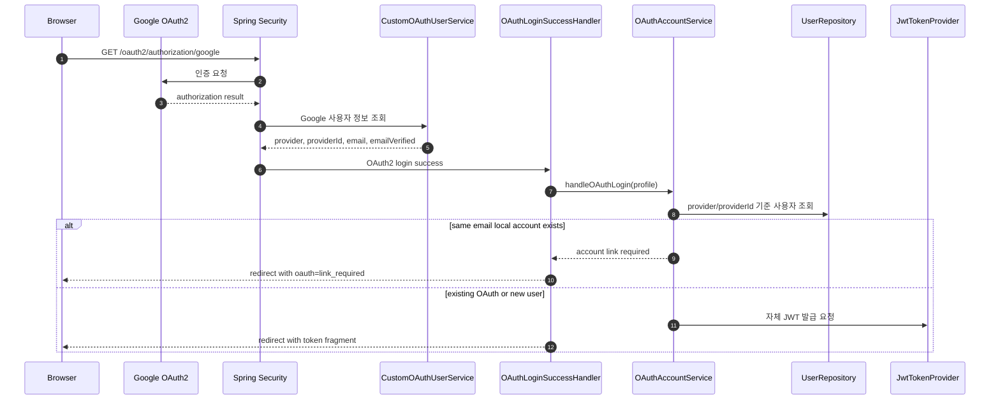
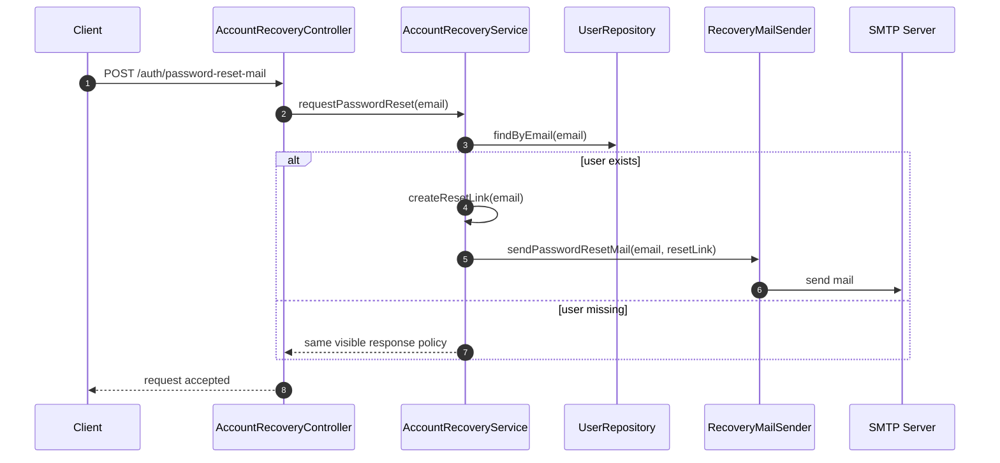
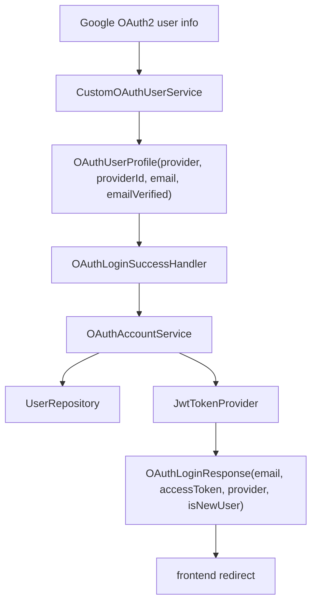
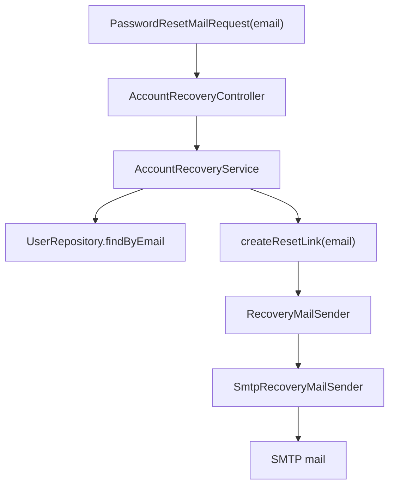

# 이론 정리

> 이번 시퀀스는 기존 JWT 인증 흐름 위에 Google OAuth2 로그인과 SMTP 기반 비밀번호 재설정 메일 요청을 붙여 보는 단계입니다.
> 핵심은 외부에서 성공한 인증 결과와 메일 발송 요청을 우리 서비스의 사용자, 토큰, 보안 정책 안으로 안전하게 연결하는 것입니다.

## 1. Problem - 왜 외부 인증과 계정 복구가 필요한가

04 시퀀스에서는 우리 서비스가 직접 회원가입, 로그인, JWT 발급을 처리했습니다. 하지만 실제 서비스에서는 사용자가 Google 계정으로 로그인하거나, 비밀번호를 잊었을 때 복구 메일을 요청하는 흐름도 필요합니다.

OAuth2와 SMTP는 서로 다른 기술입니다. OAuth2는 외부 인증 결과를 받아오는 흐름이고, SMTP는 메일을 보내는 흐름입니다. 이번 시퀀스에서는 두 기술을 많이 확장하기보다, 외부에서 들어온 결과를 우리 서비스의 사용자와 계정 복구 정책에 맞게 연결하는 기준을 익힙니다.

이 흐름을 잘못 다루면 아래 문제가 생길 수 있습니다.

- Google 로그인은 성공했지만 우리 서비스 사용자를 찾지 못합니다.
- 같은 email의 로컬 계정과 OAuth 계정이 따로 생깁니다.
- OAuth2 성공 후에도 우리 API를 호출할 자체 JWT가 없습니다.
- 비밀번호 재설정 요청이 계정 존재 여부를 외부에 드러냅니다.
- reset link나 SMTP password 같은 민감한 값이 로그나 문서에 남습니다.

## 2. Analyze - 어떤 선택 기준이 필요한가

### 2.1 OAuth2 로그인에서 봐야 할 기준

Google이 사용자를 인증해도, 우리 서비스는 다음 기준을 다시 판단해야 합니다.

| 기준 | 이유 | 이번 코드에서 보는 곳 |
|---|---|---|
| `provider` | 어떤 외부 제공자인지 구분합니다. | `OAuthUserProfile.provider`, `User.authProvider` |
| `providerId` | 외부 제공자 안에서 같은 사용자를 다시 찾습니다. | Google 응답의 `sub`, `User.providerId` |
| `email` | 기존 계정과 충돌하는지 확인하는 보조 기준입니다. | `OAuthUserProfile.email`, `User.email` |
| `emailVerified` | 제공자가 검증한 email만 로그인에 사용합니다. | Google 응답의 `email_verified`, `OAuthUserProfile.emailVerified` |
| 자체 JWT | OAuth2 이후 우리 API 요청을 구분합니다. | `OAuthLoginResponse.accessToken` |

`email`만으로 외부 사용자를 식별하면 provider 안의 고유 식별자를 놓칠 수 있습니다. 따라서 `provider + providerId`로 외부 사용자를 식별하고, 검증된 `email`은 기존 계정과의 충돌을 확인하는 데 사용합니다. 같은 email의 로컬 계정이 있더라도 소유 확인 없이 자동 연결하지 않고 별도의 계정 연결 절차가 필요하다고 응답합니다.

### 2.2 SMTP 계정 복구에서 봐야 할 기준

비밀번호 재설정 메일 요청은 단순 메일 발송이 아니라 보안 흐름입니다.

| 기준 | 이유 | 이번 코드에서 보는 곳 |
|---|---|---|
| 계정 존재 여부 응답 | 존재하지 않는 email을 외부에 드러내지 않기 위해 필요합니다. | `AccountRecoveryService.requestPasswordReset(...)` |
| 발송 책임 분리 | 계정 복구 로직이 SMTP 세부 구현에 묶이지 않게 합니다. | `RecoveryMailSender`, `SmtpRecoveryMailSender` |
| reset link | 사용자를 비밀번호 재설정 화면으로 보낼 진입점입니다. | `AccountRecoveryService.createResetLink(...)` |
| 민감정보 관리 | token, SMTP password가 노출되지 않아야 합니다. | `application.yaml`, 환경변수, 로그 |

## 3. API / 실행 시퀀스 다이어그램

### 3.1 Google OAuth2 로그인 흐름

이 흐름에서 Google은 외부 인증을 맡고, 우리 서비스는 사용자 식별, 계정 충돌 판단, 자체 JWT 발급을 맡습니다. 두 책임이 섞이면 로그인 성공 이후 어떤 사용자로 처리해야 하는지 흐려집니다.

### 3.2 비밀번호 재설정 메일 요청 흐름

계정이 없을 때도 외부 응답이 과하게 달라지면, 공격자가 email 가입 여부를 추측할 수 있습니다. 이번 시퀀스에서는 이 위험을 줄이는 방향으로 흐름을 설계합니다.

## 4. 계층 / DTO / 메시지 흐름

### 4.1 OAuth2 계층 흐름

| 계층 | 책임 | 직접 확인할 파일 |
|---|---|---|
| Security | OAuth2 성공 이벤트와 사용자 정보 로딩을 다룹니다. | `CustomOAuthUserService.kt`, `OAuthLoginSuccessHandler.kt` |
| Service | 외부 사용자를 식별하고 기존 계정 충돌 시 연결 필요 결과를 냅니다. | `OAuthAccountService.kt` |
| Repository | 내부 사용자 조회와 저장을 담당합니다. | `UserRepository.kt` |
| DTO | 인증 성공 결과를 응답 형태로 정리합니다. | `OAuthUserProfile.kt`, `OAuthLoginResponse.kt` |

### 4.2 SMTP 계정 복구 흐름

| 계층 | 책임 | 직접 확인할 파일 |
|---|---|---|
| Controller | 요청 DTO를 받고 Service로 전달합니다. | `AccountRecoveryController.kt` |
| Service | 사용자 조회, reset link 생성, 발송 요청을 조합합니다. | `AccountRecoveryService.kt` |
| Port | 메일 발송 책임을 추상화합니다. | `RecoveryMailSender.kt` |
| Adapter | 실제 SMTP 발송을 처리합니다. | `SmtpRecoveryMailSender.kt` |
| DTO | 외부 요청 값을 담습니다. | `PasswordResetMailRequest.kt` |

## 5. Action - 이번 구현에서 연결할 지점

### 5.1 OAuth2 사용자 정보 읽기

`CustomOAuthUserService.kt`에서는 기본 OAuth2 사용자 정보를 읽은 뒤, 우리 서비스가 사용할 `provider`, `providerId`, `email`, `emailVerified`를 정리해야 합니다. 여기서 `providerId`는 Google 응답의 `sub`, `emailVerified`는 `email_verified` 값입니다.

확인 질문:

- Google 응답에서 `email`이 없을 때 어떻게 다룰 것인가요?
- `email_verified`가 `false`이면 왜 로그인을 중단해야 하나요?
- `sub` 값을 왜 우리 서비스의 `providerId`로 다시 담아야 하나요?
- 이후 Handler가 같은 속성 이름으로 읽을 수 있나요?

### 5.2 OAuth2 성공 후 내부 사용자 연결

`OAuthLoginSuccessHandler.kt`는 성공 이벤트를 받는 입구이고, `OAuthAccountService.kt`는 내부 사용자 연결 정책이 모이는 곳입니다. Handler가 정책을 직접 처리하면 redirect와 계정 연결 책임이 섞이므로 Service로 분리합니다.

확인 질문:

- 이미 같은 `provider + providerId` 사용자가 있을 때 어떤 결과여야 하나요?
- 같은 email의 로컬 사용자가 있을 때 자동 연결하지 않고 `link_required`로 처리하나요?
- OAuth2 성공 후 우리 서비스 JWT를 발급하는 위치가 명확한가요?

### 5.3 비밀번호 재설정 메일 요청

`AccountRecoveryService.kt`는 email로 사용자를 찾고, reset link를 만든 뒤, `RecoveryMailSender`에 발송을 맡깁니다. 실제 SMTP 세부 구현은 `SmtpRecoveryMailSender.kt`가 담당합니다.

확인 질문:

- 존재하지 않는 email 요청이 외부에 과하게 드러나지 않나요?
- reset link 안의 token을 로그나 응답에 남기고 있지 않나요?
- 테스트에서는 실제 SMTP 서버 없이 흐름을 확인할 수 있나요?

## 6. Result - 무엇을 확인하고 어떤 한계가 남는가

이번 시퀀스를 마치면 아래를 설명할 수 있어야 합니다.

- OAuth2 로그인 성공 후에도 우리 서비스 사용자 연결이 필요한 이유
- `provider`, `providerId`, `email`이 각각 필요한 이유
- OAuth2 성공 후 자체 JWT를 발급하는 이유
- 계정 복구 요청에서 존재하지 않는 email을 조심해서 다뤄야 하는 이유
- 메일 발송 책임을 `RecoveryMailSender`로 분리하는 이유

남는 한계도 분명히 봅니다.

- 실제 비밀번호 변경 완료, 토큰 저장소, 재사용 방지까지는 이번 시퀀스의 중심 범위가 아닙니다.
- Google client secret과 SMTP password는 실제 값 없이 환경변수 자리만 확인합니다.
- 외부 Google 서버나 SMTP 서버에 직접 의존하지 않고 service 흐름을 우선 확인합니다.

## 7. 실무 포인트

- OAuth2는 외부 인증이고, JWT는 우리 서비스 API 인증입니다. 둘은 이어지지만 같은 역할이 아닙니다.
- `email`은 바뀔 수 있거나 제공자별 정책이 다를 수 있으므로 외부 사용자 식별에는 `providerId`를 함께 봅니다.
- 같은 email이라는 이유만으로 로컬 계정을 자동 연결하면 계정 탈취로 이어질 수 있으므로, 별도의 소유 확인과 명시적 동의 절차가 필요합니다.
- 계정 복구 API는 계정 존재 여부, token, reset link를 모두 민감하게 다뤄야 합니다.
- SMTP password, Google client secret, JWT secret은 코드와 문서에 실제 값으로 남기지 않습니다.
- 테스트는 외부 네트워크보다 내부 service 결정과 sender 호출 여부를 먼저 검증합니다.

## 8. 용어 정리

### OAuth2

- 뜻
  외부 제공자가 사용자 인증을 처리하고, 우리 서비스가 그 결과를 받아오는 인증 흐름입니다.
- 왜 중요한가
  자체 로그인만으로는 외부 계정 로그인을 처리할 수 없기 때문입니다.
- 이번 코드에서는 어디에 보이는가
  `SecurityConfig.kt`, `CustomOAuthUserService.kt`, `OAuthLoginSuccessHandler.kt`
- 짧은 상황 예시
  사용자가 Google 로그인 버튼을 누르면 Google이 인증을 처리하고, 우리 서버가 성공 결과를 받습니다.

### provider / providerId

- 뜻
  `provider`는 Google 같은 외부 제공자 이름이고, `providerId`는 그 제공자 안에서 사용자를 구분하는 값입니다.
- 왜 중요한가
  같은 email이라도 외부 제공자 기준의 고유 사용자를 다시 찾기 위해 필요합니다.
- 이번 코드에서는 어디에 보이는가
  `OAuthUserProfile`, `User.authProvider`, `User.providerId`
- 짧은 상황 예시
  Google 사용자는 `provider=GOOGLE`, `providerId=<Google sub>` 조합으로 다시 찾을 수 있습니다.

### SMTP

- 뜻
  메일을 보내기 위한 전송 프로토콜입니다.
- 왜 중요한가
  비밀번호 재설정 링크처럼 사용자에게 전달해야 하는 메시지를 보낼 때 필요합니다.
- 이번 코드에서는 어디에 보이는가
  `SmtpRecoveryMailSender.kt`, `spring.mail.*` 설정
- 짧은 상황 예시
  사용자가 비밀번호 재설정 메일을 요청하면 서버가 SMTP 설정으로 메일을 보냅니다.

### reset link

- 뜻
  사용자를 비밀번호 재설정 화면으로 이동시키기 위한 링크입니다.
- 왜 중요한가
  링크 안의 token이 계정 복구 권한처럼 동작할 수 있어 민감하게 다뤄야 합니다.
- 이번 코드에서는 어디에 보이는가
  `AccountRecoveryService.createResetLink(...)`
- 짧은 상황 예시
  메일 본문에 reset link가 들어가고, 사용자는 그 링크로 다음 단계를 진행합니다.

### RecoveryMailSender

- 뜻
  계정 복구 메일 발송 책임을 표현하는 인터페이스입니다.
- 왜 중요한가
  Service가 SMTP 구현에 직접 묶이지 않도록 도와줍니다.
- 이번 코드에서는 어디에 보이는가
  `RecoveryMailSender.kt`, `SmtpRecoveryMailSender.kt`
- 짧은 상황 예시
  테스트에서는 fake sender로 바꾸고, 운영에서는 SMTP sender로 바꿔 같은 service 흐름을 확인할 수 있습니다.

## 9. 다음 구현으로 연결되는 지점

`docs/implementation.md`에서는 위 흐름을 기준으로 TODO를 채웁니다. 구현할 때는 먼저 OAuth2 사용자 정보가 어떤 DTO로 정리되는지 보고, 그 다음 내부 사용자 연결과 자체 JWT 발급, 마지막으로 계정 복구 메일 요청 흐름을 확인하면 됩니다.

멘토용 설명 포인트

- 멘티가 Google 로그인 성공과 우리 서비스 로그인 성공을 같은 사건으로 보는지 확인합니다.
- `providerId`와 `email`의 차이를 질문으로 먼저 끌어냅니다.
- SMTP 파트에서는 메일 발송 성공보다 계정 존재 여부 노출과 token 민감도를 먼저 확인합니다.
- 구현 방향을 먼저 제시하기보다 “같은 email의 로컬 사용자가 이미 있으면 어떤 일이 생기나요?”처럼 시나리오 질문으로 유도합니다.

