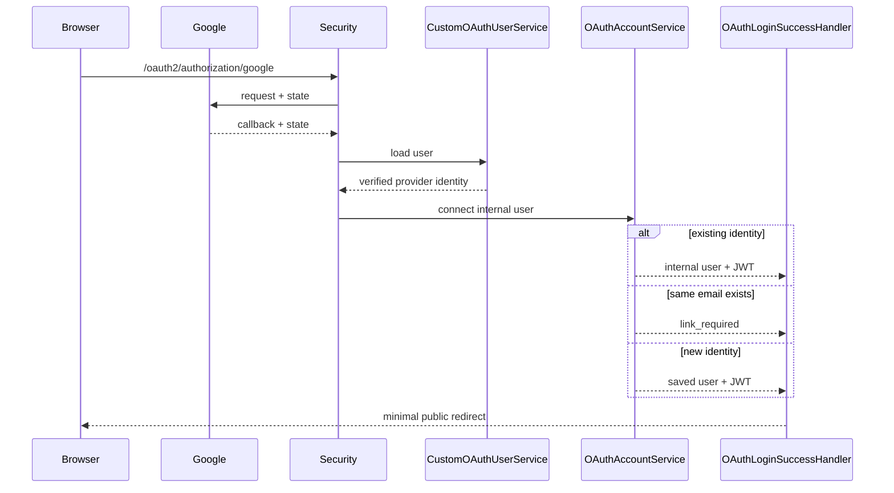
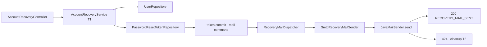

# 이론 정리

> 외부 인증 결과와 메일 발송 요청을 내부 사용자, JWT, 공개 응답 정책 안으로 안전하게 연결하는 기준을 다룹니다.

<a id="seq-05"></a>
## 1. Problem - 외부 성공을 그대로 사용할 수 없는 이유

Google 인증이 성공해도 우리 서비스는 내부 사용자를 식별하고 자체 JWT를 발급해야 합니다. 공개 운영 API에서는 복구 요청 결과로 계정 존재나 인증 방식을 드러내지 않는 것이 일반적인 방어 정책입니다. 이번 실습은 SMTP가 멈춘 경계를 관찰하려고 상태를 의도적으로 구분하며, 이 계약을 운영에 그대로 적용하지 않습니다.

이번 시퀀스는 다음 경계를 분리합니다.

- Google 사용자 정보 검증 / 내부 계정 연결
- OAuth 외부 인증 / 우리 API JWT
- OAuth `state` 임시 저장 / API session 인증
- 계정 복구 정책 / SMTP 구현
- 자동 정책 테스트 / 실제 외부 연결 검증
- raw reset token 전달 / hash 저장과 실제 비밀번호 변경

| 단계 | 들어온 것 | 한 일 | 나간 것 또는 상태 |
| --- | --- | --- | --- |
| OAuth profile | `sub`, email, verified 상태 | provider identity와 충돌 정책 확인 | 내부 OAuth 사용자 또는 연결 중단 |
| 복구 요청 | LOCAL email | cooldown 확인, raw/hash 분리, token commit | 동기 발송용 mail command |
| SMTP | commit된 mail command | 실제 `JavaMailSender.send()` 호출 | `200` 또는 원인을 구분한 `424` |
| 복구 확정 | raw token, 새 password | hash·만료·사용 여부 확인 | password와 `usedAt` commit, `204` |

[Visual Lab에서 입력 조건을 보고 경로 예측하기](./visual-lab/sequences/05/)

제공된 OAuth 연결은 외부 user-info를 내부 profile gate로 넘기고, 학습자는 `normalizePrincipal`의 검증을 완성합니다.

```kotlin
override fun loadUser(userRequest: OAuth2UserRequest): OAuth2User {
    return normalizePrincipal(
        userRequest.clientRegistration.registrationId,
        delegate.loadUser(userRequest)
    )
}
```

## 2. OAuth 사용자 식별

| 값 | 역할 |
|---|---|
| `provider` | 외부 제공자를 구분합니다. |
| `providerId` | 제공자 안의 고유 사용자 ID이며 Google `sub`를 사용합니다. |
| `email` | 내부 계정 충돌을 확인합니다. |
| `emailVerified` | `true`인 email만 내부 판단에 사용합니다. |

판단 순서:

1. profile의 필수 값, 길이, verified 여부를 검증하고 정규화합니다.
2. `provider + providerId`로 기존 OAuth 사용자를 찾습니다.
3. 기존 사용자는 DB의 내부 email을 유지합니다.
4. 기존 identity가 없고 같은 email 계정이 있으면 자동 연결하지 않습니다.
5. 충돌이 없을 때만 신규 사용자를 저장하고 DB unique 제약으로 저장 경쟁을 막습니다.

같은 email의 LOCAL 계정은 외부 인증 결과만으로 소유권과 연결 동의를 증명할 수 없으므로 `link_required`로 끝냅니다.

기존 OAuth 사용자의 provider email도 자동 갱신하지 않습니다. 내부 email은 현재 JWT subject와 게시글 작성자 식별값이므로 변경하려면 별도 소유 확인, 충돌 검사, 데이터 migration이 필요합니다.

Google 비밀번호는 OAuth profile에 포함되지 않으며 우리 서버로 전달되지 않습니다. 신규 OAuth 사용자를 저장할 때 DB의 NOT NULL 계약을 만족하려고 서버가 만든 무작위 값의 BCrypt hash를 둘 수는 있지만, 그 값은 사용자가 아는 LOCAL 비밀번호가 아니며 자체 로그인에 사용할 수 없습니다. OAuth 계정에 LOCAL 비밀번호를 추가하려면 재인증과 명시적 계정 연결 절차를 별도로 설계해야 합니다.

OAuth 컬럼을 추가하기 전에 만들어진 자체 가입 계정은 MySQL schema update 과정에서 `auth_provider`가 빈 문자열로 남을 수 있습니다. 시작 시 실행되는 `data.sql`은 `auth_provider = ''`이고 `provider_id`도 없는 행만 `LOCAL`로 바꿉니다. 외부 식별자가 있는 행까지 추측해 바꾸면 OAuth 계정을 LOCAL로 오인할 수 있으므로 자동 보정 범위를 넓히지 않습니다.

## 3. OAuth 흐름



실패와 연결 필요 redirect에는 provider 원본 오류, 내부 예외, email, token을 넣지 않습니다.

## 4. STATELESS API와 임시 OAuth session

`SessionCreationPolicy.STATELESS`는 보호 API가 HTTP session Authentication을 사용하지 않는다는 뜻입니다. 신원은 매 요청의 Bearer JWT로 만듭니다.

OAuth 시작과 callback은 같은 흐름인지 `state`로 확인해야 하므로 OAuth client의 authorization-request 저장소가 짧은 session을 사용할 수 있습니다. 이 임시 session은 보호 API 권한이 아닙니다. OAuth 과정의 session만으로 `/auth/me`에 접근할 수 없어야 합니다.

## 5. fragment 소비와 브라우저 경계

성공 Handler는 우리 API JWT를 query가 아니라 fragment에 둡니다.

```text
/auth-practice/oauth.html?oauth=success&provider=GOOGLE&isNewUser=true#access_token=<jwt>
```

fragment는 서버 request target에 포함되지 않아 일반적인 access log와 referrer 전달 범위를 줄이지만 브라우저 JavaScript는 읽을 수 있습니다. `oauth.html`이 본문을 파싱하기 전에 실행하는 동기 `redirect-bootstrap.js`는 가장 먼저 `access_token`을 메모리로 옮기고 `history.replaceState`로 query와 fragment를 제거합니다. query의 provider와 신규 여부는 학습용 callback metadata일 뿐 권한 근거가 아닙니다. JWT를 Bearer token으로 `/auth/me`에 보내고 서버가 돌려준 내부 email만 로그인 ID의 최종 근거로 사용합니다.

JWT는 local storage, session storage, cookie에 저장하지 않습니다. 다만 이 화면은 token 구조를 학습하는 실습이므로 명시적인 token receipt에 JWT가 보일 수 있습니다. URL을 지운 것과 화면·메모리에서 secret이 사라진 것은 같은 의미가 아닙니다.

복구 link는 `recovery.html#reset_token=<raw-token>`을 사용합니다. 같은 동기 bootstrap이 raw token을 메모리로 소비하고 URL을 먼저 지운 다음 `recovery.js`의 확정 요청에만 넘기며, DOM이나 HTTP 교환 기록에 값을 출력하지 않습니다.

운영에서는 일회용 code 교환 또는 HttpOnly cookie를 검토하고, cookie를 쓰면 CSRF 정책도 다시 설계합니다.

## 6. 계정 복구 공개 정책

형식이 유효한 `POST /account-recovery/password-reset`은 계정과 cooldown을 먼저 판단합니다. LOCAL 계정이면 token transaction을 commit한 뒤 같은 HTTP 요청에서 실제 SMTP 호출이 끝날 때까지 기다립니다.

- SMTP 호출 정상 반환: no-store 200 `RECOVERY_MAIL_SENT`
- 계정 없음 또는 OAuth 계정: no-store 422 `RECOVERY_MAIL_NOT_SENT`
- 활성 token cooldown: no-store 429 `RECOVERY_MAIL_COOLDOWN`과 `Retry-After`
- Gmail 앱 비밀번호 인증 실패: no-store 424 `RECOVERY_MAIL_AUTHENTICATION_FAILED`
- 그 밖의 SMTP 전송 실패: no-store 424 `RECOVERY_MAIL_DELIVERY_FAILED`
- 요청 형식 오류: SMTP 호출 전 400

200은 `JavaMailSender.send()`가 예외 없이 반환되어 SMTP 서버가 요청을 수락한 범위입니다. 받은 편지함 도착, 스팸 분류, 이후 반송 여부는 이 응답만으로 증명할 수 없습니다.



Service 반환 시점에는 token transaction이 끝났으므로 commit되지 않은 링크를 먼저 보내지 않습니다. dispatcher는 예외를 삼키지 않고 Controller로 전달합니다. SMTP 실패 시 Controller는 별도 transaction에서 `id + tokenHash + usedAt is null`이 모두 맞는 이번 token만 삭제합니다. 더 최신 hash로 회전됐거나 이미 사용된 행은 삭제하지 않습니다.

이 계약은 실습에서 실패 지점을 관찰하기 위해 200/422/429/424를 구분합니다. 그 결과 reset 가능한 LOCAL 계정과 cooldown 상태를 추측할 수 있으므로 계정 열거 방어가 필요한 공개 운영 API에 그대로 적용하지 않습니다.

## 7. reset token 수명 주기

token 생성과 저장:

1. `SecureRandom`의 32-byte 난수를 Base64URL without padding 문자열로 만듭니다.
2. raw token은 email 없는 reset link의 fragment에만 넣습니다.
3. DB에는 raw token이 아니라 64자리 SHA-256 hex hash를 저장합니다.
4. LOCAL 사용자당 token 행은 하나이며 새 발급 시 같은 행을 회전합니다. 그러면 이전 raw token은 즉시 매칭되지 않습니다.
5. 기본 TTL은 15분입니다. `expiresAt > now`일 때만 유효하므로 정확히 만료 시각이면 실패합니다.

확정 endpoint는 다음 계약을 사용합니다.

```http
POST /account-recovery/password-reset/confirm
Content-Type: application/json

{"token":"<raw-token>","newPassword":"<8~64자>"}
```

유효하면 새 password를 BCrypt로 바꾸고 token의 `usedAt`을 같은 트랜잭션에서 기록한 뒤 `Cache-Control: no-store`와 204를 반환합니다. 만료·재사용·회전된 token 등 수명 주기 실패는 같은 400 `INVALID_PASSWORD_RESET_TOKEN`으로 처리합니다.

LOCAL 사용자별 기본 재요청 cooldown은 1분입니다. 활성 token을 발급한 뒤 1분 전까지는 새 token과 메일을 만들지 않으며 정확히 1분 경계에서는 다시 허용합니다.

## 8. 남아 있는 보안 범위

- 비밀번호 변경은 이미 발급된 JWT를 폐기하지 않습니다. token version, 사용자별 revoke 시각 또는 denylist가 필요합니다.
- 사용자별 cooldown은 IP·장치별 공격과 여러 instance를 아우르는 distributed rate limiter가 아닙니다.
- 학습 환경의 JPA `ddl-auto=update`는 Flyway 같은 versioned migration을 대신하지 않습니다.
- H2 기반 자동 테스트는 MySQL의 실제 lock·격리 동작을 완전히 증명하지 않습니다.
- 실제 Google consent/callback과 Gmail SMTP 인증·수신은 credential을 넣은 수동 E2E가 필요합니다.

reset token, 복구 대상 email, reset link, credential, SMTP 내부 오류는 로그나 공개 응답에 남기지 않습니다.

## 9. 검증 경계

자동 테스트:

- OAuth 필수 값과 verified email
- provider identity, email 충돌, 내부 email 안정성
- 외부 식별자 없는 레거시 빈 provider의 LOCAL 보정
- unique 저장 경쟁과 자체 JWT
- redirect의 fragment/no-store와 HTML 정적 진입점의 URL 제거 코드 연결
- 임시 OAuth session과 보호 API 경계
- no-store 200/422/429/424와 `Retry-After`
- LOCAL-only recovery, 1분 cooldown과 실패 token 조건부 정리
- token 난수·hash·회전·만료 경계·단일 사용·BCrypt 변경
- token commit 이후 동기 dispatch와 SMTP 예외 전파
- sender 메시지와 최신 04 회귀

외부 수동 검증:

- 실제 Google consent와 callback URI
- 실제 SMTP 인증, TLS, 발신자 정책과 수신함 도착

자동 테스트는 외부 서버에 접속하지 않습니다. 단위 테스트 통과와 실제 provider 연결 성공을 서로 대신하지 않습니다.

## 10. 완료 후 설명할 수 있어야 하는 것

- providerId와 verified email의 역할 차이
- LOCAL 동일 email을 자동 연결하지 않는 이유
- 내부 email을 안정적으로 유지하는 이유
- OAuth state session과 STATELESS API의 차이
- fragment를 즉시 지워도 메모리·화면 노출 경계를 별도로 봐야 하는 이유
- 200이 받은 편지함 도착이 아니라 SMTP 요청 수락까지만 뜻하는 이유
- 422/429/424 계약이 계정 상태 추측 가능성을 높이는 이유
- LOCAL-only recovery와 `RecoveryMailSender` 분리
- raw token과 DB hash를 분리하는 이유
- 만료·회전·단일 사용과 BCrypt 변경의 트랜잭션 경계
- token commit 뒤 SMTP를 호출하고 실패 token만 별도 transaction에서 정리하는 이유
- 기존 JWT 폐기와 distributed rate limit이 별도 과제인 이유

<details>
<summary>멘토용 설명 포인트</summary>

- email 동일성과 계정 소유권이 같은 개념인지 질문합니다.
- 외부 email 자동 변경이 JWT subject와 ownership에 미칠 영향을 묻습니다.
- STATELESS를 이유로 OAuth state 검증까지 제거하지 않게 합니다.
- 동기 SMTP 결과의 관찰성과 계정 열거 방어 사이의 trade-off를 구분하게 합니다.
- URL 제거만으로 token 노출 위험이 모두 사라진다고 설명하지 않게 합니다.
- 실제 MySQL·Google·Gmail 검증과 자동 테스트의 증거 범위를 구분하게 합니다.

</details>
