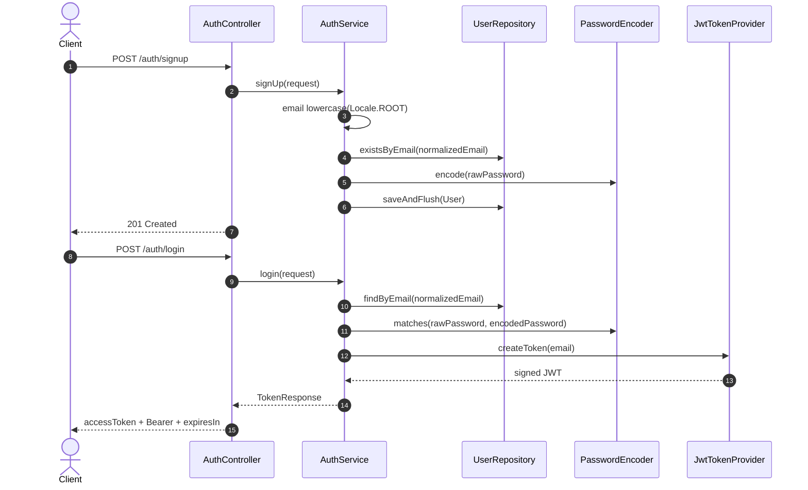
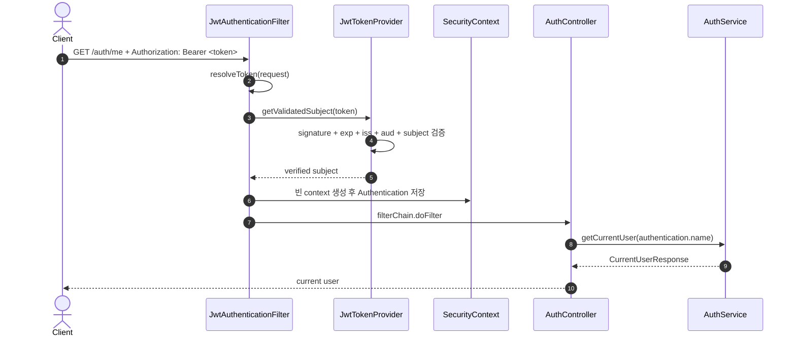
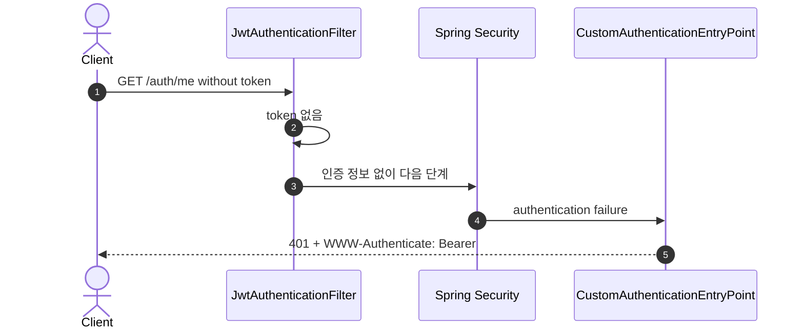
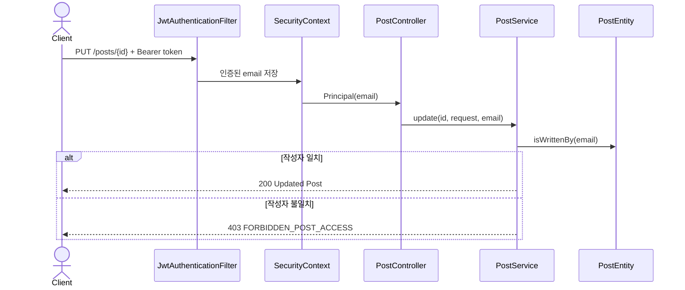
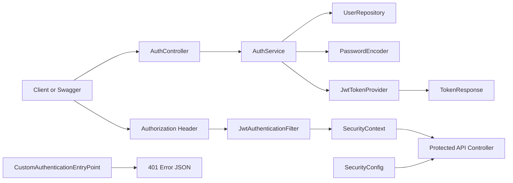

# 이론 정리

> 이 문서는 참고 구현을 기준으로 회원가입, 로그인, JWT 발급, JWT 검증, 인증 필터, `SecurityConfig` 경계를 설명합니다. 핵심은 로그인으로 토큰을 발급받는 흐름과 이후 요청에서 토큰을 검증하는 흐름을 분리해 읽는 것입니다.

## 1. Problem - 왜 인증과 JWT가 필요한가

CRUD와 Validation만으로는 요청자가 누구인지 설명할 수 없습니다. 현재 사용자 정보를 조회하거나 보호된 API에 접근하려면 서버가 요청자의 인증 상태를 알아야 합니다.

HTTP 요청은 기본적으로 독립적입니다. 로그인 요청이 성공했다고 해서 다음 요청에서 서버가 자동으로 사용자를 기억하지 않습니다. 참고 구현은 로그인 성공 시 JWT를 발급하고, 이후 요청마다 `Authorization` header의 Bearer token을 검증해 인증 정보를 구성합니다.

## 2. Analyze - 참고 구현에서 인증 흐름을 나누는 기준

JWT 흐름은 회원가입, 로그인, 토큰 발급, 토큰 검증, 보안 경계로 나누어 읽어야 합니다. 인증과 인가도 구분해야 합니다.

| 구분 | 참고 구현의 위치 | 리뷰할 지점 |
|---|---|---|
| 회원가입 | `AuthService.signUp()` | email 정규화, 중복 확인, 비밀번호 암호화, unique 경쟁 처리 |
| 로그인 | `AuthService.login()` | 비밀번호 검증과 실패 예외 |
| 토큰 발급 | `JwtTokenProvider.createToken(email)` | issuer, audience, subject, 만료, HS256 서명 |
| 토큰 검증 | `JwtAuthenticationFilter` | Bearer token 추출, 한 번의 파싱, `SecurityContext` 저장 |
| 인증 경계 | `SecurityConfig` | 공개 API와 인증 필요 API 구분 |
| 인증/인가 실패 응답 | Entry point, access denied handler | 401/403 `ErrorResponse` JSON 응답 |
| 게시글 소유권 | `PostService` | 인증된 사용자와 작성자 비교 |

이번 시퀀스는 자체 회원가입/로그인과 access token 기반 인증을 다룹니다. 회원가입은 계정 생성이고 로그인과는 다릅니다. 로그인 자격 증명 확인은 `AuthService`가 수동으로 처리하며, access token을 받은 뒤의 요청 인증과 인가는 Spring Security가 처리합니다. Refresh Token, Redis, OAuth2, SMTP와 비밀번호 재설정은 구현하지 않습니다.

## 3. API / 실행 시퀀스 다이어그램

### 3.1 회원가입과 로그인 흐름

회원가입은 사용자 저장과 비밀번호 암호화가 핵심입니다. 중복 조회와 저장 사이에 다른 요청이 들어올 수 있으므로 DB unique 제약을 마지막 방어선으로 유지하고, 저장 시 unique 위반도 동일한 409 응답으로 바꿉니다. 비밀번호는 공백도 입력의 일부이므로 trim하지 않습니다. 로그인은 사용자 조회와 비밀번호 검증 후 `TokenResponse`를 반환합니다.

### 3.2 토큰 검증과 현재 사용자 조회 흐름

필터는 Controller보다 먼저 실행됩니다. 같은 JWT를 검증과 subject 조회를 위해 두 번 파싱하지 않습니다. 유효한 토큰이면 email을 꺼내 인증 객체를 만들고 새 `SecurityContext`에 저장합니다. 이미 Authentication이 있다면 덮어쓰지 않습니다. Controller는 이 인증 정보에서 현재 사용자 이름을 읽습니다.

### 3.3 인증 실패 흐름

토큰이 없거나 비어 있거나 변조·만료되어 인증 정보가 만들어지지 않으면 보호 API 접근은 동일한 401 `ErrorResponse`로 실패합니다. 잘못된 Authorization 헤더가 공개 API에 오면 인증 정보만 만들지 않고 공개 요청은 계속 처리합니다.

### 3.4 보호된 게시글과 소유권 인가 흐름

Authentication은 요청자의 신원을 확인하는 일입니다. Authorization은 인증된 사용자가 해당 작업을 할 수 있는지 판단하는 일입니다. 그래서 신원을 만들 수 없으면 401이고, 신원은 있지만 게시글 소유권이 없으면 403입니다.

## 4. 계층 / DTO / 메시지 흐름

### 4.1 계층 흐름

| 흐름 | 참고 구현의 타입 | 책임 |
|---|---|---|
| 회원가입 | `UserSignUpRequest`, `User`, `UserRepository` | 사용자 저장과 중복 email 방지 |
| 로그인 | `LoginRequest`, `PasswordEncoder`, `TokenResponse` | 비밀번호 검증과 access token 응답 |
| 토큰 발급/검증 | `JwtTokenProvider` | JWT 생성, subject 추출, 서명 검증 |
| 요청 인증 | `JwtAuthenticationFilter` | header token을 인증 객체로 변환 |
| 보안 경계 | `SecurityConfig` | 공개 API와 인증 필요 API 설정 |
| 인증 실패 | `CustomAuthenticationEntryPoint` | 401 JSON 응답 |

### 4.2 DTO와 인증 메시지 구분

| 데이터 | 이동 방향 | 참고 구현에서의 의미 |
|---|---|---|
| `UserSignUpRequest` | Client -> `/auth/signup` | 회원가입 입력입니다. |
| `LoginRequest` | Client -> `/auth/login` | 로그인 입력입니다. |
| `TokenResponse` | `/auth/login` -> Client | `accessToken`, `tokenType="Bearer"`, 초 단위 `expiresIn` 응답입니다. |
| `Authorization: Bearer <token>` | Client -> protected API | 이후 요청 인증 증표입니다. |
| `CurrentUserResponse` | protected API -> Client | 인증된 사용자 정보 응답입니다. |

JWT 발급과 JWT 검증은 같은 파일을 사용할 수 있지만 다른 시점의 작업입니다. 발급은 로그인 성공 시, 검증은 이후 보호 API 요청마다 일어납니다. JWT payload는 Base64URL로 표현되어 읽을 수 있으며 암호화된 비밀 영역이 아닙니다.

## 5. Action - 참고 구현에서 비교할 코드 흐름

### 5.1 `AuthService.signUp()`

회원가입은 `Locale.ROOT`로 email을 소문자 정규화하고 중복을 확인한 뒤 비밀번호를 암호화해 `User`를 저장합니다. 중복 검사를 BCrypt보다 먼저 실행해 불필요한 비용을 피하고, 트랜잭션 안의 `saveAndFlush()`에서 발생한 email unique 위반만 `UserAlreadyExistsException`으로 바꿉니다. 다른 DB 무결성 오류를 중복 email로 오인하지 않습니다. 비밀번호 평문 저장과 password trim은 허용하지 않습니다.

리뷰 질문:

- 중복 email이면 어떤 예외가 발생하나요?
- `PasswordEncoder.encode()` 결과를 저장하나요?
- 회원가입 요청 DTO와 `User` Entity 역할을 구분하나요?

### 5.2 `AuthService.login()`과 `JwtTokenProvider`

로그인은 정규화한 email로 사용자를 찾고 비밀번호를 검증한 뒤 JWT를 발급합니다. `JwtTokenProvider`는 HS256으로 토큰을 만들고 서명, 만료, issuer, audience, 필수 claim을 검증합니다. 현재 subject=email은 교육용 단순화이며 운영에서는 변경되지 않는 userId가 더 안전합니다.

리뷰 질문:

- 잘못된 email이나 password가 성공 응답으로 내려가지 않나요?
- 토큰 subject로 어떤 값을 사용하나요?
- token expiration과 secret 설정을 어디에서 읽나요?

### 5.3 `JwtAuthenticationFilter`

필터는 Authorization header에서 Bearer token을 꺼내고, 유효하면 `SecurityContext`에 인증 정보를 저장합니다. Controller는 이 뒤에 실행됩니다.

리뷰 질문:

- Bearer prefix가 없으면 token으로 처리하지 않나요?
- 유효하지 않은 token이면 인증 정보를 만들지 않나요?
- 동일한 token을 한 요청에서 한 번만 파싱하나요?
- 기존 Authentication을 덮어쓰지 않나요?
- 인증 객체의 principal이 현재 사용자 식별 값과 연결되나요?

### 5.4 `SecurityConfig`와 인증 실패 응답

`SecurityConfig`는 Swagger, 회원가입, 로그인과 게시글 GET을 공개하고, 현재 사용자 조회와 게시글 변경 API를 인증 필요로 설정합니다. 인증 실패는 `CustomAuthenticationEntryPoint`가 `WWW-Authenticate: Bearer`가 있는 401 JSON으로, Spring Security의 접근 거부는 JSON access denied handler가 403으로 변환합니다. 서비스의 게시글 ownership 403은 기존 예외 흐름을 유지합니다.

리뷰 질문:

- 공개 API와 인증 필요 API 경계가 문서와 맞나요?
- `/auth/me`는 토큰 없이 실패하나요?
- 게시글 작성/수정/삭제의 인증/인가 정책은 커리큘럼 기준에 맞게 별도로 확인했나요?

## 6. Result - 확인할 결과와 남은 한계

완료 후에는 다음을 확인합니다.

- `./gradlew test`가 통과합니다.
- 회원가입 요청이 사용자를 저장합니다.
- 로그인 성공 시 access token이 발급됩니다.
- 잘못된 로그인 요청은 실패 응답으로 내려갑니다.
- `Authorization: Bearer <token>`이 있는 요청과 없는 요청의 차이를 설명합니다.
- 인증과 인가의 차이를 설명합니다.

남은 한계는 분명합니다. 현재 시퀀스는 Access Token only이며 authorities가 비어 있습니다. `authenticated` 여부와 게시글 ownership만 다루고 Role 기반 인가는 하지 않습니다. Refresh Token, Redis, OAuth2, SMTP, 비밀번호 재설정도 직접 구현하지 않습니다.

## 7. 실무 포인트

- JWT secret은 운영 민감값입니다. `JWT_SECRET` 환경 변수나 비밀 관리 체계로 분리하고 UTF-8 기준 32바이트 이상을 사용합니다.
- 현재는 single-key 구조이므로 secret, issuer, audience를 바꾸면 기존 access token이 모두 401이 됩니다. 여러 키의 중첩 교체와 `kid`는 별도 운영 설계가 필요합니다.
- access token은 탈취 위험이 있으므로 만료 시간과 재발급 정책을 함께 고민해야 합니다.
- Access Token only 구조는 개별 토큰을 즉시 회수할 저장소가 없습니다. 짧은 TTL과 재인증 정책으로 위험을 제한합니다.
- 로그인 응답은 `Cache-Control: no-store`로 캐시를 막습니다.
- 브라우저 쿠키에 JWT를 저장하도록 바꾸면 현재의 CSRF 비활성화 정책을 다시 검토해야 합니다.
- 기존 mixed-case email을 애플리케이션 시작 시 자동 변환하면 unique 충돌이 날 수 있습니다. 배포 전에 충돌을 조사하고 명시적 migration으로 처리합니다.
- 학습 환경의 `ddl-auto=update`와 공개 Swagger는 운영 기본값이 아닙니다. 운영에서는 `JPA_DDL_AUTO=validate` 또는 `none`, `SPRINGDOC_ENABLED=false`를 사용합니다.
- 인증 필터에서 실패한 요청은 Controller에 도달하지 않을 수 있습니다. 이 동작은 보안 흐름의 일부입니다.
- 401은 인증 실패, 403은 인가 실패입니다. 테스트와 문서에서도 구분해서 읽습니다.
- `SecurityConfig`는 API 공개 범위를 결정하므로 문서, 테스트, 실제 설정이 맞는지 반드시 리뷰합니다.

## 8. 용어 정리

`Authentication`
: 요청자가 누구인지 확인하는 과정입니다.

`Authorization`
: 인증된 사용자가 특정 작업을 할 수 있는지 판단하는 과정입니다.

`JWT`
: 서명된 토큰 형식의 인증 증표입니다. payload 자체가 암호화되지는 않습니다.

`Bearer Token`
: `Authorization: Bearer <token>` 형식으로 전달하는 토큰입니다.

`SecurityContext`
: 현재 요청의 인증 정보를 담는 Spring Security 컨텍스트입니다.

`Authentication Filter`
: Controller 전에 요청을 검사하고 인증 정보를 구성하는 필터입니다.

`PasswordEncoder`
: 비밀번호를 안전한 저장 형태로 바꾸고 검증하는 컴포넌트입니다.

`TokenResponse`
: 로그인 성공 후 access token을 내려주는 응답 DTO입니다.

`AuthenticationEntryPoint`
: 인증 실패 시 HTTP 응답을 만드는 Spring Security 확장 지점입니다.

`Stateless`
: 서버가 요청 사이의 로그인 상태를 세션으로 저장하지 않는 방식입니다.

## 9. 다음 구현으로 연결되는 지점

다음 시퀀스에서는 Google OAuth2 로그인과 SMTP 계정 복구 흐름을 다룹니다. 이번 단계에서 자체 로그인과 JWT 응답 구조를 이해해 두면 외부 인증 결과를 자체 사용자와 연결하고 access token으로 응답하는 흐름을 더 수월하게 읽을 수 있습니다.

멘토용 설명 포인트

- starter와 비교할 때 `AuthService`, `JwtTokenProvider`, `JwtAuthenticationFilter`, `SecurityConfig` 순서로 봅니다.
- 토큰 문자열을 외우게 하지 말고 발급 위치와 검증 위치를 구분하게 합니다.
- OAuth2 질문은 다음 시퀀스에서 외부 인증 후 자체 JWT를 발급하는 이유로 연결합니다.
- 공개 API와 보호 API 경계가 실제 설정과 문서에서 일치하는지 리뷰하게 합니다.

